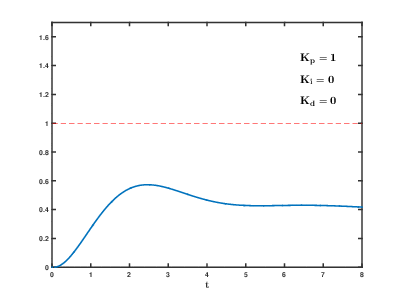

Mycodo
======

Environmental Regulation System

Latest version: 8.4.0

Mycodo is open source software for the Raspberry Pi that couples inputs
and outputs in interesting ways to sense and manipulate the environment.

|Build Status| |Codacy Badge| |DOI|

`Mycodo Manual <https://github.com/kizniche/Mycodo/blob/master/mycodo-manual.rst>`__
(`PDF <https://kizniche.github.io/Mycodo/mycodo-manual.pdf>`__,
`HTML <https://kizniche.github.io/Mycodo/mycodo-manual.html>`__,
`TEXT <https://kizniche.github.io/Mycodo/mycodo-manual.txt>`__)

`Mycodo API <https://kizniche.github.io/Mycodo/mycodo-api.html>`__ (Latest Version: v1)

`Mycodo Support Android App <https://play.google.com/store/apps/details?id=com.mycodo.mycododocs>`__

`Mycodo Wiki <https://github.com/kizniche/Mycodo/wiki>`__

`Mycodo on GitHub.io <https://kizniche.github.io/Mycodo/>`__

`Mycodo Custom Inputs and Controllers Repository <https://github.com/kizniche/Mycodo-custom>`__

For technical support discussion, use the `Mycodo Forum <https://kylegabriel.com/forum>`__

.. contents:: Table of Contents
   :depth: 1

Features
--------

-  `Inputs <https://github.com/kizniche/Mycodo/blob/master/mycodo-manual.rst#input>`__ that record measurements from a number of places, including sensors, GPIO pin states, analog-to-digital converters, etc. (or write your own custom input module).
-  `Outputs <https://github.com/kizniche/Mycodo/blob/master/mycodo-manual.rst#output>`__ that perform actions such as switching GPIO pins high/low, generating PWM signals, executing Linux shell commands and Python code, etc. (or write your own custom output module).
-  `Web Interface <https://github.com/kizniche/Mycodo/blob/master/mycodo-manual.rst#web-interface>`__ for securely accessing the system using a web browser on your local network or anywhere in the world with an internet connection.
-  `Dashboard <https://github.com/kizniche/Mycodo/blob/master/mycodo-manual.rst#dashboard>`__ that display configurable widgets, including interactive live and historical graphs, gauges, output state indicators, text measurements.
-  `Proportional Integral Derivative (PID) controllers <https://github.com/kizniche/Mycodo/blob/master/mycodo-manual.rst#pid-controller>`__ that regulate environmental conditions with feedback loops utilizing Inputs and Outputs.
-  `Setpoint Tracking <https://github.com/kizniche/Mycodo/blob/master/mycodo-manual.rst#methods>`__ for changing a PID controller setpoint over time, for use with things like reptile terrariums, reflow ovens, thermal cyclers, sous-vide cooking, and more.
-  `Conditional Statements <https://github.com/kizniche/Mycodo/blob/master/mycodo-manual.rst#conditional>`__ that react to input measurements, manipulate outputs, and execute actions based on user-generated code. This is a very powerful feature that enables custom user-created `conditions <https://en.wikipedia.org/wiki/Conditional_(computer_programming)>`__ for Inputs, Outputs, Actions, and other parts of the system.
-  `Triggers <https://github.com/kizniche/Mycodo/blob/master/mycodo-manual.rst#trigger>`__ that can trigger actions at periodic intervals (daily, duration, sunrise/sunset, etc.).
-  `Alerts <https://github.com/kizniche/Mycodo/blob/master/mycodo-manual.rst#alerts>`__ to notify via email when measurements reach or exceed user-specified thresholds.
-  `Notes <https://github.com/kizniche/Mycodo/blob/master/mycodo-manual.rst#notes>`__ to keep track of events, alerts, and other important points in time.
-  `Camera Feed <https://github.com/kizniche/Mycodo/blob/master/mycodo-manual.rst#camera>`__ for remote live stream, image capture, or time-lapse photography.
-  `Energy Usage Statistics <https://github.com/kizniche/Mycodo/blob/master/mycodo-manual.rst#energy-usage>`__ to calculate and track power consumption and cost over time.
-  `Upgrade System <https://github.com/kizniche/Mycodo/blob/master/mycodo-manual.rst#upgrading>`__ to easily upgrade the Mycodo system to the latest release or restore to a previously-backed up version.
-  `Translation <https://github.com/kizniche/Mycodo/blob/master/mycodo-manual.rst#translations>`__ to several languages, including English, Chinese, Dutch, German, French, Italian, Norwegian, Portuguese, Russian, Serbian, Spanish, and Swedish.

Uses
----

Originally developed to cultivate edible mushrooms, Mycodo has evolved to do much more. Here are a few things that have been done with Mycodo:

My projects

-  `Growing mushrooms <https://kylegabriel.com/projects/2015/04/mushroom-cultivation-revisited.html>`__
-  `Growing plants <https://www.youtube.com/watch?v=QNCx_VE7D-8>`__
-  `Maintaining honey bee apiary homeostasis <https://kylegabriel.com/projects/2015/12/environmentally-controlled-apiary.html>`__
-  `Maintaining humidity in an underground artificial bat cave <https://kylegabriel.com/projects/2015/10/artificial-bat-cave.html>`__
-  `Remote radiation monitoring and mapping <https://kylegabriel.com/projects/2019/08/remote-radiation-monitoring.html>`__
-  `Cooking sous-vide <https://hackaday.io/project/11997-mycodo-environmental-regulation-system/log/45733-sous-vide-pid-tuning-and-the-unexpected-electrical-fire>`__

Projects of others

-  Maintaining aquatic systems (e.g. fish, hydroponic, aquaponic)
-  Maintaining terrarium, herpetarium, and vivarium environments
-  Incubating young animals and eggs
-  Aging cheese
-  Dry-aging, curing, and smoking meat (`1 <http://archive.is/NHKqp>`__)
-  Fermenting beer, food, and tobacco
-  Controlling reflow ovens
-  Culturing microorganisms
-  Treating agricultural waste water (`1 <http://archive.is/enJQs>`__)
-  ...and more

`Let me know <https://kylegabriel.com/contact/>`__ how you use Mycodo, and I may include it on this list.

Screenshots
-----------

Visit the `Screenshots <https://github.com/kizniche/Mycodo/wiki/Screenshots>`__ page of the Wiki.

Install Mycodo
--------------

Prerequisites
~~~~~~~~~~~~~

-  `Raspberry Pi <https://www.raspberrypi.org>`__ single-board computer (any version: Zero, 1, 2, 3, or 4)
-  `Raspbian OS <https://www.raspberrypi.org/downloads/raspbian/>`__ flashed to a micro SD card
-  An active internet connection

Mycodo has been tested to work with Raspbian Buster Lite (2019-09-26).

Install
~~~~~~~

Once you have the Raspberry Pi booted into Raspbian with an internet
connection, run the following command in a terminal to initiate the
Mycodo install:

.. code:: bash

    curl -L https://kizniche.github.io/Mycodo/install | bash

Install Notes
~~~~~~~~~~~~~

Make sure the install script finishes without errors. A log of the
output will be created at ``~/Mycodo/install/setup.log``.

If the install is successful, the web user interface should be
accessible by navigating a web browser to ``https://127.0.0.1/``,
replacing ``127.0.0.1`` with your Raspberry Pi's IP address. The first
time you visit this page, you will be prompted to create an admin user.
You will then be redirected to the login page. Once logged in, check
that the host name and version number at the top left of the page is
green, indicating the daemon is running. Red indicates the
daemon is inactive or unresponsive. Ensure any java-blocking plugins are
disabled for all parts of the web interface to function properly.

If you receive an unresolvable error during the install, please `create
an issue <https://github.com/kizniche/Mycodo/issues>`__. If you want to
try to diagnose the issue yourself, see `Diagnosing
Issues <#diagnosing-issues>`__.

A minimal set of anonymous usage statistics are collected to help
improve development. No identifying information is saved from the
information that is collected and it is only used to improve Mycodo. No
other sources will have access to this information. The data collected
is mainly how much specific features are used, and other similar
statistics. The data that's collected can be viewed from the 'View
collected statistics' link in the ``Settings -> General`` page. You may
opt out from the General Settings page.

Support
-------

Before making a post to the forum, slack, or issue tracker on github, please read the
`Manual <https://github.com/kizniche/Mycodo/blob/master/mycodo-manual.rst>`__.

Need assistance with Mycodo
~~~~~~~~~~~~~~~~~~~~~~~~~~~

If you Mycodo is supposedly operating correctly and you would like assistance with how to
configure the system or to merely discuss something related to Mycodo, do a search on the
`Mycodo Forum <https://kylegabriel.com/forum/mycodo/>`__ for a similar discussion. If a pertinent
topic doesn't already exist on the forum, create a new post in the appropriate subforum.

You can also find Mycodo on slack at `mycodo.slack.com <https://mycodo.slack.com>`__.

Bug in the Mycodo Software
~~~~~~~~~~~~~~~~~~~~~~~~~~

If you believe there is a bug in the Mycodo software, first search through the guthub
`Issues <https://github.com/kizniche/Mycodo/issues>`__ and see if your issue has already
been discussed or resolved. If your issue is novel, you can create a
`New Issue <https://github.com/kizniche/Mycodo/issues/new>`__. When creating a new issue,
make sure to read all information in the issue template and follow the instructions. Replace
the template text with the actual information, such as "step 1" under "Steps to Reproduce
the issue" should be replaced with the actual step to reproduce the issue.

Manual
------

The Mycodo Manual may be viewed as
`Markdown <https://github.com/kizniche/Mycodo/blob/master/mycodo-manual.rst>`__,
`PDF <https://kizniche.github.io/Mycodo/mycodo-manual.pdf>`__,
`HTML <https://kizniche.github.io/Mycodo/mycodo-manual.html>`__,
or `Plain Text <https://kizniche.github.io/Mycodo/mycodo-manual.txt>`__

The `Mycodo Wiki <https://github.com/kizniche/Mycodo/wiki>`__ also contains useful information.

REST API
--------

The latest API documentation can be found here: `Mycodo API Docs <https://kizniche.github.io/Mycodo/mycodo-api.html>`__

If a new API version is released, older documentation will be provided here.

About PID Control
-----------------

A `proportional-derivative-integral (PID)
controller <https://en.wikipedia.org/wiki/PID_controller>`__ is a
control loop feedback mechanism used throughout industry for controlling
systems. It efficiently brings a measurable condition, such as
temperature, to a desired state (setpoint). A well-tuned PID controller
can raise to a setpoint quickly, have minimal overshoot, and maintain
the setpoint with little oscillation.

|Mycodo|

The top graph visualizes the regulation of temperature. The red line is
the desired temperature (setpoint) that has been configured to change
over the course of each day. The blue line is the actual recorded
temperature. The green vertical bars represent how long a heater has
been activated for every 20-second period. This regulation was achieved
with minimal tuning, and already displays a very minimal deviation from
the setpoint (±0.5° Celsius). Further tuning would reduce this
variability further.

See the
`PID Controller <https://github.com/kizniche/Mycodo/blob/master/mycodo-manual.rst#pid-controller>`__
and
`PID Tuning <https://github.com/kizniche/Mycodo/blob/master/mycodo-manual.rst#pid-tuning>`__
sections of the manual for more information.

Supported Inputs
----------------

All supported Inputs can be found under the
`Input Devices <https://github.com/kizniche/Mycodo/blob/master/mycodo-manual.rst#input-devices>`__
section of the manual.

If you would like to add to the list of supported Inputs, submit a pull request with a
`new Input Module you created <https://github.com/kizniche/Mycodo/blob/master/mycodo-manual.rst#custom-inputs>`__
or start a
`New Issue <https://github.com/kizniche/Mycodo/issues/new?assignees=&labels=&template=feature-request.md&title=>`__.

Additionally, I have another github repository devoted to custom Inputs and Controllers that do not
necessarily fit with the built-in set and are not included by default with Mycodo.
These can be found at `kizniche/Mycodo-custom <https://github.com/kizniche/Mycodo-custom>`__.

Donate
------

I have always made Mycodo free, and I don't intend on changing that to
make a profit. However, if you would like to make a donation, you can
find several options to do so at
`KyleGabriel.com/donate <https://kylegabriel.com/donate>`__

Links
-----

Thanks for using and supporting Mycodo, however it may not be the latest
version or it may have been altered if not obtained through an official
distribution site. You should be able to find the latest version on
github or my web site.

https://github.com/kizniche/Mycodo

https://KyleGabriel.com

License
-------

Mycodo is free software: you can redistribute it and/or modify it under
the terms of the GNU General Public License as published by the Free
Software Foundation, either version 3 of the License, or (at your
option) any later version.

Mycodo is distributed in the hope that it will be useful, but WITHOUT
ANY WARRANTY; without even the implied warranty of MERCHANTABILITY or
FITNESS FOR A PARTICULAR PURPOSE. See the `GNU General Public
License <http://www.gnu.org/licenses/gpl-3.0.en.html>`__ for more
details.

A full copy of the GNU General Public License can be found at
http://www.gnu.org/licenses/gpl-3.0.en.html

This software includes third party open source software components.
Please see individual files for license information, if applicable.

Languages
---------

-  Native: English
-  Complete: `Dutch <#dutch>`__,
   `German <#german>`__,
   `French <#french>`__,
   `Italian <#italian>`__,
   `Norwegian <#norwegian>`__,
   `Portuguese <#portuguese>`__,
   `Russian <#russian>`__,
   `Serbian <#serbian>`__,
   `Spanish <#spanish>`__,
   `Swedish <#swedish>`__,
   `Chinese <#chinese>`__.

By default, mycodo will display the default language set by your browser. You may also
force a language in the settings at ``[Gear Icon] -> Configure -> General -> Language``

If you would like to improve the translations, you can submit a pull request with an
amended .po file from ~/Mycodo/mycodo/mycodo_flask/translations/ or start a
`New Issue <https://github.com/kizniche/Mycodo/issues/new>`__ detailing the corrections.

English
~~~~~~~

The native language used in the software.

Dutch
~~~~~

Mycodo is een geautomatiseerd monitoring- en regelsysteem dat is gebouwd
om op de Raspberry Pi te draaien (versies Zero, 1, 2, 3 en 4).

Oorspronkelijk ontworpen om eetbare paddenstoelen te kweken, is Mycodo
uitgegroeid tot het vermogen om veel meer te doen, waaronder het kweken
van planten, het kweken van micro-organismen, het onderhouden van
bijenbijen bij de bijen, het incuberen van dieren en eieren, het
onderhouden van aquatische systemen, het ouder worden van kazen, het
fermenteren van voedsel en tabak, het koken eten (sous-vide) en meer.

Het systeem bestaat uit een backend (daemon) en een frontend
(gebruikersinterface). De backend voert metingen uit van sensoren en
apparaten, coördineert vervolgens een diverse reeks antwoorden op die
metingen, inclusief het vermogen om outputs te moduleren (relais, PWM,
draadloze outlets), omgevingsomstandigheden te regelen met elektrische
apparaten onder PID-regeling (gestage regeling of omschakeling tijd),
timers plannen, foto's maken en video streamen, acties activeren wanneer
metingen aan bepaalde voorwaarden voldoen (relais moduleren, opdrachten
uitvoeren, per e-mail op de hoogte stellen, etc.) en meer. De frontend is
een webinterface die gemakkelijke navigatie en configuratie mogelijk
maakt vanaf elk apparaat met een browser.

French
~~~~~~

Mycodo est un système de surveillance et de régulation automatisé conçu
pour fonctionner sur le Raspberry Pi (versions zéro, 1, 2, 3 et 4).

Conçu à l'origine pour cultiver des champignons comestibles, Mycodo s'est
développé pour inclure la capacité de faire beaucoup plus, notamment la
culture de plantes, la culture de micro-organismes, le maintien de
l'homéostasie du rucher des abeilles, la mise en incubation des animaux
et des œufs, la maintenance des systèmes aquatiques, le vieillissement
des fromages, la fermentation nourriture (sous vide), et plus.

Le système comprend un serveur (démon) et une interface utilisateur
(interface utilisateur). Le système effectue des mesures à partir de
capteurs et d’appareils, puis coordonne un ensemble divers de réponses à
ces mesures, notamment la possibilité de moduler les sorties (relais,
PWM, prises sans fil), de réguler les conditions environnementales avec
des appareils électriques sous contrôle PID (régulation continue ou
basculement temps), planifiez des minuteries, capturez des photos et des
flux vidéo, déclenchez des actions lorsque les mesures répondent à
certaines conditions (moduler des relais, exécuter des commandes, notifier
par courrier électronique, etc.), etc. L'interface Web est une interface
Web qui facilite la navigation et la configuration à partir de tout
appareil compatible avec le navigateur.

German
~~~~~~

Mycodo ist ein automatisiertes Überwachungs- und Regulierungssystem, das
für den Raspberry Pi (Versionen Zero, 1, 2, 3 und 4) entwickelt wurde.

Ursprünglich für die Kultivierung von Speisepilzen konzipiert, hat Mycodo
die Fähigkeit zu weitaus mehr erweitert, darunter die Kultivierung von
Pflanzen, die Kultivierung von Mikroorganismen, die Aufrechterhaltung der
Homöostase der Bienenhaus-Bienenhäuser, die Inkubation von Tieren und
Eiern, die Aufrechterhaltung von Wassersystemen, das Altern von Käse, das
Gären von Lebensmitteln und Tabak sowie das Kochen Essen (Sous-Vide) und
mehr.

Das System besteht aus einem Backend (Daemon) und einem Frontend
(Benutzeroberfläche). Das Backend führt Messungen von Sensoren und Geräten
durch und koordiniert dann eine Vielzahl von Reaktionen auf diese
Messungen, einschließlich der Möglichkeit, Ausgänge (Relais, PWM,
drahtlose Ausgänge) zu modulieren und Umgebungsbedingungen mit elektrischen
Geräten unter PID-Steuerung zu regulieren (stetige Regelung oder
Umschaltung) Zeit), Zeitpläne planen, Fotos aufnehmen und Videos streamen,
Aktionen auslösen, wenn Messungen bestimmte Bedingungen erfüllen (Relais
modulieren, Befehle ausführen, per E-Mail benachrichtigen usw.) und vieles
mehr. Das Frontend ist eine Weboberfläche, die eine einfache Navigation und
Konfiguration von jedem Browser-fähigen Gerät aus ermöglicht.

Italian
~~~~~~~

Mycodo è un sistema di monitoraggio e regolazione automatico che è stato
creato per funzionare sul Raspberry Pi (versioni Zero, 1, 2, 3 e 4).

Originariamente progettato per coltivare funghi commestibili, Mycodo è
cresciuto fino a comprendere la capacità di fare molto di più, coltivando
piante, coltivando microrganismi, mantenendo l'omeostasi delle api apistiche
del miele, incubando animali e uova, mantenendo sistemi acquatici, formaggi
stagionati, alimenti fermentati e tabacco, cucinando cibo (sous-vide) e
altro ancora.

Il sistema comprende un backend (demone) e un frontend (interfaccia utente).
Il back-end esegue misurazioni da sensori e dispositivi, quindi coordina un
insieme diversificato di risposte a tali misurazioni, inclusa la possibilità
di modulare le uscite (relè, PWM, prese wireless), regola le condizioni
ambientali con dispositivi elettrici sotto controllo PID (regolazione costante
o commutazione tempo), programmare i timer, acquisire foto e trasmettere
video, attivare azioni quando le misurazioni soddisfano determinate condizioni
(modulazione di relè, esecuzione di comandi, notifica via e-mail, ecc.) e
altro. Il frontend è un'interfaccia web che consente una facile navigazione e
configurazione da qualsiasi dispositivo abilitato per il browser.

Norwegian
~~~~~~~~~

Mycodo er et automatisert overvåkings- og reguleringssystem som ble bygget
for å kjøre på Raspberry Pi (versjoner Zero, 1, 2, 3 og 4).

Mycodo er opprinnelig utviklet for å dyrke spiselige sopp, og har vokst
til å inkludere muligheten til å gjøre mye mer, inkludert dyrking av
planter, dyrking av mikroorganismer, opprettholder honningbi apiary
homeostasis, inkubering av dyr og egg, opprettholde akvatiske systemer,
aldrende oster, fermenterende matvarer og tobakk, matlaging mat (sous-vide)
og mer.

Systemet består av en backend (daemon) og en frontend (brukergrensesnitt).
Backend utfører målinger fra sensorer og enheter, og koordinerer deretter
et mangfoldig sett med svar på disse målingene, inkludert muligheten til å
modulere utganger (reléer, PWM, trådløse uttak), regulere miljøforhold med
elektriske enheter under PID-kontroll (stabil regulering eller endring over
tid), planlegge timere, ta bilder og streame video, utløse handlinger når
målingene oppfyller visse forhold (modulere reléer, utføre kommandoer,
varsle via e-post, etc.) og mer. Frontend er et webgrensesnitt som gjør det
enkelt å navigere og konfigurere fra hvilken som helst nettleseraktivert
enhet.

Portuguese
~~~~~~~~~~

O Mycodo é um sistema automatizado de monitoramento e regulação que foi
construído para rodar no Raspberry Pi (versões Zero, 1, 2, 3 e 4).

Originalmente concebido para cultivar cogumelos comestíveis, o Mycodo
cresceu para incluir a capacidade de fazer muito mais, incluindo cultivar
plantas, cultivar microorganismos, manter a homeostase do apiário de
abelhas, incubar animais e ovos, manter sistemas aquáticos, queijos
envelhecidos, fermentar alimentos e tabaco, cozinhar comida (sous-vide) e
muito mais.

O sistema compreende um backend (daemon) e um frontend (interface de
usuário). O backend conduz medições a partir de sensores e dispositivos e
coordena um conjunto diversificado de respostas a essas medições,
incluindo a capacidade de modular saídas (relés, PWM, tomadas sem fio),
regular as condições ambientais com dispositivos elétricos sob controle
PID (regulação estável ou troca tempo), agendar cronômetros, capturar
fotos e transmitir vídeo, acionar ações quando as medições atenderem a
determinadas condições (modular relés, executar comandos, notificar por
e-mail etc.) e muito mais. O frontend é uma interface da web que permite
fácil navegação e configuração a partir de qualquer dispositivo habilitado
para navegador.

Russian
~~~~~~~

Mycodo - это автоматизированная система мониторинга и регулирования,
созданная для работы на Raspberry Pi (версии Zero, 1, 2, 3 и 4).

Первоначально разработанный для выращивания съедобных грибов, Mycodo
вырос и теперь способен делать гораздо больше, включая выращивание
растений, выращивание микроорганизмов, поддержание гомеостаза пасеки
медоносных пчел, инкубацию животных и яиц, поддержание водных систем,
старение сыров, ферментацию продуктов и табака, приготовление пищи. еда
(sous-vide) и многое другое.

Система включает в себя бэкэнд (демон) и интерфейс (пользовательский
интерфейс). Бэкэнд проводит измерения от датчиков и устройств, затем
координирует разнообразный набор ответов на эти измерения, включая
возможность модулировать выходы (реле, ШИМ, беспроводные выходы),
регулировать условия окружающей среды с помощью электрических устройств
под управлением ПИД (постоянное регулирование или переключение). время),
планировать таймеры, захватывать фотографии и потоковое видео, запускать
действия, когда измерения соответствуют определенным условиям
(модулировать реле, выполнять команды, отправлять уведомления по
электронной почте и т. д.) и многое другое. Интерфейс представляет собой
веб-интерфейс, который обеспечивает простую навигацию и настройку с любого
устройства с поддержкой браузера.

Serbian
~~~~~~~

Мицодо је аутоматски систем за надзор и регулацију који је направљен да
ради на Распберри Пи (верзије Зеро, 1, 2, 3 и 4).

Оригинално дизајниран за узгајање јестивих гљива, Мицодо је нарастао на
могућност да уради много више, укључујући култивирање биљака, култивисање
микроорганизама, одржавање хомеостазе пчелињег меда, инкубирање животиња
и јаја, одржавање водених система, старење сирева, ферментисање хране и
дуван, кухање храна (соус-виде), и више.

Систем садржи бацкенд (даемон) и фронтенд (кориснички интерфејс). Бацкенд
врши мерења од сензора и уређаја, затим координира различите одговоре на
та мерења, укључујући могућност модулације излаза (релеји, ПВМ, бежичне
утичнице), регулисање услова околине са електричним уређајима под ПИД
контролом (стална регулација или промена време), распоред времена, снимање
фотографија и стримовање видео снимака, акције покретања када мерења
испуњавају одређене услове (модулација релеја, извршавање команди,
обавештавање путем е-поште, итд.), и још много тога. Фронтенд је веб
интерфејс који омогућава једноставну навигацију и конфигурацију са било
ког уређаја са омогућеним претраживачем.

Spanish
~~~~~~~

Mycodo es un sistema automatizado de monitoreo y regulación que fue creado
para ejecutarse en la Raspberry Pi (versiones cero, 1, 2, 3 y 4).

Originalmente diseñado para cultivar hongos comestibles, Mycodo ha crecido
para incluir la capacidad de hacer mucho más, incluido el cultivo de plantas,
el cultivo de microorganismos, el mantenimiento de la homeostasis de las
abejas, la incubación de animales y huevos, el mantenimiento de los sistemas
acuáticos, el envejecimiento de los quesos, la fermentación de alimentos y el
tabaco, la cocina. comida (sous-vide), y más.

El sistema comprende un backend (daemon) y un frontend (interfaz de usuario).
El backend realiza mediciones desde sensores y dispositivos, luego coordina
un conjunto diverso de respuestas a esas mediciones, incluida la capacidad
de modular salidas (relés, PWM, salidas inalámbricas), regular las
condiciones ambientales con dispositivos eléctricos bajo control PID
(regulación constante o cambio tiempo), programe temporizadores, capture
fotos y transmita videos, active acciones cuando las mediciones cumplan
ciertas condiciones (module relés, ejecute comandos, notifique por correo
electrónico, etc.) y más. La interfaz es una interfaz web que permite una
fácil navegación y configuración desde cualquier dispositivo con navegador.

Swedish
~~~~~~~

Mycodo är ett automatiserat övervaknings- och reglersystem som byggdes
för att springa på Raspberry Pi (versioner noll, 1, 2, 3 och 4).

Mycodo har ursprungligen utformats för att odla ätliga svampar, och har
därmed ökat möjligheten att göra mycket mer, inklusive odling av växter,
odlingsmikroorganismer, upprätthållande av honeybee apiary homeostasis,
inkubering av djur och ägg, upprätthållande av vattenlevande system,
åldrande ostar, jäsning av mat och tobak, matlagning mat (sous-vide)
och mer.

Systemet innefattar en backend (daemon) och en frontend
(användargränssnitt). Bakgrunden utför mätningar från sensorer och
enheter och samordnar sedan en mängd olika svar på dessa mätningar,
inklusive möjligheten att modulera utgångar (reläer, PWM, trådlösa
uttag), reglera miljöförhållandena med elektriska enheter under
PID-kontroll (ständig reglering eller byte över tid), schemalägg timer,
ta bilder och strömma video, utlös åtgärder när mätningar uppfyller
vissa villkor (modulera reläer, utföra kommandon, meddela via e-post
etc.) och mer. Frontend är ett webbgränssnitt som möjliggör enkel
navigering och konfiguration från alla webbläsaraktiverade enheter.

Chinese
~~~~~~~

Mycodo是一个自动监控和调节系统，可在Raspberry Pi上运行（版本为Zero，1,2,3和4）。

Mycodo最初设计用于种植可食用的蘑菇，已经发展到能够做更多的事情，包括种植植物，培养微生物，保持蜂蜜蜂房稳态，孵化动物和鸡蛋，维持水生系统，陈年奶酪，发酵食品和烟草，烹饪食物（sous-vide）等等。

该系统包括后端（守护进程）和前端（用户界面）。后端从传感器和设备进行测量，然后协调对这些测量的各种响应，包括调制输出（继电器，PWM，无线插座）的能力，通过PID控制的电气设备调节环境条件（稳定调节或转换时间），安排计时器，捕获照片和流视频，在测量满足特定条件时触发操作（调制继电器，执行命令，通过电子邮件通知等）等等。前端是一个Web界面，可以从任何支持浏览器的设备轻松导航和配置。

.. |Build Status| image:: https://travis-ci.org/kizniche/Mycodo.svg?branch=master
   :target: https://travis-ci.org/kizniche/Mycodo
.. |Codacy Badge| image:: https://api.codacy.com/project/badge/Grade/5b9c21d5680f4f7fb87df1cf32f71e80
   :target: https://www.codacy.com/app/Mycodo/Mycodo?utm_source=github.com&utm_medium=referral&utm_content=kizniche/Mycodo&utm_campaign=Badge_Grade
.. |DOI| image:: https://zenodo.org/badge/DOI/10.5281/zenodo.824199.svg
   :target: https://doi.org/10.5281/zenodo.824199
.. |Mycodo| image:: https://kylegabriel.com/projects/wp-content/uploads/sites/3/2016/05/Mycodo-3.6.0-tango-Graph-2016-05-21-11-15-26.png
   :target: https://kylegabriel.com/projects/

Thanks
------

-  `Alembic <https://alembic.sqlalchemy.org>`__
-  `Bootstrap <https://getbootstrap.com>`__
-  `Date Range Picker <https://github.com/dangrossman/daterangepicker>`__
-  `Flask <http://flask.palletsprojects.com>`__
-  `Flask-Babel <https://github.com/python-babel/flask-babel>`__
-  `Flask-Limiter <https://github.com/alisaifee/flask-limiter>`__
-  `Flask-RestPlus <https://github.com/noirbizarre/flask-restplus>`__
-  `Flask-WTF <https://github.com/lepture/flask-wtf>`__
-  `FontAwesome <https://fontawesome.com>`__
-  `gridstack.js <https://github.com/gridstack/gridstack.js>`__
-  `Gunicorn <https://gunicorn.org>`__
-  `Highcharts <https://www.highcharts.com>`__
-  `InfluxDB <https://github.com/influxdata/influxdb>`__
-  `jQuery <https://jquery.com>`__
-  `Pyro5 <https://github.com/irmen/Pyro5>`__
-  `SQLAlchemy <https://www.sqlalchemy.org>`__
-  `SQLite <https://www.sqlite.org>`__
-  `toastr <https://github.com/CodeSeven/toastr>`__
