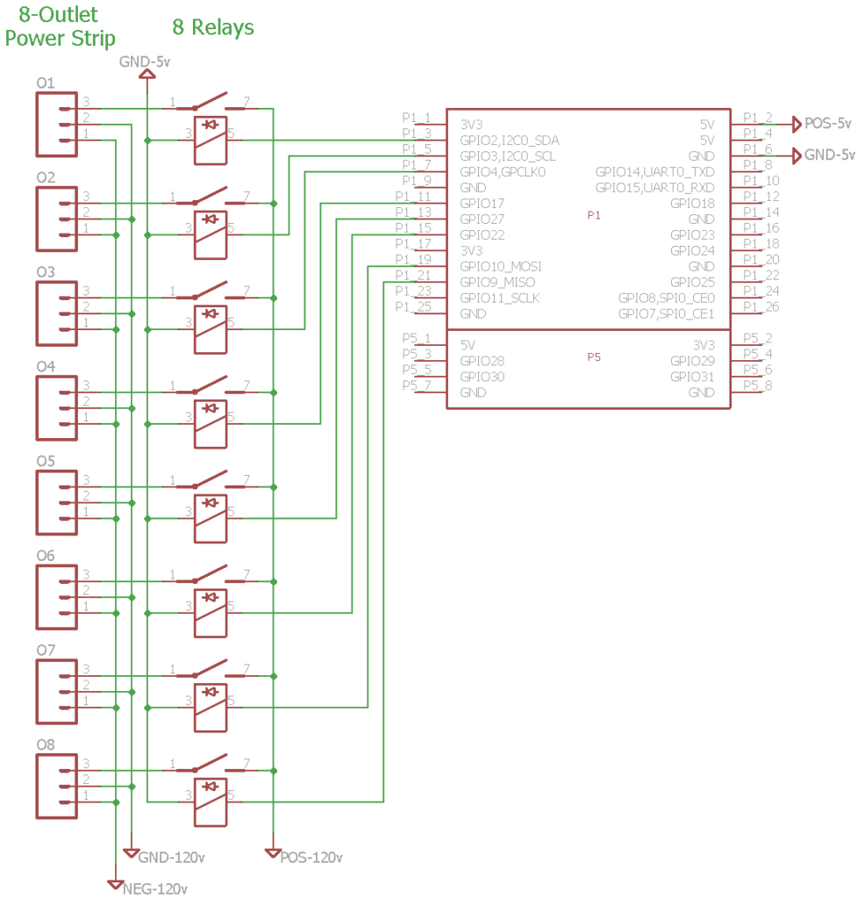

This information may not be current, so always reference and follow manufacturer recommendations for operating their devices.

## Edge Detection

The detection of a changing signal, for instance a simple switch completing a circuit, requires the use of edge detection. By detecting a rising edge (LOW to HIGH), a falling edge (HIGH to LOW), or both, actions or events can be triggered. The GPIO chosen to detect the signal should be equipped with an appropriate resistor that either pulls the GPIO up [to 5-volts] or down [to ground]. The option to enable the internal pull-up or pull-down resistors is not available for safety reasons. Use your own resistor to pull the GPIO high or low.

Examples of devices that can be used with edge detection: simple switches and buttons, PIR motion sensors, reed switches, hall effect sensors, float switches, and more.

## Displays

There are only a few number fo displays that are supported. 16x2 and 20x4 character LCD displays with I2C backpacks and the [128x32](https://www.adafruit.com/product/931) / [128x64](https://www.adafruit.com/product/931) OLED displays are supported. The below image is the type of device with the I2C backpack that should be compatible. See [Supported Functions](Supported-Functions.md) for more information.


## Raspberry Pi

The Raspberry Pi has an integrated temperature sensor on the BCM2835 SoC that measure the temperature of the CPU/GPU. This is the easiest sensor to set up in Mycodo, as it is immediately available to be used.

## AM2315

From [@Theoi-Meteoroi](https://github.com/kizniche/Mycodo/issues/315#issuecomment-344798815) on GitHub:

I figured out why this [AM2315] sensor is unreliable with Rpi3 hardware I2C. It is among a number of I2C devices that really hates the BCM2835 clock stretching blunder (hardware bug: [raspberrypi/linux\#254](https://github.com/raspberrypi/linux/issues/254)). The wakeup attempts fail, consistently. I checked the bitstream with a sniffer, and see that the sensor may respond once out of 20 or so tries (or not at all) but only with a single byte returned. The solution is to use a software implementation of the I2C bus. You need to add pull-up resistors (4.7k is dandy) to 3.3v and install the i2c\_gpio device overlay. Seems to work fine now, will run for a few days, but the CRC failures are gone and I get good readings, every time. And no twiddling the power for the sensor is required.

To enable software I2C, add the following line to your `/boot/config.txt`

`dtoverlay=i2c-gpio,i2c_gpio_sda=23,i2c_gpio_scl=24,i2c_gpio_delay_us=4`

After rebooting, a new I2C bus at /dev/i2c-3 should exist with SDA on pin 23 (BCM) and SCL on pin 24 (BCM). Make sure you add the appropriate pull-up resistors before connecting any devices.

## K-30


Be very careful when connecting the K-30, as there is no reverse-voltage protection and improper connections could destroy your sensor.

Wiring instructions for the Raspberry Pi can be found [here](https://www.co2meter.com/blogs/news/8307094-using-co2meter-com-sensors-with-raspberry-pi).

## USB Device Persistence Across Reboots

From [(#547) Theoi-Meteoroi on Github](https://github.com/kizniche/Mycodo/issues/547#issuecomment-428752904):

Using USB devices, such as USB-to-serial interfaces (CP210x) to connect a sensor, while convenient, poses an issue if there are multiple devices when the system reboots. After a reboot, there is no guarantee the device will persist with the same name. For instance, if Sensor A is /dev/ttyUSB0 and Sensor B is /dev/ttyUSB1, after a reboot Sensor A may be /dev/ttyUSB1 and Sensor B may be /dev/ttyUSB0. This will cause Mycodo to query the wrong device for a measurement, potentially causing a mis-measurement, or worse, an incorrect measurement because the response is not from the correct sensor (I've seen my temperature sensor read 700+ degrees celsius because of this!). Follow the instructions below to alleviate this issue.

I use udev to create a persistent device name ('/dev/dust-sensor') that will be linked to the /dev/ttyUSBn that is chosen at device arrival in the kernel. The only requirement is some attribute returned from the USB device that is unique. The common circumstance is that none of the attributes are unique and you get stuck with just VID and PID, which is ok as long as you don't have any other adapters that report the same VID and PID. If you have multiple adapters with the same VID and PID, then hopefully they have some unique attribute. This command will walk the attributes. Run on each USB device and then compare differences to possibly find some attribute to use.

`udevadm info --name=/dev/ttyUSB0 --attribute-walk`

I ended up using the serial number on the ZH03B to program the USB adapter serial field. This way guarantees unique serial numbers rather than me trying to remember what was the last serial number I used to increment by 1.

When you plug a USB device in it can be enumerated to different device names by the operating system. To fix this problem for this sensor on linux, I changed attributes that make the connection unique.

First - find the VID and PID for the USB device:

```
pi@raspberry:~ $ lsusb
Bus 001 Device 008: ID 10c4:ea60 Cygnal Integrated Products, Inc. CP210x UART Bridge / myAVR mySmartUSB light
Bus 001 Device 003: ID 0424:ec00 Standard Microsystems Corp. SMSC9512/9514 Fast Ethernet Adapter
Bus 001 Device 002: ID 0424:9514 Standard Microsystems Corp. SMC9514 Hub
Bus 001 Device 001: ID 1d6b:0002 Linux Foundation 2.0 root hub
```

In this case the Vendor ID is 10c4 The Product ID is ea60

!!! note
    If you have multiple devices and you find your IDs to be the same, you can change IDs with the Simplicity Studio Xpress Configurator tool (discussed starting on page 6 of the [AN721: USBXpress Device Configuration and Programming Guide](https://www.silabs.com/documents/public/application-notes/AN721.pdf)).

Since I changed the serial number field - this will be unique.

```
pi@raspberry:~ $ udevadm info --name=/dev/ttyUSB0 --attribute-walk | grep serial
SUBSYSTEMS=="usb-serial"
ATTRS{serial}=="ZH03B180904"
ATTRS{serial}=="3f980000.usb"
```

Now I have an attribute to tell udev what to do. I create a file in /etc/udev/rules.d with a name like "99-dustsensor.rules". In that file I tell udev what device name to create when it sees this device plugged in:

`SUBSYSTEM=="tty", ATTRS{idVendor}=="10c4", ATTRS{idProduct}=="ea60", ATTRS{serial}=="ZH03B180904" SYMLINK+="dust-sensor"`

To test the new rule:

```
pi@raspberry:/dev $ sudo udevadm trigger
pi@raspberry:/dev $ ls -al dust-sensor
lrwxrwxrwx 1 root root 7 Oct 6 21:04 dust-sensor -> ttyUSB0
```

Now, every time the dust sensor is plugged in, it shows up at /dev/dust-sensor

## Diagrams

### DHT11 Diagrams


### DS18B20 Diagrams


### Raspberry Pi and Relay Diagrams

#### Raspberry Pi, 4 relays, 4 outlets, 1 DS18B20 sensor


#### Raspberry Pi, 8 relays, 8 outlets


