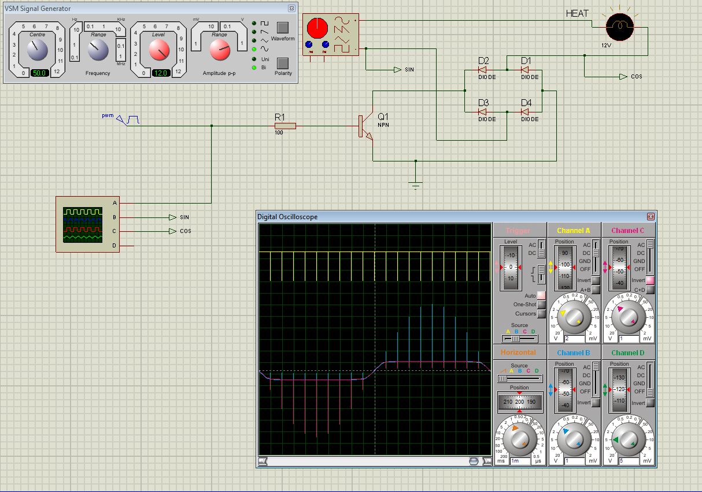

Page\: `Setup -> Output`

For a full list of supported Outputs, see [Supported Outputs Devices](Supported-Outputs.md).

Outputs are various signals that can be generated that operate devices. An output can be a HIGH/LOW signal on a GPIO pin, a pulse-width modulated (PWM) signal, a 315/433 MHz signal to switch a radio frequency-operated relay, driving of pumps and motors, or an execution of a linux or Python command, to name a few.

## Custom Outputs

There is a Custom Output import system in Mycodo that allows user-created Outputs to be created an used in the Mycodo system. Custom Outputs can be uploaded and imported from the `[Gear Icon] -> Configure -> Custom Outputs` page. After import, they will be available to use on the `Setup -> Output` page.

If you develop a working module, please consider [creating a new GitHub issue](https://github.com/kizniche/Mycodo/issues/new?assignees=&labels=&template=feature-request.md&title=New%20Module) or pull request, and it may be included in the built-in set.

Open any of the built-in modules located in the directory [Mycodo/mycodo/outputs](https://github.com/kizniche/Mycodo/tree/master/mycodo/outputs/) for examples of the proper formatting. There are also example Custom Outputs in the directory [Mycodo/mycodo/outputs/examples](https://github.com/kizniche/Mycodo/tree/master/mycodo/outputs/examples)

For Outputs that require new measurements/units, they can be added on the `[Gear Icon] -> Configure -> Measurements` page.

## Output Options

<table>
<thead>
<tr class="header">
<th>Setting</th>
<th>Description</th>
</tr>
</thead>
<tbody>
<tr>
<td>Pin (GPIO)</td>
<td>This is the GPIO that will be the signal to the output, using BCM numbering.</td>
</tr>
<tr>
<td>WiringPi Pin</td>
<td>This is the GPIO that will be the signal to the output, using WiringPi numbering.</td>
</tr>
<tr>
<td>On State</td>
<td>This is the state of the GPIO to signal the output to turn the device on. HIGH will send a 3.3-volt signal and LOW will send a 0-volt signal. If you output completes the circuit (and the device powers on) when a 3.3-volt signal is sent, then set this to HIGH. If the device powers when a 0-volt signal is sent, set this to LOW.</td>
</tr>
<tr>
<td>Protocol</td>
<td>This is the protocol to use to transmit via 315/433 MHz. Default is 1, but if this doesn't work, increment the number.</td>
</tr>
<tr>
<td>UART Device</td>
<td>The UART device connected to the device.</td>
</tr>
<tr>
<td>Baud Rate</td>
<td>The baud rate of the UART device.</td>
</tr>
<tr>
<td>I2C Address</td>
<td>The I2C address of the device.</td>
</tr>
<tr>
<td>I2C Bus</td>
<td>The I2C bus the device is connected to.</td>
</tr>
<tr>
<td>Output Mode</td>
<td>The Output mode, if supported.</td>
</tr>
<tr>
<td>Flow Rate</td>
<td>The flow rate to dispense the volume (ml/min).</td>
</tr>
<tr>
<td>Pulse Length</td>
<td>This is the pulse length to transmit via 315/433 MHz. Default is 189 ms.</td>
</tr>
<tr>
<td>Bit Length</td>
<td>This is the bit length to transmit via 315/433 MHz. Default is 24-bit.</td>
</tr>
<tr>
<td>Execute as User</td>
<td>Select which user executes Linux Commands.</td>
</tr>
<tr>
<td>On Command</td>
<td>This is the command used to turn the output on. For wireless relays, this is the numerical command to be transmitted, and for command outputs this is the command to be executed. Commands may be for the linux terminal or Python 3 (depending on which output type selected).</td>
</tr>
<tr>
<td>Off Command</td>
<td>This is the command used to turn the output off. For wireless relays, this is the numerical command to be transmitted, and for command outputs this is the command to be executed. Commands may be for the linux terminal or Python 3 (depending on which output type selected).</td>
</tr>
<tr>
<td>Force Command</td>
<td>If an Output is already on, enabling this option will allow the On command to be executed rather than returning &quot;Output is already On&quot;.</td>
</tr>
<tr>
<td>PWM Command</td>
<td>This is the command used to set the duty cycle. The string &quot;((duty_cycle))&quot; in the command will be replaced with the actual duty cycle before the command is executed. Ensure &quot;((duty_cycle))&quot; is included in your command for this feature to work correctly. Commands may be for the linux terminal or Python 3 (depending on which output type selected).</td>
</tr>
<tr>
<td>Current Draw (amps)</td>
<td>The is the amount of current the device powered by the output draws. Note: this value should be calculated based on the voltage set in the Energy Usage Settings.</td>
</tr>
<tr>
<td>Startup State</td>
<td>This specifies whether the output should be ON or OFF when mycodo initially starts. Some outputs have an additional options.</td>
</tr>
<tr>
<td>Startup Value</td>
<td>If the Startup State is set to User Set Value (such as for PWM Outputs), then this value will be set when Mycodo starts up.</td>
</tr>
<tr>
<td>Shutdown State</td>
<td>This specifies whether the output should be ON or OFF when mycodo initially shuts down. Some outputs have an additional options.</td>
</tr>
<tr>
<td>Shutdown Value</td>
<td>If the Shutdown State is set to User Set Value (such as for PWM Outputs), then this value will be set when Mycodo shuts down.</td>
</tr>
<tr>
<td>Trigger at Startup</td>
<td>Select to enable triggering Functions (such as Output Triggers) when Mycodo starts and if Start State is set to ON.</td>
</tr>
<tr>
<td>Seconds to turn On</td>
<td>This is a way to turn a output on for a specific duration of time. This can be useful for testing the outputs and powered devices or the measured effects a device may have on an environmental condition.</td>
</tr>
</tbody>
</table>

## On/Off (GPIO)

The On/Off (GPIO) output merely turns a GPIO pin High (3.3 volts) or Low (0 volts). This is useful for controlling things like electromechanical switches, such as relays, to turn electrical devices on and off.

Relays are electromechanical or solid-state devices that enable a small voltage signal (such as from a microprocessor) to activate a much larger voltage, without exposing the low-voltage system to the dangers of the higher voltage.

Add and configure outputs in the Output tab. Outputs must be properly set up before they can be used in the rest of the system.

To set up a wired relay, set the "GPIO Pin" (using BCM numbering) to the pin you would like to switch High (5 volts) and Low (0 volts), which can be used to activate relays and other devices. *On Trigger* should be set to the signal state (High or Low) that induces the device to turn on. For example, if your relay activates when the potential across the coil is 0-volts, set *On Trigger* to "Low", otherwise if your relay activates when the potential across the coil is 5 volts, set it to "High".

## Pulse-Width Modulation (PWM)

Pulse-width modulation (PWM) is a modulation technique used to encode a message into a pulsing signal, at a specific frequency in Hertz (Hz). The average value of voltage (and current) fed to the load is controlled by turning the switch between supply and load on and off at a fast rate. The longer the switch is on compared to the off periods, the higher the total power supplied to the load.

The PWM switching frequency has to be much higher than what would affect the load (the device that uses the power), which is to say that the resultant waveform perceived by the load must be as smooth as possible. The rate (or frequency) at which the power supply must switch can vary greatly depending on load and application, for example

!!! quote
    Switching has to be done several times a minute in an electric stove; 120 Hz in a lamp dimmer; between a few kilohertz (kHz) to tens of kHz for a motor drive; and well into the tens or hundreds of kHz in audio amplifiers and computer power supplies.

The term duty cycle describes the proportion of 'on' time to the regular interval or 'period' of time; a low duty cycle corresponds to low power, because the power is off for most of the time. Duty cycle is expressed in percent, with 0% being always off, 50% being off for half of the time and on for half of the time, and 100% being always on.

## Pulse-Width Modulation (PWM) Options

<table>
<thead>
<tr class="header">
<th>Setting</th>
<th>Description</th>
</tr>
</thead>
<tbody>
<tr>
<td>Library</td>
<td>Select the method for producing the PWM signal. Hardware pins can produce up to a 30 MHz PWM signal, while any other (non-hardware PWM) pin can produce up to a 40 kHz PWM signal. See the table, below, for the hardware pins on various Pi boards.</td>
</tr>
<tr>
<td>Pin (GPIO)</td>
<td>This is the GPIO pin that will output the PWM signal, using BCM numbering.</td>
</tr>
<tr>
<td>Frequency (Hertz)</td>
<td>This is frequency of the PWM signal.</td>
</tr>
<tr>
<td>Invert Signal</td>
<td>Send an inverted duty cycle to the output controller.</td>
</tr>
<tr>
<td>Duty Cycle</td>
<td>This is the proportion of the time on to the time off, expressed in percent (0 -100).</td>
</tr>
</tbody>
</table>

### Non-hardware PWM Pins

When using non-hardware PWM pins, there are only certain frequencies that can be used. These frequencies in Hertz are 40000, 20000, 10000, 8000, 5000, 4000, 2500, 2000, 1600, 1250, 1000, 800, 500, 400, 250, 200, 100, and 50 Hz. If you attempt to set a frequency that is not listed here, the nearest frequency from this list will be used.

### Hardware PWM Pins

The exact frequency may be set when using hardware PWM pins. The same PWM channel is available on multiple GPIO. The latest frequency and duty cycle setting will be used by all GPIO pins which share a PWM channel.

<table>
<thead>
<tr class="header">
<th>BCM Pin</th>
<th>PWM Channel</th>
<th>Raspberry Pi Version</th>
</tr>
</thead>
<tbody>
<tr>
<td>12</td>
<td>0</td>
<td>All models except A and B</td>
</tr>
<tr>
<td>13</td>
<td>1</td>
<td>All models except A and B</td>
</tr>
<tr>
<td>18</td>
<td>0</td>
<td>All models</td>
</tr>
<tr>
<td>19</td>
<td>1</td>
<td>All models except A and B</td>
</tr>
<tr>
<td>40</td>
<td>0</td>
<td>Compute module only</td>
</tr>
<tr>
<td>41</td>
<td>1</td>
<td>Compute module only</td>
</tr>
<tr>
<td>45</td>
<td>1</td>
<td>Compute module only</td>
</tr>
<tr>
<td>52</td>
<td>0</td>
<td>Compute module only</td>
</tr>
<tr>
<td>53</td>
<td>1</td>
<td>Compute module only</td>
</tr>
</tbody>
</table>

### Schematics for DC Fan Control

Below are hardware schematics that enable controlling direct current (DC) fans from the PWM output from Mycodo.

PWM output controlling a 12-volt DC fan (such as a PC fan)


### Schematics for AC Modulation

Below are hardware schematics that enable the modulation of alternating current (AC) from the PWM output from Mycodo.

PWM output modulating alternating current (AC) at 1% duty cycle


PWM output modulating alternating current (AC) at 50% duty cycle


PWM output modulating alternating current (AC) at 99% duty cycle



## Peristaltic Pump

There are two peristaltic pump Output modules that Mycodo supports, a generic peristaltic pump Output, and the Atlas Scientific EZO-PMP peristaltic pump.

### Generic Peristaltic Pump

Any peristaltic pump can be used with the Generic Peristaltic Pump Output to dispense liquids. The most basic dispensing abilities are to start dispensing, stop dispensing, or dispense for a duration of time. If the pump rate has been measured, this value can be entered into the Fastest Rate (ml/min) setting and the Output controller will then be able to dispense specific volumes rather than merely for durations of time. In oder to dispense specific volumes, the Output Mode will also need to be set in addition to the Desired Flow Rate (ml/min), if the Output Mode has been set to Specify Flow Rate.

To determine your pump's flow rate, first purge all air from your pump's hose. Next, instruct the pump to dispense for 60 seconds and collect the liquid it dispenses. Once finished, measure the amount of liquid and enter this value, in milliliters into the Fastest Rate (ml/min) setting. Once your pump's flow rate is set, you can now start dispensing specific volumes rather than durations.

This Output module relies on switching a GPIO pin High and Low to switch the peristaltic pump on and off. This is most easily accomplished with the use of a relay in-line with your pump's power supply or using the GPIO as an input signal directly to the pump (if supported). When using a relay, it's important to develop your circuit to provide the fastest possible switching of the pump. Since the volume dispensed by the pump is dependent on time, the faster the pump switching can occur, the more accurate the dispensing will be. Many peristaltic pumps operate on DC voltage and require an AC-DC converter. These converters can take a significant amount of time to energize once power is applied as well as de-energize once power is removed, causing significant delays that can impact dispensing accuracy. To alleviate this issue, the DC power should be switched, rather than the AC power, which will remove this potential delay.

### Atlas Scientific Peristaltic Pump

The Atlas Scientific peristaltic pump is a peristaltic pump and microcontroller combined that allows it to be communicated with via I2C or Serial and can accurately dispense specific volumes of fluid. There are [several commands](https://www.atlas-scientific.com/files/EZO_PMP_Datasheet.pdf) the pump can accept, including commands to calibrate, turn on, turn off, and dispense at a specific rate, among others. Atlas Scientific peristaltic pumps are good options, but are more expensive than generic peristaltic pumps.

### Peristaltic Pump Options

<table>
<thead>
<tr class="header">
<th>Setting</th>
<th>Description</th>
</tr>
</thead>
<tbody>
<tr>
<td>Output Mode</td>
<td>&quot;Fastest low Rate&quot; will pump liquid at the fastest rate the pump can perform. &quot;Specify Flow Rate&quot; will pump liquid at the rate set by the &quot;Flow Rate (ml/min)&quot; option.</td>
</tr>
<tr>
<td>Flow Rate (ml/min)</td>
<td>This is how fast liquid will be pumped if the &quot;Specify Flow Rate&quot; option is selected for the Output Mode option.</td>
</tr>
<tr>
<td>Fastest Rate (ml/min)</td>
<td>This is the rate at which the pump dispenses liquid, in ml/min.</td>
</tr>
<tr>
<td>Minimum On (sec/min)</td>
<td>This is the minimum duration (seconds) the pump should be turned on for every 60 second period of pumping. This option is only used when Specify Flow Rate is selected as the output Mode.</td>
</tr>
</tbody>
</table>

## Wireless 315/433 MHz

Certain 315/433 MHz wireless relays may be used, however you will need to set the pin of the transmitter (using BCM numbering), pulse length, bit length, protocol, on command, and off command. To determine your On and Off commands, connect a 315/433 MHz receiver to your Pi, then run the receiver script, below, replacing 17 with the pin your receiver is connected to (using BCM numbering), and press one of the buttons on your remote (either on or off) to detect the numeric code associated with that button.

```bash
sudo /opt/Mycodo/env/bin/python /opt/Mycodo/mycodo/devices/wireless_rpi_rf.py -d 2 -g 17
```

433 MHz wireless relays have been successfully tested with SMAKN 433MHz RF Transmitters/Receivers and Etekcity Wireless Remote Control Electrical Outlets (see [Issue 88](https://github.com/kizniche/Mycodo/issues/88) for more information). If you have a 315/433 MHz transmitter/receiver and a wireless relay that does not work with the current code, submit a [new issue](https://github.com/kizniche/Mycodo/issues/new) with details of your hardware.

## Linux Command

Another option for output control is to execute a terminal command when the output is turned on, off, or a duty cycle is set. Commands will be executed as the user 'root'. When a Linux Command output is created, example code is provided to demonstrate how to use the output.

## Python Command

The Python Command output operates similarly to the Linux Command output, however Python 3 code is being executed. When a Python Command output is created, example code is provided to demonstrate how to use the output.

## Output Notes

Wireless and Command (Linux/Python) Outputs: Since the wireless protocol only allows 1-way communication to 315/433 MHz devices, wireless relays are assumed to be off until they are turned on, and therefore will appear red (off) when added. If a wireless relay is turned off or on outside Mycodo (by a remote, for instance), Mycodo will **\*not**\* be able to determine the state of the relay and will indicate whichever state the relay was last. This is, if Mycodo turns the wireless relay on, and a remote is used to turn the relay off, Mycodo will still assume the relay is on.
