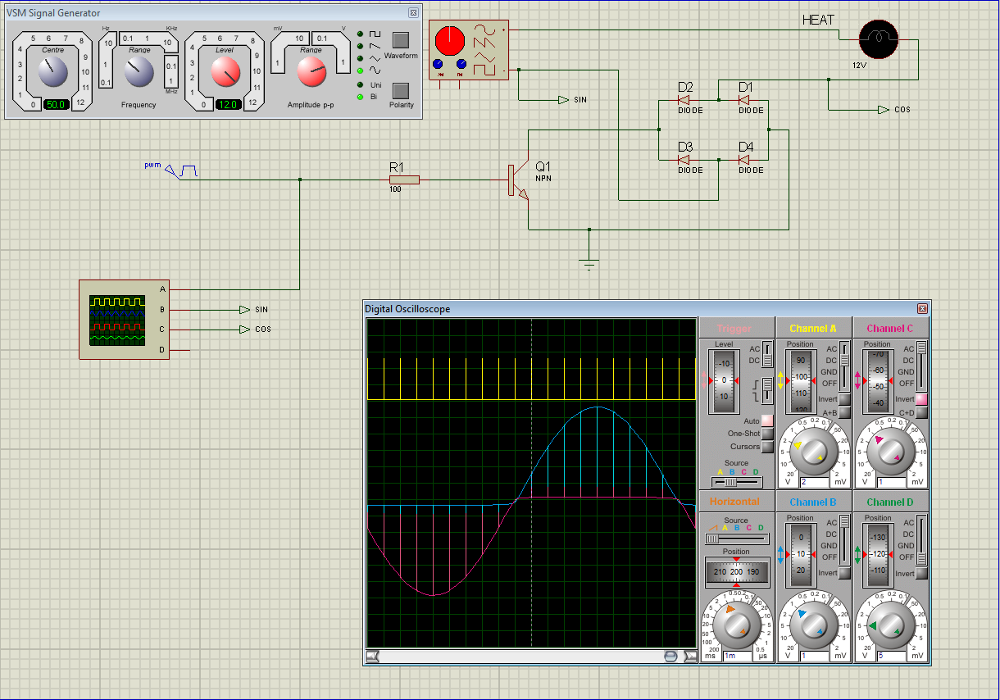
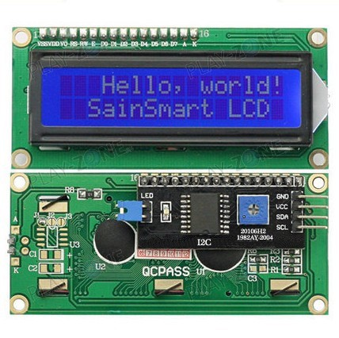
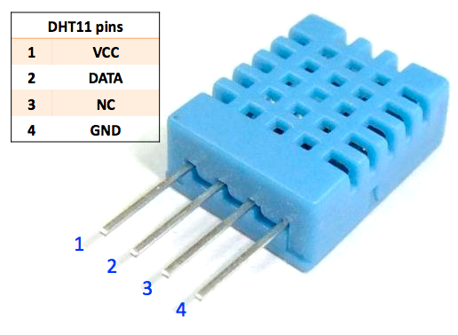
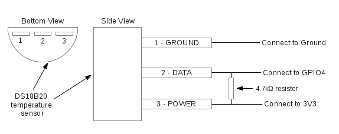
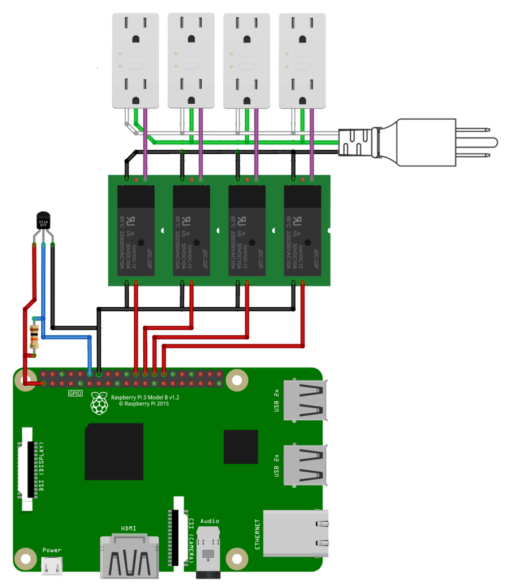

 
Mycodo Manual
=============

Table of Contents
=================

[About Mycodo](#about-mycodo)

[Brief Overview](#brief-overview)

[Frequently Asked Questions](#frequently-asked-questions)

[Upgrading](#upgrading)

[Controllers](#controllers)

   - [Input](#input)
   - [Output](#output)
   - [PIDs](#pids)
   - [Timers](#timers)
   - [LCDs](#lcds)
 
[Controller Functions](#controller-functions)

   - [Conditional Statements](#conditional-statements)
   - [Methods](#methods)

[PID Tuning](#pid-tuning)

   - [PID Control Theory](#pid-control-theory)
   - [Quick Setup Examples](#quick-setup-examples)
   - [Exact-Temperature Regulation](#exact-temperature-regulation)
   - [High-Temperature Regulation](#high-temperature-regulation)

[Configuration Settings](#configuration-settings)

   - [General Settings](#general-settings)
   - [Output Usage Settings](#output-usage-settings)
   - [Users](#users)
   - [User Roles](#user-roles)
   - [Alert Settings](#alert-settings)
   - [Camera Settings](#camera-settings)

[Miscellaneous](#miscellaneous)

   - [Graphs](#graphs)
   - [Camera](#camera)
   - [Output Usage](#output-usage)
   - [System Backup](#system-backup)
   - [System Restore](#system-restore)

[Troubleshooting](#troubleshooting)

   - [Daemon Not Running](#daemon-not-running)
   - [More](#more)

[Device Interfaces](#device-interfaces)

   - [1-Wire](#1-wire)
   - [GPIO](#gpio)
   - [UART](#uart)
   - [I<sup>2</sup>C](#i2c)
   - [Edge Detection](#edge-detection)
   - [I<sup>2</sup>C Multiplexers](#i2c-multiplexers)

[Device Specific Information](#device-specific-information)

[LCD Displays](#lcd-displays)

[Temperature Sensors](#temperature-sensors)

   - [Raspberry Pi](#raspberry-pi)
   - [Atlas Scientific PT-1000](#atlas-scientific-pt-1000)
   - [DS18B20](#ds18b20)
   - [TMP006, TMP007](#tmp006-tmp007)

[Temperature, Humidity Sensors](#temperature-humidity-sensors)

   - [AM2315](#am2315)
   - [DHT11](#dht11)
   - [DHT22, AM2302](#dht22-am2302)
   - [HTU21D](#htu21d)
   - [SHT1x](#sht1x)
   - [SHT7x](#sht7x)

[CO2 Sensors](#co2-sensors)

   - [K-30](#k-30)
   - [MH-Z19](#mh-z19)

[Moisture Sensors](#moisture-sensors)

   - [Chirp](#chirp)

[pH Sensors](#ph-sensors)

   - [Atlas Scientific pH](#atlas-scientific-ph)

[Pressure Sensors](#pressure-sensors)

   - [BME280](#bme280)
   - [BMP085, BMP180](#bmp085-bmp180)

[Luminosity Sensors](#luminosity-sensors)

   - [BH1750](#bh1750)
   - [TSL2561](#tsl2561)

[Analog to Digital Converters](#analog-to-digital-converters)

   - [ADS1x15](#ads1x15)
   - [MCP342x](#mcp342x)

[Diagrams](#diagrams)

   - [DHT11 Diagrams](#dht11-diagrams)
   - [DS18B20 Diagrams](#ds18b20-diagrams)
   - [Raspberry Pi and Relay Diagrams](#raspberry-pi-and-relay-diagrams)

* * * * *

About Mycodo
============

Mycodo is a system for acquiring and using sensor measurements in a feedback loop that controls a diverse set of outputs. This is commonly used for automated regulation of environmental conditions, such as temperature, humidity, CO2 concentration, and many more. It was built to run on the Raspberry Pi (versions Zero, 1, 2, and 3) and aims to be easy to install and set up.

The system coordinates a diverse set of responses to sensor measurements, including actions such as relay switching, regulation by [PID control](https://en.wikipedia.org/wiki/PID_controller), email notifications, camera captures, and more. Mycodo has been used for cultivating gourmet mushrooms, cultivating plants, culturing microorganisms, maintaining honey bee apiary homeostasis, incubating snake eggs and young animals, aging cheeses, fermenting foods, maintaining aquatic systems, and more.

Brief Overview
==============

There are a number of different uses for Mycodo, from simple storing of sensor measurements, to regulating the environmental conditions of a physical space, to capturing motion-activated or timelapse photography. There are several componenets of the system that may be configured.

Input
-----

Input controllers acquire measurements and store them in a [time series database](https://en.wikipedia.org/wiki/Time_series_database). Measurements taken by an Input Controller typically come from sensors, but Input Controllers may also be configured to use the return value of a linux command, making integrating new input systems very easy.

Output
------

Output Controllers produce changes to the general input/output (GPIO) pins of the Raspberry Pi or may be configured to execute linux commands in order to allow an unlimited number of extra potential uses. There are a few different types of outputs: simple switching of pins (HIGH/LOW), generating pulse-width modulatated (PWM) signals, switching 433 MHz wireless relays, and linux command execution. The most common setup is using a relay to switch electrical devices on and off. 

PID
---

When Inputs and Outputs are combined, PID Controllers may be used to create a fedback loop that uses the Output device to modulate an environmental condition the Input detects. Certain Inputs may be coupled with certain Outputs to create a variety of different control and regulation applications. Beyond simple regulation, Methods may be used to create changing setpoints over time, enabling such things as thermal cyclers, reflow ovens, environmental simulation for terrariums, food and beverage fermenttion or curing, and cooking food ([sous-vide](https://en.wikipedia.org/wiki/Sous-vide)), to name a few.


Timer
-----

Timers can be set to trigger events based on specific dates and times or according to durations of time. Timers are fairly basic, but can be configured in very complex ways. Don't underestimate a good timer.

LCD
---

LCDs may be set up to have a way to quickly view information, such as Input, Output, or PID controllers, and can be set to flash in case of triggered events, like an emergency, such as the temperature increasing beyond a certain point in an area that is supposed to be kept cold.


Frequently Asked Questions
==========================

*Where do I even begin?*

Here is how I generally set up Mycodo to monitor and regulate:

1.  Determine what environmental condition you want to measure or regulate. Consider the devices that must be coupled to achieve this. For instance, temperature regulation require a temperature sensor as the input and an electric heater as the output.
2.  Determine what relays you will need to power your electric devices. The Raspberry Pi is capable of directly switching relays (using a 3.3-volt signal), although opto-isolating the circuit is advisable. Be careful when selecting a relay not to exceed the current draw of the Raspberry Pi’s GPIO.
3.  See the [Device Specific Information](#device-specific-information) for information about what sensors are supported. Acquire one or more of these sensors and relays and connect them to the Raspberry Pi according to the manufacturer’s instructions.
4.  On the ```Input```  page, create a new input using the dropdown to select the correct sensor or input device. Configure the input with the correct communication pins and other options. Activate the input to begin recording measurements to the database..
5.  Go to the ```Data``` -> ```Live Measurements``` page to ensure there is recent data being acquired from the input.
6.  On the ```Ouput``` -> ```Devices```  page, add a relay and configure the GPIO pin that switches it, whether the relay switches On when the signal is HIGH or LOW, and what state (On or Off) to set the relay when Mycodo starts. A pulse-width modulated (PWM) output may also be used..
7.  Test the relay by switching it On and Off or generating a PWM signal from the ```Output``` -> ```Devices``` page and make sure the device connected to the relay turns On when you select "On", and Off when you select "Off".
8.  On the ```PID``` -> ```PID Controllers``` page, create a PID controller with the appropriate input, output, and other parameters.
9.  On the ```Data``` -> ```Live Graphs``` page, create a graph that includes the input measurement, the output that is being used by the PID, and the PID setpoint. This provides a good visualization for tuning the PID. See [Quick Setup Examples](#quick-setup-examples) for tuning tips.

* * * * *

*How do I add an input (like a sensor) to the system that's not currently supported?*

Currently, adding the ability to receive input that's not currently supported to the system can be achieved by two different methods.

The first involves editing several files. There has been effort to make the addition process as simple as possible. See the [Adding Support for a New Input](https://github.com/kizniche/Mycodo/wiki/Adding-Support-for-a-New-Input) Wiki page for how to do this.

The second way to add an input is to create a script that obtains and returns a numerical value when executed in the linux system of the Raspberry Pi. This script may be configured to be executed by a "Linux Command" Input type. This will periodically execute the command and store the returned value to the database for use with the rest of the Mycodo system.

* * * * *

*Can I variably control the speed of motors or other devices with the PWM output signal from the PID?*

Yes, as long as you have the proper hardware to do that. The PWM signal being produced by the PID should be handled appropriately, whether by a fast-switching solid state relay, an [AC modulation ciruit](#schematics-for-ac-modulation), [DC modulation circuit](#schematics-for-dc-fan-control), or something else.

* * * * *

*What should I do if I have an issue?*

First, read the manual to make sure you understand how the system works and you're using the system properly. ALso check out the [Wiki](https://github.com/kizniche/Mycodo/wiki). You may even want to look through recent [Issues](https://github.com/kizniche/Mycodo/issues). If you haven't resolved your issue by this point, make a [New Issue](https://github.com/kizniche/Mycodo/issues/new) describing the issue and attaching a sufficient amount of evidence (screenshots, log files, etc.) to aid diagnostics.

* * * * *


Upgrading
=========

If you already have Mycodo installed (version >= 4.0.0), you can perform an upgrade to the latest [release](https://github.com/kizniche/Mycodo/releases) on github by either using the Upgrade option in the web UI (recommended) or by issuing the following command in a terminal. A log of the upgrade process is created at ```/var/log/mycodo/mycodoupgrade.log```

```sudo /bin/bash ~/Mycodo/mycodo/scripts/upgrade_commands.sh upgrade```


Controllers
===========

Controllers are essentially modules that can be used to perform
functions or communicate with other parts of Mycodo. Each controller
performs a specific task or group of related tasks. There are also
Controller Functions, which are larger functions of a controller or
controllers and have been given their own sections.

Input
-----

Inputs (such as sensors or analog signals) measure environmental and other characteristic conditions, which will be stored in an influxdb round-robin database. This database will provide recent measurements for [Graphs](#graphs), [LCDs](#lcds), [PID Controllers](#pids), [Conditional Statements](#conditional-statements), and other parts of Mycodo to operate from.

Among the sensors is 'Linux Command'. This is a way to use a custom script to return a value to be used
within Mycodo, without having to edit the Mycodo code. Merely create your script and use this sensor to
have the return value of the script be stored in the Mycodo database for use with PIDs and other parts
of Mycodo that uses sensor measurements.

Setting | Description
-------------------- | ----------------------------------------------
Activate | After the sensor has been properly configured, activation begins acquiring measurements from the sensor. Any activated conditional statements will now being operating.
Deactivate | Deactivation stops measurements from being acquired from the sensor. All associated conditional statements will cease to operate.
Save | Save the current configuration entered into the input boxes for a particular sensor.
Delete | Delete a particular sensor.
Up/Down | Move a particular sensor up or down in the order displayed.
Power Output | Select a output that powers the sensor. This enables powering cycling (turn off then on) when the sensor returns 3 consecutive errors to attempt to fix the issue. Transistors may also be used instead of a relay (note: NPN transistors are preferred over PNP for powering sensors).
Location | Depending on what sensor is being used, you will need to either select a serial number (DS18B20 temperature sensor), a GPIO pin (in the case of sensors read by a GPIO), or an I<sup>2</sup>C address. and channel if using the TCA9548A I<sup>2</sup>C multiplexer.
I<sup>2</sup>C Bus | The bus to be used to communicate with the I<sup>2</sup>C address. If you're using an I<sup>2</sup>C multiplexer that provides multiple buses, this allows you to select which bus the sensor is connected to.
Period | After the sensor is successfully read and a database entry is made, this is the duration of time waited until the sensor is measured again.
Pre Output | If you require a output to be activated before a measurement is made (for instance, if you have a pump that extracts air to a chamber where the sensor resides), this is the output number that will be activated. The output will be activated for a duration defined by the Pre Duration, then once the output turns off, a measurement by the sensor is made.
Pre Output Duration | This is the duration of time that the Pre Output runs for before the sensor measurement is obtained.
Command | A linux command (executed as the user 'mycodo') that the return value becomes the measurement
Command Measurement | The measured condition (e.g. temperature, humidity, etc.) from the linux command
Command Units | The units of the measurement condition from the linux command
Edge | Edge sensors only: Select whether the Rising or Falling (or both) edges of a changing voltage are detected. A number of devices to do this when in-line with a circuit supplying a 3.3-volt input signal to a GPIO, such as simple mechanical switch, a button, a magnet (reed/hall) sensor, a PIR motion detector, and more.
Bounce Time (ms) | Edge sensors only: This is the number of milliseconds to bounce the input signal. This is commonly called [debouncing a signal](http://kylegabriel.com/projects/2016/02/morse-code-translator.html#debouncing). and may be necessary if using a mechanical circuit.
Reset Period | Edge sensors only: This is the period of time after an edge detection that another edge will not be recorded. This enables devices such as PIR motion sensors that may stay activated for longer periods of time.
Multiplexer (MX) | If connected to the TCA9548A I<sup>2</sup>C multiplexer, select what the I<sup>2</sup>C address of the multiplexer is.
Mx I<sup>2</sup>C Bus | If connected to the TCA9548A I<sup>2</sup>C multiplexer, select the I<sup>2</sup>C bus the multiplexer is connected to.
Mx Channel | If connected to the TCA9548A I<sup>2</sup>C multiplexer, select the channel of the multiplexer the device is connected to.
Measurement | Analog-to-digital converter only: The type of measurement being acquired by the ADC. For instance, if the resistance of a photocell is being measured through a voltage divider, this measurement would be "light".
Units | Analog-to-digital converter only: This is the unit of the measurement. With the above example of "light" as the measurement, the unit may be "lux" or "intensity".
Channel | Analog-to-digital converter only: This is the channel to obtain the voltage measurement from the ADC.
Gain | Analog-to-digital converter only: set the gain when acquiring the measurement.
Volts Min | Analog-to-digital converter only: What is the minimum voltage to use when scaling to produce the unit value for the database. For instance, if your ADC is not expected to measure below 0.2 volts for your particular circuit, set this to "0.2".
Volts Max | Analog-to-digital converter only: This is similar to the Min option above, however it is setting the ceiling to the voltage range. Units Min Analog-to-digital converter only: This value will be the lower value of a range that will use the Min and Max Voltages, above, to produce a unit output. For instance, if your voltage range is 0.0 - 1.0 volts, and the unit range is 1 - 60, and a voltage of 0.5 is measured, in addition to 0.5 being stored in the database, 30 will be stored as well. This enables creating calibrated scales to use with your particular circuit.
Units Max | Analog-to-digital converter only: This is similar to the Min option above, however it is setting the ceiling to the unit range.
Weighting | The This is a number between 0 and 1 and indicates how much the old reading affects the new reading.  It defaults to 0 which means the old reading has no effect.  This may be used to smooth the data.
Pulses Per Rev | The number of pulses for a complete revolution.


### Sensor Verification

Sensor verification was introduced in an earlier version and was broken
when the system moved to its new software framework. It was a great
feature, and it's planned to be integrated into the latest version.

This allows the verification of a sensor's measurement with another
sensor's measurement. This feature is best utilized when you have two
sensors in the same location (ideally as close as possible). One sensor
(host) should be set up to use the other sensor (slave) to verify. The
host sensor should be used to operate the PID, as one feature of the
verification is the ability to disable the PID if the difference between
measurements is not within the range specified.

Setting | Description
-------------------- | ----------------------------------------------
GPIO | This is the sensor that will be used to verify the sensor measurement. The sensor will be read directly after the first sensor's measurement to verify whether the sensors have similar measurements.
Difference | This is the maximum measured measurement difference between the two sensors before an action is triggered (either notify by email or prevent PID from operating; more below).
Notification | If the measurements of the two sensors differ by more than the set *Difference*, an email will be sent to the address in the *Notification* field.
Stop PID | If the measurements of the two sensors differ by more than the set *Difference*, the PID controller will turn off.

Output
------

Outputs are various signals that can be generated that operate devices. An output can be a PWM signal, a simple HIGH/LOW signal to operate a relay, or a 433MHz signal to switch a radio frequency-operated relay, or an execution of a command on the linux system Mycodo runs on.

### PWM

Pulse-width modulation (PWM) is a modulation technique used to encode a message into a pulsing signal, at a specific frequency in Hertz (Hz). The average value of voltage (and current) fed to the load is controlled by turning the switch between supply and load on and off at a fast rate. The longer the switch is on compared to the off periods, the higher the total power supplied to the load.

The PWM switching frequency has to be much higher than what would affect the load (the device that uses the power), which is to say that the resultant waveform perceived by the load must be as smooth as possible. The rate (or frequency) at which the power supply must switch can vary greatly depending on load and application, for example

> Switching has to be done several times a minute in an electric stove; 120 Hz in a lamp dimmer; between a few kilohertz (kHz) to tens of kHz for a motor drive; and well into the tens or hundreds of kHz in audio amplifiers and computer power supplies.

The term duty cycle describes the proportion of 'on' time to the regular interval or 'period' of time; a low duty cycle corresponds to low power, because the power is off for most of the time. Duty cycle is expressed in percent, 100% being fully on.

Currently, PWM is very new in Mycodo and does not have many features. PWM pins can be set up in the Output -> Devices page, then it may be used by a PWM PID Controller.

Setting | Description
-------------------- | ----------------------------------------------
Library | Select the method for producing the PWM signal. Hardware pins can produce up to a 30 MHz PWM signal, while any other (non-hardware PWM) pin can produce up to a 40 kHz PWM signal. See the table, below, for the hardware pins on various Pi boards.
BCM Pin | This is the GPIO that will output the PWM signal, using BCM numbering.
Hertz | This is frequency of the PWM signal.
Duty Cycle | This is the proportion of the time on to the time off, expressed in percent (0 - 100).
Current Draw (amps) | This is the current draw, in amps, when the duty cycle is 100%. Note: this value should be calculated based on the voltage set in the [Output Usage Settings](#output-usage-settings).

#### Non-hardware PWM Pins

If using any non-hardware PWM pin (see table below for hardware PWM pins), then there are only certain frequencies that can be used. These frequencies are 40000, 20000, 10000, 8000, 5000, 4000, 2500, 2000, 1600, 1250, 1000, 800, 500, 400, 250, 200, 100, and 50 Hz. If you attempt to set a frequency that is not listed here, the nearest frequency from this list will be used.

#### Hardware PWM Pins

The exact frequency may be set when using a hardware PWM pin. The same PWM channel is available on multiple GPIO. The latest frequency and duty cycle setting will be used by all GPIO pins which share a PWM channel. 

BCM Pin | PWM Channel | Raspberry Pi Version
------- | ----------- | --------------------
12 | 0 | All models except A and B
13 | 1 | All models except A and B
18 | 0 | All models
19 | 1 | All models except A and B
40 | 0 | Compute module only
41 | 1 | Compute module only
45 | 1 | Compute module only
52 | 0 | Compute module only
53 | 1 | Compute module only

#### Schematics for DC Fan Control

Below are hardware schematics that enable controlling direct current (DC) fans from the PWM output from Mycodo.

PWM output controlling a 12-volt DC fan (such as a PC fan)

\ 

#### Schematics for AC Modulation

Below are hardware schematics that enable the modulation of alternating current (AC) from the PWM output from Mycodo.

PWM output modulating alternating current (AC) at 1% duty cycle

\ 

PWM output modulating alternating current (AC) at 50% duty cycle

\ 

PWM output modulating alternating current (AC) at 99% duty cycle

\ 

### Relays

Relays are electromechanical or solid-state devices that enable a small voltage signal (such as from a microprocessor) to activate a much larger voltage, without exposing the low-voltage system to the dangers of the higher voltage.

Add and configure outputs in the Output tab. Outputs must be properly set up before PID regulation can be achieved.

#### Wired 

To set up a wired relay, set the "GPIO Pin" to the BCM GPIO number of each pin that activates each relay. *On Trigger* should be set to the signal that activates the relay (the device attached to the relay turns on). If your relay activates when the potential across the coil is 0-volts, set *On Trigger* to "Low", otherwise if your relay activates when the potential across the coil is 3.3-volts (or whatever switching voltage you are using, if not being driven by the GPIO pin), set it to "High".

#### Wireless

Certain 433 MHz wireless relays may be used, however you will need to set the pin of the transmitter (using WiringPi numbering), pulse length, bit length, protocol, on command, and off command. To determine your on and off commands, connect a 433 MHz receiver to your Pi, then run the receiver script, below, and press one of the buttons (either on or off) on your remote to detect the numeric code associated with that button.

```sudo ~/Mycodo/env/bin/python ~/Mycodo/mycodo/devices/wireless_433mhz_pi_switch.py```

433 MHz wireless relays have been successfully tested with SMAKN 433MHz RF Transmitters/Receivers and Etekcity Wireless Remote Control Electrical Outlets (see [Issue 88](https://github.com/kizniche/Mycodo/issues/88) for more information). If you have a 433 MHz transmitter/receiver and a wireless relay that does not work with the current code (even after trying several different protocol settings), submit a [new issue](https://github.com/kizniche/Mycodo/issues/new) with details of your hardware.

#### Command

Another option for output control is to execute a terminal command when the output is turned on or off. Commands will be executed as the user 'mycodo'.

Wireless and Command Output Note: Since the wireless protocol only allows 1-way communication to 433 MHz devices, wireless relays are assumed to be off until they are turned on, and therefore will appear red (off) when added. If a wireless relay is turned off or on outside Mycodo (by a remote, for instance), Mycodo will ***not*** be able to determine the state of the relay and will indicate whichever state the relay was last. This is, if Mycodo turns the wireless relay on, and a remote is used to turn the relay off, Mycodo will still assume the relay is on.

Setting | Description
-------------------- | ----------------------------------------------
BCM Pin | This is the GPIO that will be the signal to the output, using BCM numbering.
On Trigger | This is the state of the GPIO to signal the output to turn the device on. HIGH will send a 3.3-volt signal and LOW will send a 0-volt signal. If you output completes the circuit (and the device powers on) when a 3.3-volt signal is sent, then set this to HIGH. If the device powers when a 0-volt signal is sent, set this to LOW.
WiringPi Pin | This is the GPIO that will be the signal to the output, using WireingPi numbering.
Protocol | This is the protocol to use to transmit via 433MHz. Default is 1, but if this doesn't work, increment the number.
Pulse Length | This is the pulse length to transmit via 433MHz. Default is 189 ms.
Bit Length | This is the bit length to transmit via 433MHz. Default is 24-bit.
On Command | This is the command used to turn the output on. For wireless relays, this is the numerical command to be transmitted, and for command outputs this is the command to be executed. 
Off Command | This is the command used to turn the output off. For wireless relays, this is the numerical command to be transmitted, and for command outputs this is the command to be executed. 
Current Draw (amps) | The is the amount of current the device powered by the output draws. Note: this value should be calculated based on the voltage set in the [Output Usage Settings](#output-usage-settings).
Start State | This specifies whether the output should be ON or OFF when mycodo initially starts. Wireless relays have an additional option 'Neither' which will not issue an on or off command when Mycodo starts or stops.
Seconds to turn On | This is a way to turn a output on for a specific duration of time. This can be useful for testing the outputs and powered devices or the measured effects a device may have on an environmental condition.

PIDs
----

A [proportional-derivative-integral (PID)
controller](https://en.wikipedia.org/wiki/PID_controller) is a control
loop feedback mechanism used throughout industry for controlling
systems. It efficiently brings a measurable condition, such as the
temperature, to a desired state and maintains it there with little
overshoot and oscillation. A well-tuned PID controller will raise to the
setpoint quickly, have minimal overshoot, and maintain the setpoint with
little oscillation.

PID settings may be changed while the PID is activated and the new
settings will take effect immediately. If settings are changed while the
controller is paused, the values will be used once the controller
resumes operation.

Setting | Description
-------------------- | ----------------------------------------------
Activate/Deactivate | Turn a particular PID controller on or off.
Pause | When paused, the PID will not turn on the associated outputs, and settings can be changed without losing current PID output values.
Hold | When held, the PID will turn on the associated outputs, and settings can be changed without losing current PID output values.
Resume | Resume a PID controller from being held or paused.
Setpoint | This is the specific point you would like the environment to be regaulted at. For example, if you would like the humidity regulated to 60%, enter 60.
Direction | This is the direction that you wish to regulate. For example, if you only require the temperature to be raised, set this to "Up," but if you require regulation up and down, set this to "Both."
Period | This is the duration between when the PID acquires a measurement, the PID is updated, and the output is modulated.
Max Age | The time (in seconds) that the sensor measurement age is required to be less than. If the measurement is not younger than this age, the measurement is thrown out and the PID will not actuate the output. This is a safety measure to ensure the PID is only using recent measurements.
Raise Output | This is the output that will cause the particular environmental condition to rise. In the case of raising the temperature, this may be a heating pad or coil.
Min Duration (raise) | This is the minimum that the PID output must be before the Up Output turns on. If the PID output exceeds this minimum, the Up Output will turn on for the PID output number of seconds.
Max Duration (raise) | This is the maximum duration the Up Output is allowed to turn on for. If the PID output exceeds this number, the Up Output will turn on for no greater than this duration of time.
Lower Output | This is the output that will cause the particular environmental condition to lower. In the case of lowering the CO<sub>2</sub>, this may be an exhaust fan.
Min Duration (lower) | This is the minimum that the PID output must be before the Down Output turns on. If the PID output exceeds this minimum, the Down Output will turn on for the PID output number of seconds.
Max Duration (lower) | This is the maximum duration the Down Output is allowed to turn on for. if the PID output exceeds this number, the Down Output will turn on for no greater than this duration of time.
K~P~ | Proportional coefficient (non-negative). Accounts for present values of the error. For example, if the error is large and positive, the control output will also be large and positive.
K~I~ | Integral coefficient (non-negative). Accounts for past values of the error. For example, if the current output is not sufficiently strong, the integral of the error will accumulate over time, and the controller will respond by applying a stronger action.
K~D~ | Derivative coefficient (non-negative). Accounts for predicted future values of the error, based on its current rate of change.
Integrator Min | The minimum allowed integrator value, for calculating Ki\_total: (Ki\_total = Ki \* integrator; and PID output = Kp\_total + Ki\_total + Kd\_total)
Integrator Max | The maximum allowed integrator value, for calculating Ki\_total: (Ki\_total = Ki \* integrator; and PID output = Kp\_total + Ki\_total + Kd\_total)

Timers
------

Timers enable outputs to be manipulated after specific durations of time or at a specific times of the day. Timers will ***only*** do as instructed, therefore if you turn a output *ON* from *Start Time* to *End Time* and you want that output to turn *OFF* at the end of that period, you will need to create another timer that turns the output *OFF* at *End Time* + 1 minute.

 There are two types of timers, one for general outputs that turn on and off, and those that generate a PWM signal.

#### General Output

For *Duration Timers*, both the on duration and the off duration can be defined and the timer will be turned on and off for those durations until deactivated.

For *Daily Timers*, the start hour:minute can be set to turn a specific output on or off at the specific time of day.

#### PWM Method

This timer allows a method to be used to determine the duty cycle (as percent) of a PWM output. While creating these methods, keep in mind a duty cycle is a percentage and the values must stay between 0 and 100.


LCDs
----

Data may be output to a liquid crystal display (LCD) for easy viewing. Please see [LCD Displays](#lcd-displays) for specific information regarding compatibility.

There may be multiple displays created for each LCD. If there is only one display created for the LCD, it will refresh at the set period. If there is more than one display, it will cycle from one display to the next every set period.

Setting | Description
-------------------- | ----------------------------------------------
Reset Flashing | If the LCD is flashing to alert you because it was instructed to do so by a triggered Conditional Statement, use this button to stop the flashing.
Type | Select either a 16x2 or 20x4 character LCD display.
I<sup>2</sup>C Address | Select the I<sup>2</sup>C to communicate with the LCD.
Multiplexer I<sup>2</sup>C Address | If the LCD is connected to a multiplexer, select the multiplexer I<sup>2</sup>C address.
Multiplexer Channel | If the LCD is connected to a multiplexer, select the multiplexer channel the LCD is connected to.
Period | This is the period of time (in seconds) between redrawing the LCD with new data or switching to the next set of displays (if multiple displays are used).
Add Display Set | Add a set of display lines to the LCD.
Display Line \# | Select which measurement to display on each line of the LCD.
Max Age (seconds) | The maximum age the measurement is allowed to be. If no measurement was acquired in this time frame, the display will indicate "NO DATA".


Controller Functions
====================


Conditional Statements
----------------------

A conditional statement is a way to perform certain actions based on
whether a condition is true. Conditional statements can be created for
both inputs and outputs. Possible conditional statements include:

-   If Output \#1 turns ON, turn Output \#3 ON
-   If Output \#1 turns ON, turn Output \#4 ON for 40 seconds and notify
    critical-issue@domain.com
-   If Output \#1 turns ON for any duration, turn Output \#4 ON
-   If Output \#4 turns ON for 21 seconds, turn Output \#5 ON for 50
    seconds
-   If Output \#4 turns ON for 20 seconds, turn Output \#1 OFF
-   If Humidity is Greater Than 80%, turn Output \#4 ON for 40 seconds
-   If Humidity if Less Than 50%, turn Output \#1 ON for 21 seconds,
    execute '/usr/local/bin/myscript.sh', and notify email@domain.com
-   If Temperature if Greater Than 35 C, deactivate PID \#1

Before activating any conditional statements or PID controllers, it's
advised to thoroughly explore all possible scenarios and plan a
configuration that eliminates conflicts. Then, trial run your
configuration before connecting devices to the outputs. Some devices or
outputs may respond atypically or fail when switched on and off in rapid
succession. Therefore, avoid creating an [infinite
loop](https://en.wikipedia.org/wiki/Loop_%28computing%29#Infinite_loops)
with conditional statements.

### Input Conditional Statement If Options

Setting | Description
-------------------- | ----------------------------------------------
Measurement | The measurement that will be checked every Period.
Greater Than | If the measurement is greater than the set Value.
Less Than | If the measurement is less than the set Value.
Value | The value that the measurement will be checked against (greater or less than).
Period | The period (seconds) between conditional checks.

### Output Conditional Statement If Options

Setting | Description
-------------------- | ----------------------------------------------
Output | The Output to monitor for a change of state.
On | If the Output turns On (with or without a duration), the conditional will trigger.
On (any duration) | If the Output turns On (for any duration), the conditional will trigger.
Off | If the Output turns off, the conditional will trigger.
Seconds | If "On" is selected, a optional duration (seconds) may be set that will trigger the conditional only if the Output is turned on for this specific duration.

### Conditional Statement Actions

Setting | Description
-------------------- | ----------------------------------------------
Output | Turn a output on, off, or on for a duration of time.
Command | Execute a command in the linux shell (as user mycodo).
Activate PID | Activate a particular PID controller.
Deactivate PID | Deactivate a particular PID controller.
Email | Send an email containing information about the current condition that triggered the conditional to send the email.
Flash LCD | Have an LCD screen begin flashing in order to alert.
Photo | Capture a photo with the selected camera.
Email Photo | Capture a photo and email it as an attachment to the an email address.
Video | Capture a video of a set duration with the selected camera.
Email Video | Capture a video and email it as an attachment to the an email address.

### Conditional Statement variables

Commands that are executed by conditional statements can now include variables. To use, just place the variable name, including "((" and "))" in your command, and it will be replaced with the variable's value before execution. See the tables below for the currently-supported variables.

##### Input Conditional command variables
Variable | Description
--------------------------- | -------------------------------------------
((input_location)) | The Input location (such as GPIO pin, I2C address, etc.)
((input_period)) | The period (seconds) between measurements
((input_linux_command)) | Input measurement: Linux Command return value
((input_altitude)) | Input measurement: altitude
((input_co2)) | Input measurement: CO2
((input_cpu_load_1m)) | Input measurement:  CPU load (1 min)
((input_cpu_load_5m)) | Input measurement: CPU load (5 min)
((input_cpu_load_15m)) | Input measurement: CPU load (15 min)
((input_dewpoint)) | Input measurement: dew point
((input_disk_space)) | Input measurement: disk space
((input_duty_cycle)) | Input measurement: duty cycle
((input_edge)) | Input measurement: edge detected (1 or -1)
((input_frequency)) | Input measurement: frequency
((input_humidity)) | Input measurement: humidity
((input_lux)) | Input measurement: lux
((input_moisture)) | Input measurement: moisture
((input_ph)) | Input measurement: ph
((input_pressure)) | Input measurement: pressure
((input_pulse_width)) | Input measurement: pulse width
((input_rpm)) | Input measurement: RPM
((input_temperature)) | Input measurement: temperature
((input_temperature_die)) | Input measurement: temperature (die)
((input_temperature_object)) | Input measurement: temperature (object)
((input_voltage)) | Input measurement: voltage

##### Output Conditional command variables
Variable | Description
--------------------------- | -------------------------------------------
((output_pin)) | The output pin
((output_action)) | The state change of the output (turned on = 1, turned off = 0)
((output_duration)) | The number of seconds the output turned on for (will return 0 if not applicable)
((output_pwm)) | The PWM duty cycle the output turned on for (will return 0 if not applicable)

It is recommended to output a test string to a text file to verify the output is as expected, with a command such as the following (for a Raspberry Pi CPU temperature Input Conditional):

```
echo "TEST: ((input_temperature)), ((input_location)), ((input_period))" > /home/mycodo/test_input.txt
```

Or for an Output Conditional:

```
echo "TEST: ((output_pin)), ((output_action)), ((output_duration)), ((output_pwm))" > /home/mycodo/test_output.txt
```

Methods
-------

Methods enable Setpoint Tracking in PIDs and time-based duty cycle changes in timers.
Normally, a PID controller will regulate an environmental condition to a
specific setpoint. If you would like the setpoint to change over time,
this is called setpoint tracking. Setpoint Tracking is useful for
applications such as reflow ovens, thermal cyclers (DNA replication),
mimicking natural daily cycles, and more. Methods may also be used to change a duty cycle over time when used with a Timer.

### Universal Options

These options are shared with several method types.

Setting | Description
-------------------- | ----------------------------------------------
Start Time/Date | This is the start time of a range of time.
End Time/Date | This is the end time of a range of time.
Start Setpoint | This is the start setpoint of a range of setpoints.
End Setpoint | This is the end setpoint of a range of setpoints.

### Specific Method Options

#### Time/Date Method

A time/date method allows a specific time/date span to dictate the
setpoint. This is useful for long-running methods, that may take place
over the period of days, weeks, or months.

#### Duration Method

A Duration Method allows a ***Setpoint*** (for PIDs) or ***Duty Cycle*** (for Timers) to be set after specific durations of time. Each new duration added will stack, meaning it will come after the previous duration, meaning a newly-added ***Start Setpoint*** will begin after the previous entry's ***End Setpoint***.

If the "Repeat Method" option is used, this will cause the method to repeat once it has reached the end. If this option is used, no more durations may be added to the method. If the repeat option is deleted then more durations may be added. For instance, if your method is 200 seconds total, if the Repeat Duration is set to 600 seconds, the method will repeat 3 times and then automatically turn off the PID or Timer.

#### Daily (Time-Based) Method

The daily time-based method is similar to the time/date method, however
it will repeat every day. Therefore, it is essential that only the span
of one day be set in this method. Begin with the start time at 00:00:00
and end at 23:59:59 (or 00:00:00, which would be 24 hours from the
start). The start time must be equal or greater than the previous end
time.

#### Daily (Sine Wave) Method

The daily sine wave method defines the setpoint over the day based on a
sinusoidal wave. The sine wave is defined by y = [A \* sin(B \* x + C)]
+ D, where A is amplitude, B is frequency, C is the angle shift, and D
is the y-axis shift. This method will repeat daily.

#### Daily (Bezier Curve) Method

A daily Bezier curve method define the setpoint over the day based on a
cubic Bezier curve. If unfamiliar with a Bezier curve, it is recommended
you use the [graphical Bezier curve
generator](https://www.desmos.com/calculator/cahqdxeshd) and use the 8
variables it creates for 4 points (each a set of x and y). The x-axis
start (x3) and end (x0) will be automatically stretched or skewed to fit
within a 24-hour period and this method will repeat daily.

PID Tuning
==========

PID Control Theory
------------------

The PID controller is the most common regulatory controller found in
industrial settings, for it"s ability to handle both simple and complex
regulation. The PID controller has three paths, the proportional,
integral, and derivative.

The **P**roportional takes the error and multiplies it by the constant
K~p~, to yield an output value. When the error is large, there will be a
large proportional output.

The **I**ntegral takes the error and multiplies it by K~i~, then
integrates it (K~i~ · 1/s). As the error changes over time, the integral
will continually sum it and multiply it by the constant K~i~. The
integral is used to remove perpetual error in the control system. If
using K~p~ alone produces an output that produces a perpetual error
(i.e. if the sensor measurement never reaches the Set Point), the
integral will increase the output until the error decreases and the Set
Point is reached.

The **D**erivative multiplies the error by K~d~, then differentiates it
(K~d~ · s). When the error rate changes over time, the output signal
will change. The faster the change in error, the larger the derivative
path becomes, decreasing the output rate of change. This has the effect
of dampening overshoot and undershoot (oscillation) of the Set Point.

* * * * *

Using temperature as an example, the Process Variable (PV) is the
measured temperature, the Setpoint (SP) is the desired temperature, and
the Error (e) is the distance between the measured temperature and the
desired temperature (indicating if the actual temperature is too hot or
too cold and to what degree). The error is manipulated by each of the
three PID components, producing an output, called the Manipulated
Variable (MV) or Control Variable (CV). To allow control of how much
each path contributes to the output value, each path is multiplied by a
gain (represented by *K~P~*, *K~I~*, and *K~D~*). By adjusting the
gains, the sensitivity of the system to each path is affected. When all
three paths are summed, the PID output is produced. If a gain is set to
0, that path does not contribute to the output and that path is
essentially turned off.

The output can be used a number of ways, however this controller was
designed to use the output to affect the measured value (PV). This
feedback loop, with a *properly tuned* PID controller, can achieve a set
point in a short period of time, maintain regulation with little
oscillation, and respond quickly to disturbance.

Therefor, if one would be regulating temperature, the sensor would be a
temperature sensor and the feedback device(s) would be able to heat and
cool. If the temperature is lower than the Set Point, the output value
would be positive and a heater would activate. The temperature would
rise toward the desired temperature, causing the error to decrease and a
lower output to be produced. This feedback loop would continue until the
error reaches 0 (at which point the output would be 0). If the
temperature continues to rise past the Set Point (this is may be
acceptable, depending on the degree), the PID would produce a negative
output, which could be used by the cooling device to bring the
temperature back down, to reduce the error. If the temperature would
normally lower without the aid of a cooling device, then the system can
be simplified by omitting a cooler and allowing it to lower on its own.

Implementing a controller that effectively utilizes *K~P~*, *K~I~*, and
*K~D~* can be challenging. Furthermore, it is often unnecessary. For
instance, the *K~I~* and *K~D~* can be set to 0, effectively turning
them off and producing the very popular and simple P controller. Also
popular is the PI controller. It is recommended to start with only
*K~P~* activated, then experiment with *K~P~* and *K~I~*, before finally
using all three. Because systems will vary (e.g. airspace volume, degree
of insulation, and the degree of impact from the connected device,
etc.), each path will need to be adjusted through experimentation to
produce an effective output.

Quick Setup Examples
--------------------

These example setups are meant to illustrate how to configure regulation
in particular directions, and not to achieve ideal values to configure
your *K~P~*, *K~I~*, and *K~D~* gains. There are a number of online
resources that discuss techniques and methods that have been developed
to determine ideal PID values (such as
[here](http://robotics.stackexchange.com/questions/167/what-are-good-strategies-for-tuning-pid-loops),
[here](http://innovativecontrols.com/blog/basics-tuning-pid-loops),
[here](https://hennulat.wordpress.com/2011/01/12/pid-loop-tuning-101/),
[here](http://eas.uccs.edu/wang/ECE4330F12/PID-without-a-PhD.pdf), and
[here](http://www.atmel.com/Images/doc2558.pdf)) and since there are no
universal values that will work for every system, it is recommended to
conduct your own research to understand the variables and essential to
conduct your own experiments to effectively implement them.

Provided merely as an example of the variance of PID values, one of my
setups had temperature PID values (up regulation) of *K~P~* = 30, *K~I~*
= 1.0, and *K~D~* = 0.5, and humidity PID values (up regulation) of
*K~P~* = 1.0, *K~I~* = 0.2, and *K~D~* = 0.5. Furthermore, these values
may not have been optimal but they worked well for the conditions of my
environmental chamber.

Exact Temperature Regulation
----------------------------

This will set up the system to raise and lower the temperature to a
certain level with two regulatory devices (one that heats and one that
cools).

Add a sensor, then save the proper device and pin/address for each
sensor and activate the sensor.

Add two outputs, then save each GPIO and On Trigger state.

Add a PID, then select the newly-created sensor. Change *Setpoint* to
the desired temperature, *Regulate Direction* to "Both". Set *Raise
Output* to the relay attached to the heating device and the *Lower Relay*
to the relay attached to the cooling device.

Set *K~P~* = 1, *K~I~* = 0, and *K~D~* = 0, then activate the PID.

If the temperature is lower than the Set Point, the heater should
activate at some interval determined by the PID controller until the
temperature rises to the set point. If the temperature goes higher than
the Set Point (or Set Point + Buffer), the cooling device will activate
until the temperature returns to the set point. If the temperature is
not reaching the Set Point after a reasonable amount of time, increase
the *K~P~* value and see how that affects the system. Experiment with
different configurations involving only *Read Interval* and *K~P~* to
achieve a good regulation. Avoid changing the *K~I~* and *K~D~* from 0
until a working regulation is achieved with *K~P~* alone.

View graphs in the 6 to 12 hour time span to identify how well the
temperature is regulated to the Setpoint. What is meant by
well-regulated will vary, depending on your specific application and
tolerances. Most applications of a PID controller would like to see the
proper temperature attained within a reasonable amount of time and with
little oscillation around the Setpoint.

Once regulation is achieved, experiment by reducing *K~P~* slightly
(\~25%) and increasing *K~I~* by a low amount to start, such as 0.1 (or
lower, 0.01), then start the PID and observe how well the controller
regulates. Slowly increase *K~I~* until regulation becomes both quick
and with little oscillation. At this point, you should be fairly
familiar with experimenting with the system and the *K~D~* value can be
experimented with once both *K~P~* and *K~I~* have been tuned.

High Temperature Regulation
---------------------------

Often the system can be simplified if two-way regulation is not needed.
For instance, if cooling is unnecessary, this can be removed from the
system and only up-regulation can be used.

Use the same configuration as the [Exact Temperature
Regulation](#exact-temperature-regulation) example, except change
*Regulate Direction* to "Raise" and do not touch the "Down Relay"
section.


Configuration Settings
======================

The settings menu, accessed by selecting the gear icon in the top-right,
then the Configure link, is a general area for various system-wide
configuration options.


General Settings
----------------

Setting | Description
-------------------- | ----------------------------------------------
Language | Set the language that will be displayed in the web user interface.
Force HTTPS | Require web browsers to use SSL/HTTPS. Any request to http:// will be redirected to https://.
Hide success alerts | Hide all success alert boxes that appear at the top of the page.
Hide info alerts | Hide all info alert boxes that appear at the top of the page.
Hide warning alerts | Hide all warning alert boxes that appear at the top of the page.
Opt-out of statistics | Turn off sending anonymous usage statistics. Please consider that this helps the development to leave on.
Check for Updates | Automatically check for updates every 2 days and notify through the web interface. If there is a new update, the Configure (Gear Icon) as well as the Upgrade menu will turn the color red.


Output Usage Settings
--------------------

In order to calculate accurate output usage statistics, a few
characteristics of your electrical system needs to be know. These
variables should describe the characteristics of the electrical system
being used by the relays to operate electrical devices. Note: Proper
output usage calculations also rely on the correct current draw to be set
for each output (see [Output Settings](#outputs)).

Setting | Description
-------------------- | ----------------------------------------------
Max Amps | Set the maximum allowed amperage to be switched on at any given time. If a output that's instructed to turn on will cause the sum of active devices to exceed this amount, the output will not be allowed to turn on, to prevent any damage that may result from exceeding current limits.
Voltage | Alternating current (AC) voltage that is switched by the outputs. This is usually 120 or 240.
Cost per kWh | This is how much you pay per kWh.
Currency Unit | This is the unit used for the currency that pays for electricity.
Day of Month | This is the day of the month (1-30) that the electricity meter is read (which will correspond to the electrical bill).

Users
-----

Mycodo requires at least one Admin user for the login system to be
enabled. If there isn't an Admin user, the web server will redirect to
an Admin Creation Form. This is the first page you see when starting
Mycodo for the first time. After an Admin user has been created,
additional users may be created from the User Settings page.

Setting | Description
-------------------- | ----------------------------------------------
Username | Choose a user name that is between 2 and 64 characters. The user name is case insensitive (all user names are converted to lower-case).
Email | The email associated with the new account.
Password/Repeat | Choose a password that is between 6 and 64 characters and only contain letters, numbers, and symbols.
Role | Roles are a way of imposing access restrictions on users, to either allow or deny actions. See the table below for explanations of the four default Roles.

User Roles
----------

Roles define the permissions of each user. There are 4 default roles
that determine if a user can view or edit particular areas of Mycodo.
Four roles are provided by default, but custom roles may be created.

| Role | Admin | Editor | Monitor | Guest |
| ------ | ------ | ------ | ------ | ------ |
| Edit Users       | X | | | |
| Edit Controllers | X | X | | |
| Edit Settings    | X | X | | |
| View Settings    | X | X | X | |
| View Camera      | X | X | X | |
| View Stats       | X | X | X | |
| View Logs        | X | X | X | |

<sup>1</sup>The ```Edit Controllers``` permission protects the editing of Graphs, LCDs, Methods, PIDs, Outputs, Inputs, and Timers.

<sup>2</sup>The ```View Stats``` permission protects the viewing of usage statistics and the System Info and Output Usage pages.

Alert Settings
--------------

Alert settings set up the credentials for sending email notifications.

Setting | Description
-------------------- | ----------------------------------------------
SMTP Host | The SMTP server to use to send emails from.
SMTP Port | Port to communicate with the SMTP server (465 for SSL, 587 for TSL).
Enable SSL | Check to emable SSL, uncheck to enable TSL.
SMTP User | The user name to send the email from. This can be just a name or the entire email address.
SMTP Password | The password for the user.
From Email | What the from email address be set as. This should be the actual email address for this user.
Max emails (per hour) | Set the maximum number of emails that can be sent per hour. If more notifications are triggered within the hour and this number has been reached, the notifications will be discarded.
Send Test Email | Test the email configuration by sending a test email.

Camera Settings
---------------

Many cameras can be used simultaneously with Mycodo. Each camera needs
to be set up in the camera settings, then may be used throughout the
software. Note that not every option (such as Hue or White Balance) may
be able to be used with your particular camera, due to manufacturer
differences in hardware and software.

Setting | Description
-------------------- | ----------------------------------------------
Type | Select whether the camera is a Raspberry Pi Camera or a USB camera.
Library | Select which library to use to communicate with the camera. The Raspberry Pi Camera uses picamera (and potentially opencv), and USB cameras should be set to opencv.
OpenCV Device | Any devices detected by opencv will populate this dropdown list. If there are no values in this list, none were detected. If you have multiple opencv devices detected, try setting the camera to each device and take a photo to determine which camera is associated with which device.
Output ID | This output will turn on during the capture of any still image (which includes timelapses).
Rotate Image | The number of degrees to rotate the image.
... | Image Width, Image Height, Brightness, Contrast, Exposure, Gain, Hue, Saturation, White Balance. These options are self-explanatory. Not all options will work with all cameras.
Pre Command | A command to execute (as user mycodo) before a still image is captured.
Post Command | A command to execute (as user mycodo) after a still image is captured.
Flip horizontally | Flip, or mirror, the image horizontally.
Flip vertically | Flip, or mirror, the image vertically.

Miscellaneous
=============

Graphs
------

There are two different types of graphs, Live and Asynchronous.

### Live Graphs

A graphical data display that is useful for viewing data sets spanning
relatively short periods of time (hours/days/weeks). Select a time frame
to view data and continually updating data from new sensor measurements.
Multiple graphs can be created on one page that enables a dashboard to
be created of graphed sensor data. Each graph may have one or more data
from inputs, outputs, or PIDs rendered onto it. To edit graph options,
select the plus sign on the top-right of a graph.

Setting | Description
-------------------- | ----------------------------------------------
Width | The width of the graph on the page, in 1/12th increments. Mulstiple graphs can share the sme row if their combined fraction doesn't exceed 12/12.
Height (pixels) | The height of the graph.
x-Axis (minutes) | The duration to diaply on the x-axis of the graph.
Enable Auto Refresh | Automatically refresh the data on the graph Refresh Period.
Refresh Period (seconds) | The duration between acquisitions of new data to display on the graph.
Inputs/Outputs/PIDs | The Inputs, Outputs, and PIDs to display on the graph.
Enable X-Axis Reset | Reset the x-axis min/max every time new data comes in during the auto refresh.
Enable Title | Show a title of the graph name.
Enable Navbar | Show a slidable navigation bar at the bottom of the graph.
Enable Export | Enable a button on the top right of the graph to allow exporting of the currently-displayed data as PNG, JPEG, PDF, SVG, CSV, XLS.
Enable Range Selector | Show a set of navigation buttons at the top of the graph to quickly change the display duration.
Enable Custom Colors | Use custom colors for Input, Output, and PID lines. Select the colors with the buttons that appear below this checkbox.
Up / Down | Reorganize the graph placement by moving it one placement up or down.


### Asynchronous Graphs

A graphical data display that is useful for viewing data sets spanning
relatively long periods of time (weeks/months/years), which could be
very data- and processor-intensive to view as a Live Graph. Select a
time frame and data will be loaded from that time span, if it exists.
The first view will be of the entire selected data set. For every
view/zoom, 700 data points will be loaded. If there are more than 700
data points recorded for the time span selected, 700 points will be
created from an averaging of the points in that time span. This enables
much less data to be used to navigate a large data set. For instance, 4
months of data may be 10 megabytes if all of it were downloaded.
However, when viewing a 4 month span, it's not possible to see every
data point of that 10 megabytes, and aggregating of points is
inevitable. With asynchronous loading of data, you only download what
you see. So, instead of downloading 10 megabytes every graph load, only
\~50kb will be downloaded until a new zoom level is selected, at which
time only another \~50kb is downloaded.

Note: Live Graphs require measurements to be acquired, therefore at
least one sensor needs to be added and activated in order to display
live data.

Camera
------

Once a cameras has been set up (in the [Camera
Settings](#camera-settings)), it may be used to capture still images,
create time-lapses, and stream video. Cameras may also be used by
[Conditional Statements](#conditional-statements) to trigger a camera
image or video capture (as well as the ability to email the image/video
with a notification).

Output Usage
-----------

Output usage statistics are calculated for each output, based on how long
the output has been powered, the current draw of the device connected to
the output, and other [Relay Usage Settings](#output-usage-settings).

System Backup
-------------

A backup is made to /var/Mycodo-backups when the system is upgraded
through the web interface or the upgrade script.

System Restore
--------------

If you need to restore a backup, do the following, changing the
appropriate directory names with these commands, changing 'user' to your
user name:

    sudo mv /home/user/Mycodo /home/user/Mycodo_old
    sudo cp -a /var/Mycodo-backups/Mycodo-TIME-COMMIT /home/user/Mycodo
    sudo /bin/bash ~/Mycodo/mycodo/scripts/upgrade_post.sh

Troubleshooting
===============

## Daemon Not Running

-   Check the Logs: From the ```[Gear Icon]``` -> ```Mycodo Logs``` page, check the Daemon Log
    for any errors. If the issue began after an upgrade, also check the
    Upgrade Log for indications of an issue.
-   Determine if the Daemon is Running: Execute
    `ps aux | grep '/var/www/mycodo/env/bin/python /var/www/mycodo/mycodo/mycodo_daemon.py'`
    in a terminal and look for an entry to be returned. If nothing is
    returned, the daemon is not running.
-   Daemon Lock File: If the daemon is not running, make sure the daemon
    lock file is deleted at `/var/lock/mycodo.pid`. The daemon cannot
    start if the lock file is present.
-   If a solution could not be found after investigating the above
    suggestions, submit a [New Mycodo
    Issue](https://github.com/kizniche/Mycodo/issues/new) on github.

## More

Check out the [Diagnosing Mycodo Issues Wiki
Page](https://github.com/kizniche/Mycodo/wiki/Diagnosing-Issues) on
github for more information about diagnosing issues.


Device Interfaces
=================

Inputs are categorized below by their communication interface.

1-Wire
------

The 1-wire interface should be configured with [these instructions](https://learn.adafruit.com/adafruits-raspberry-pi-lesson-11-ds18b20-temperature-sensing).

> [DS18B20](#ds18b20): Temperature [link](https://datasheets.maximintegrated.com/en/ds/DS18B20.pdf) (Also works with: [DS18S20](https://datasheets.maximintegrated.com/en/ds/DS18S20.pdf), [DS1822](https://datasheets.maximintegrated.com/en/ds/DS1822.pdf), [DS28EA00](https://datasheets.maximintegrated.com/en/ds/DS28EA00.pdf), [DS1825](https://datasheets.maximintegrated.com/en/ds/DS1825.pdf)/[MAX31850K](https://datasheets.maximintegrated.com/en/ds/MAX31850-MAX31851.pdf))

GPIO
----

> [DHT11](#dht11), [DHT22](#dht22)/AM2302: Relative humidity and temperature [link](https://learn.adafruit.com/dht-humidity-sensing-on-raspberry-pi-with-gdocs-logging/wiring)

> [SHT1x](#sht1x)/[SHT7x](#sht7x), SHT2x: Relative humidity and temperature [link](https://github.com/mk-fg/sht-sensor)

UART
----

> [Atlas Scientific pH](#atlas-scientific-ph): pH [link](https://www.atlas-scientific.com/ph.html)

> [Atlas Scientific PT-1000](#atlas-scientific-pt-1000): Temperature [link](https://www.atlas-scientific.com/temperature.html)

> [K30](#k-30): Carbon dioxide (CO<sub>2</sub>) in ppmv [link](http://www.co2meter.com/products/k-30-co2-sensor-module)

> [MH-Z19](#mh-z19): Carbon dioxide (CO<sub>2</sub>) in ppmv [link](http://www.winsen-sensor.com/products/ndir-co2-sensor/mh-z19.html)

[This documentation](http://www.co2meters.com/Documentation/AppNotes/AN137-Raspberry-Pi.zip) provides specific installation procedures for configuring UART with the Raspberry Pi version 1 or 2.

The K30 may be tested by executing ```~/Mycodo/mycodo/tests/manual_tests/test_uart_K30.py```

For Atlas Scientific sensors, [this guide](https://www.atlas-scientific.com/_files/code/pi_sample_code.pdf) may be used, as well as the above K-30 guide, to set up UART on the Raspberry Pi 1 and 2. However, for Pi 3s, use the procedure below. 

Because the UART is handled differently by the Raspberry Pi 3, from of the addition of bluetooth, there are a different set of instructions. If installing Mycodo on a Raspberry Pi 3, you only need to perform these steps to configure UART:

Run raspi-config

```sudo raspi-config```

Go to ```Advanced Options``` -> ```Serial``` and disable. Then edit ```/boot/config.txt```

```sudo vi /boot/config.txt```

Find the line "enable_uart=0" and change it to "enable_uart=1", then reboot.

I<sup>2</sup>C
--------------

The I<sup>2</sup>C interface should be enabled with `raspi-config`.

**Analog to Digital Converters**

An analog to digital converter (ADC) allows the use of any analog sensor that outputs a variable voltage. A [voltage divider](https://learn.sparkfun.com/tutorials/voltage-dividers) may be necessary to attain your desired range.

> [ADS1x15](#ads1x15): Analog-to-digital converter [link](https://www.adafruit.com/product/1085)

> [MCP342x](#mcp342x): Analog-to-digital converter [link](http://www.dfrobot.com/wiki/index.php/MCP3424_18-Bit_ADC-4_Channel_with_Programmable_Gain_Amplifier_(SKU:DFR0316))

**Sensors**

> [AM2315](#am2315): Relative humidity, temperature [link](https://github.com/lexruee/tentacle_pi)

> [Atlas Scientific pH](#atlas-scientific-ph): pH [link](https://www.atlas-scientific.com/ph.html)

> [Atlas Scientific PT-1000](#atlas-scientific-pt-1000): Temperature [link](https://www.atlas-scientific.com/temperature.html)

> [BH1750](#bh1750): Light [link](https://www.dfrobot.com/product-531.html)

> [BME280](#bme280): Barometric pressure, humidity, temperature [link](https://www.bosch-sensortec.com/bst/products/all_products/bme280)

> [BMP085, BMP180](#bmp085-bmp180): Barometric pressure, temperature [link](https://learn.adafruit.com/using-the-bmp085-with-raspberry-pi)

> [HTU21D](#htu21d): Relative humidity and temperature [link](http://www.te.com/usa-en/product-CAT-HSC0004.html)

> [TMP006, TMP007](#tmp006-tmp007): Contactless temperature [link](https://www.sparkfun.com/products/11859)

> [TSL2561](#tsl2561): Light [link](https://www.sparkfun.com/products/12055)

> [Chirp](#chirp): [link](https://wemakethings.net/chirp/) Moisture, light, and temperature

Edge Detection
--------------

The detection of a changing signal, for instance a simple switch completing a circuit, requires the use of edge detection. By detecting a rising edge (LOW to HIGH), a falling edge (HIGH to LOW), or both, actions or events can be triggered. The GPIO chosen to detect the signal should be equipped with an appropriate resistor that either pulls the GPIO up [to 5-volts] or down [to ground]. The option to enable the internal pull-up or pull-down resistors is not available for safety reasons. Use your own resistor to pull the GPIO high or low.

Examples of devices that can be used with edge detection: simple switches and buttons, PIR motion sensors, reed switches, hall effect sensors, float switches, and more.

I<sup>2</sup>C Multiplexers
---------------------------

All devices that connected to the Raspberry Pi by the I<sup>2</sup>C bus need to have a unique address in order to communicate. Some inputs may have the same address (such as the AM2315), which prevents more than one from being connected at the same time. Others may provide the ability to change the address, however the address range may be limited, which limits by how many you can use at the same time. I<sup>2</sup>C multiplexers are extremely clever and useful in these scenarios because they allow multiple sensors with the same I<sup>2</sup>C address to be connected.

> [TCA9548A](#tca9548a): I<sup>2</sup>C Multiplexer [link](https://learn.adafruit.com/adafruit-tca9548a-1-to-8-i2c-multiplexer-breakout/overview) (I<sup>2</sup>C): Has 8 selectable addresses, so 8 multiplexers can be connected to one Raspberry Pi. Each multiplexer has 8 channels, allowing up to 8 devices/sensors with the same address to be connected to each multiplexer. 8 multiplexers x 8 channels = 64 devices/sensors with the same I<sup>2</sup>C address.

> TCA9545A: I<sup>2</sup>C Bus Multiplexer [link](http://store.switchdoc.com/i2c-4-channel-mux-extender-expander-board-grove-pin-headers-for-arduino-and-raspberry-pi/) (I<sup>2</sup>C): This board works a little differently than the TCA9548A, above. This board actually creates 4 new I<sup>2</sup>C busses, each with their own selectable voltage, either 3.3 or 5.0 volts. Instructions to enable the Device Tree Overlay are at [https://github.com/camrex/i2c-mux-pca9545a](https://github.com/camrex/i2c-mux-pca9545a). Nothing else needs to be done in Mycodo after that except to select the correct I<sup>2</sup>C bus when configuring a sensor.


Device Specific Information
===========================

LCD Displays
------------

There are only a few number fo LCDs that are supported. Only 16x2 and 20x4 character LCD displays with I<sup>2</sup>C backpacks are supported. The below image is the type of device that should be compatible.

\ 

Temperature Sensors
-------------------

### Raspberry Pi

The Raspberry Pi has an integrated temperature sensor on the BCM2835 SoC
that measure the temperature of the CPU/GPU. This is the easiest sensor
to set up in Mycodo, as it is immediately available to be used.

### Atlas Scientific PT-1000

The PT1000 temperature probe is a resistance type thermometer. Where PT
stands for platinum and 1000 is the measured resistance of the probe at
0&deg;C in ohms (1k at 0&deg;C).

#### Specifications

 - UART or I<sup>2</sup>C
 - Accuracy &plusmn;(0.15 + (0.002\*t))
 - Probe type: Class A Platinum, RTD (resistance temperature detector)
 - Cable length: 81cm (32")
 - Cable material: Silicone rubber
 - 30mm sensing area (304 SS)
 - 6mm Diameter
 - BNC Connector
 - Reaction Time: 90% value in 13 seconds
 - Probe output: analog
 - Full temperature sensing range: -200&deg;C to 850&deg;C
 - Cable max temp 125&deg;C
 - Cable min temp -55&deg;C

### DS18B20

The DS18B20 is a 1-Wire digital temperature sensor from Maxim IC. Each
sensor has a unique 64-Bit Serial number, allowing for a huge number of
sensors to be used on one data bus.

#### Specifications

 - Usable temperature range: -55 to 125&deg;C (-67&deg;F to +257&deg;F)
 - 9 to 12 bit selectable resolution
 - Uses 1-Wire interface- requires only one digital pin for communication
 - Unique 64 bit ID burned into chip
 - Multiple sensors can share one pin
 - &plusmn;0.5&deg;C Accuracy from -10&deg;C to +85&deg;C
 - Temperature-limit alarm system
 - Query time is less than 750ms
 - Usable with 3.0V to 5.5V power/data

### TMP006, TMP007

The TMP006 Breakout can measure the temperature of an object without
making contact with it. By using a thermopile to detect and absorb the
infrared energy an object is emitting, the TMP006 Breakout can determine
how hot or cold the object is.

#### Specifications

 - Usable temperature range: -40&deg;C to 125&deg;C
 - Optimal operating voltage of 3.3V to 5V (tolerant up to 7V max)

Temperature, Humidity Sensors
-----------------------------

### AM2315

#### Specifications

 - 0-100% humidity readings with 1% (10-90% RH) and 3% (0-10% RH and 90-100% RH) accuracy
 - -20 to 80&deg;C temperature readings &plusmn;0.1&deg;C typical accuracy
 - 3.5 to 5.5V power and I/O
 - 10 mA max current use during conversion (while requesting data)
 - No more than 0.5 Hz sampling rate (once every 2 seconds)

### DHT11

#### Specifications

 - 3 to 5V power and I/O
 - 2.5mA max current use during conversion (while requesting data)
 - 20-80% humidity readings with 5% accuracy
 - 0-50&deg;C temperature readings &plusmn;2&deg;C accuracy
 - No more than 1 Hz sampling rate (once every second)

### DHT22, AM2302

Compared to the DHT11, this sensor is more precise, more accurate and
works in a bigger range of temperature/humidity, but its larger and more
expensive. The wiring is the same as the [DHT11](#dht11).

#### Specifications

 - 0-100% humidity readings with 2% (10-90% RH) and 5% (0-10% RH and 90-100% RH) accuracy
 - -40 to 80&deg;C temperature readings &plusmn;0.5&deg;C accuracy
 - 3 to 5V power and I/O
 - 2.5mA max current use during conversion (while requesting data)
 - No more than 0.5 Hz sampling rate (once every 2 seconds)

### HTU21D

#### Specifications

 - 0-100% humidity readings with 2% (20-80% RH) and 2%-5% (0-20% RH and 80-100% RH) accuracy
 - Optimum accuracy measurements within 5 to 95% RH
 - -30 to 90&deg;C temperature readings &plusmn;1&deg;C typical accuracy

### SHT1x

(SHT10, SHT11, SHT15)

#### Specifications

 - 0-100% humidity readings with 2%-5% (10-90% RH) and 2%-7.5% (0-10% RH and 90-100% RH) accuracy
 - -40 to 125&deg;C temperature readings &plusmn;0.5&deg;C, &plusmn;0.4&deg;C, and &plusmn;0.3&deg;C typical accuracy (respectively)
 - 2.4 to 5.5V power and I/O
 - No more than 0.125 Hz sampling rate (once every 8 seconds)

### SHT7x

(SHT71, SHT75)

#### Specifications

 - 0-100% humidity readings with 2%-3% (10-90% RH) and 2%-5% (0-10% RH and 90-100% RH) accuracy
 - -40 to 125&deg;C temperature readings &plusmn;0.4&deg;C and &plusmn;0.3&deg;C typical accuracy (respectively)
 - 2.4 to 5.5V power and I/O
 - No more than 0.125 Hz sampling rate (once every 8 seconds)

CO<sub>2</sub> Sensors
-------------

### K-30

\ 

Be very careful when connecting the K-30, as there is no reverse-voltage protection and improper connections could destroy your sensor.

Wiring instructions for the Raspberry Pi can be found [here](https://www.co2meter.com/blogs/news/8307094-using-co2meter-com-sensors-with-raspberry-pi).

#### Specifications

 - 0 – 10,000 ppmv (0 - 5,000 ppmv within specifications)
 - Repeatability: &plusmn;20 ppm &plusmn;1% of measured value within specifications
 - Accuracy: &plusmn;30 ppm &plusmn;3% of measured value within specifications
 - Non-dispersive infrared (NDIR) technology
 - Sensor life expectancy: \> 15 years
 - Self-diagnostics: complete function check of the sensor module
 - Warm-up time: \< 1 min. (@ full specs \< 15 min)
 - 0.5 Hz sampling rate (once every 2 seconds)

### MH-Z19

#### Specifications

 - 0 – 5,000 ppmv
 - Accuracy: &plusmn;50 ppm &plusmn;5% of measured value within specifications
 - Non-dispersive infrared (NDIR) technology
 - Sensor life expectancy: \> 5 years
 - Warm-up time: 3 min.
 - 0.2 Hz sampling rate (once every 5 seconds)

Moisture Sensors
----------------

### Chirp

The Chirp sensor measures moisture, light, and temperature.

#### Specifications

 - Vin: 3 to 5V
 - I<sup>2</sup>C 7-bit address 0x77

pH Sensors
----------------

### Atlas Scientific pH

The Atlas Scientific pH sensor measures the pH of a liquid.

#### Specifications

 - UART or I<sup>2</sup>C
 - Probe Max Pressure: 690 kPa (100PSI) 
 - Probe Max Depth 60 M (197 ft)
 - Probe Weight: 49 grams
 - Probe can be fully submerged in fresh or salt water indefinitely

Pressure Sensors
----------------

### BME280

The BME280 is the upgrade to the BMP085/BMP180/BMP183. It has a low altitude noise of 0.25m and the same fast conversion time. It has the same specifications, but can use either I2C or SPI.

#### Specifications

 - 300-1100 hPa (9000m to -500m above sea level)
 - -40 to +85&deg;C operational range
 - &plusmn;3% humidity accuracy tollerance
 - &plusmn;1% humidity hysteresis
 - &plusmn;1 hPa pressure accuracy
 - &plusmn;2&deg;C temperature accuracy
 - Vin: 3 to 5V
 - Logic: 3 to 5V compliant
 - I<sup>2</sup>C 7-bit address 0x76 or 0x77

### BMP085, BMP180

The BMP180 replaces the BMP085. It is completely identical to the BMP085 in terms of
firmware/software/interfacing.

#### Specifications

 - 300-1100 hPa (9000m to -500m above sea level)
 - Up to 0.03hPa / 0.25m resolution
 - -40 to +85&deg;C operational range
 - &plusmn;2&deg;C temperature accuracy
 - Vin: 3 to 5V
 - Logic: 3 to 5V compliant
 - I<sup>2</sup>C 7-bit address 0x77

Luminosity Sensors
------------------

### BH1750

The BH1750 is an I<sup>2</sup>C luminosity sensor that provides a digital value
in lux (lx) over a range of 1 - 65535 lx.

### TSL2561

The TSL2561 SparkFun Luminosity Sensor Breakout is a sophisticated light
sensor which has a flat response across most of the visible spectrum.
Unlike simpler sensors, the TSL2561 measures both infrared and visible
light to better approximate the response of the human eye. And because
the TSL2561 is an integrating sensor (it soaks up light for a
predetermined amount of time), it is capable of measuring both small and
large amounts of light by changing the integration time.

#### Specifications

 - Light range: 0.1 - 40k+ lux
 - Vin: 3V and a low supply
 - Max current: 0.6mA.

Analog to Digital Converters
----------------------------

### ADS1x15

(ADS1015, ADS1115)

#### Specifications

 - Interface: I<sup>2</sup>C
 - I<sup>2</sup>C 7-bit addresses 0x48 - 0x4B
 - Input channels: 2 (differential), 4 (single-ended)
 - Power: 2.0V to 5.5V
 - Sample Rate: 1015: 128SPS to 3.3kSPS, 1115: 8SPS to 860SPS
 - Resolution: 1015: 12-bit, 1115: 16-bit

### MCP342x

(MCP3422, MCP3423, MCP3424, MCP3426, MCP3427, MCP3428)

#### Specifications

 - Interface: I<sup>2</sup>C
 - I<sup>2</sup>C 7-bit addresses 0x68 - 0x6F
 - MCP3422: 2 channel, 12, 14, 16, or 18 bit
 - MCP3423: 2 channel, 12, 14, 16, or 18 bit
 - MCP3424: 4 channel, 12, 14, 16, or 18 bit
 - MCP3426: 2 channel, 12, 14, or 16 bit
 - MCP3427: 2 channel, 12, 14, or 16 bit
 - MCP3428: 4 channel, 12, 14, or 16 bit

Diagrams
--------

### DHT11 Diagrams

\ 

\ 

### DS18B20 Diagrams

\ 

\ 

\ 

### Raspberry Pi and Relay Diagrams

Raspberry Pi, 4 relays, 4 outlets, 1 DS18B20 sensor:

\ 

Raspberry Pi, 8 relays, 8 outlets:

\ 
