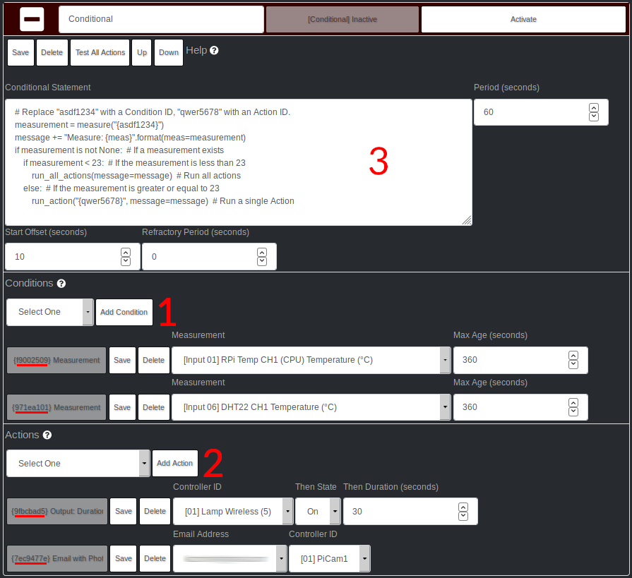
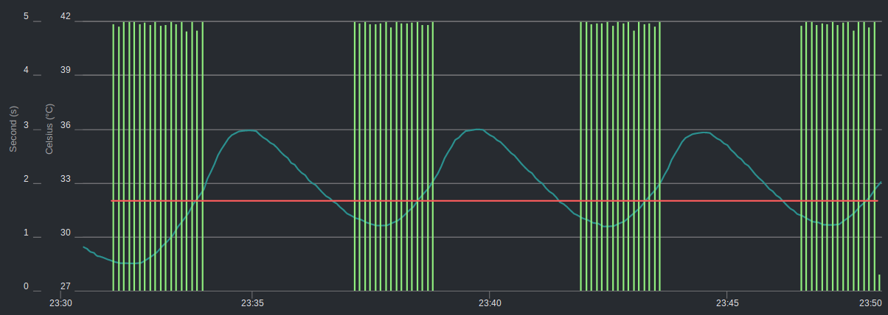
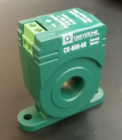

-------------
Mycodo Manual
-------------

.. contents::
    :depth: 3


About Mycodo
============

Mycodo is an automated monitoring and regulation system that was built
to run on the `Raspberry Pi <https://en.wikipedia.org/wiki/Raspberry_Pi>`__
(versions Zero, 1, 2, and 3).

Originally developed for cultivating edible mushrooms, Mycodo has grown
to do much more, including growing plants, culturing microorganisms,
maintaining animal environments (laboratory honey bee apiary, young
mammal and snake egg incubation, aquariums, herptariums), fermenting and
curing tobacco, fermenting and aging foods (beer, cheese, tempeh), cooking
food (sous-vide), and more.

The system comprises a backend (daemon) and a frontend (web server).
The backend acquires measurements from sensors and devices, and
coordinates a diverse set of responses to those measurements, including
the ability to modulate outputs (relays, PWM, wireless outlets),
regulate environmental conditions with electrical devices under PID
control (steady regulation or changing over time), schedule timers,
capture photos and stream video, trigger actions when measurements meet
certain conditions (modulate relays, execute commands, notify by email,
etc.), and more. The frontend is a web interface that enables easy
navigation and configuration from any browser-enabled device.

Brief Overview
==============

There are a number of different uses for Mycodo. Some users simply store
sensor measurements to monitor conditions remotely, others regulate the
environmental conditions of a physical space, while others capture
motion-activated or timelapse photography, and more.

Input controllers acquire measurements and store them in a
`time series database <https://en.wikipedia.org/wiki/Time_series_database>`__.
Measurements typically come from sensors, but may also be configured to
use the return value of linux or Python commands, or math equations,
making a very powerful system for acquiring and generating data.

Output controllers produce changes to the general input/output (GPIO)
pins or may be configured to execute linux or Python commands, enabling
a large number of potential uses. There are a few different types of
outputs: simple switching of pins (HIGH/LOW), generating pulse-width
modulated (PWM) signals, switching 315/433 MHz wireless outlets, as well as
executing linux and Python commands. The most common output is using a relay
to switch electrical devices on and off.

When Inputs and Outputs are combined, PID controllers may be used to
create a feedback loop that uses the Output device to modulate an
environmental condition the Input measures. Certain Inputs may be coupled
with certain Outputs to create a variety of different control and
regulation applications. Beyond simple regulation, Methods may be used
to create changing setpoints over time, enabling such things as thermal
cyclers, reflow ovens, environmental simulation for terrariums, food and
beverage fermentation or curing, and cooking food
(`sous-vide <https://en.wikipedia.org/wiki/Sous-vide>`__), to name a
few.

Triggers can be set to activate events based on specific dates and times or
according to durations of time. Conditionals are used to activates certain
events based on the truth of custom user statements (e.g. "Sensor1 > 23 and 10
< Sensor2 < 30").

Frequently Asked Questions
==========================

*What should I do if I have an issue?*

First, read though this manual to make sure you understand how the
system works and you're using the system properly. Also check out the
`Mycodo Wiki <https://github.com/kizniche/Mycodo/wiki>`__. You may even
want to look through recent `GitHub
Issues <https://github.com/kizniche/Mycodo/issues>`__. If you haven't
resolved your issue by this point, make a `New GitHub
Issue <https://github.com/kizniche/Mycodo/issues/new>`__ describing the
issue and attaching a sufficient amount of evidence (screenshots, log
files, etc.) to aid in diagnosing the issue.

--------------

*How do I add an Input (like a sensor) to the system if it's not
currently supported?*

Currently, adding an Input device that's not currently supported can be
achieved by two different methods:

The first involves editing several internal Mycodo files. There has been
effort to make the addition process as simple as possible. See the
`Adding Support for a New Input <https://github.com/kizniche/Mycodo/wiki/Adding-Support-for-a-New-Input>`__
Wiki page for how to do this. All changes will be lost during an
upgrade, therefore it is suggested to make a GitHub pull request with
your changes to permanently integrate them into Mycodo.

The second way to add an Input is to create a script that obtains and
returns a numerical value when executed in the linux system of the
Raspberry Pi. This script may be configured to be executed by a "Linux
Command" Input type. This will periodically execute the command and
store the returned value to the database for use with the rest of the
Mycodo system.

--------------

*How do I set up simple regulation?*

Here is how I generally set up Mycodo to monitor and regulate:

1. Determine what environmental condition you want to measure or
   regulate. Consider the devices that must be coupled to achieve this.
   For instance, temperature regulation require a temperature sensor as
   the input and an electric heater (or cooler) as the output.
2. Determine what relays you will need to power your electric devices.
   The Raspberry Pi is capable of directly switching relays (using a
   3.3-volt signal). Remember to select a relay that can handle the load
   and doesn't exceed the maximum current draw from the Raspberry Pi
   GPIO pins.
3. See the `Device Specific Information <#device-specific-information>`__ for information about
   what sensors are supported. Acquire sensor(s) and relay(s) and
   connect them to the Raspberry Pi according to the manufacturer’s
   instructions.
4. On the ``Setup -> Data`` page, create a new input using the drop-down to select
   the correct sensor or input device. Configure the input with the
   correct communication pins and other options. Activate the input to
   begin recording measurements to the database.
5. Go to the ``Data -> Live`` page to ensure there is
   recent data being acquired from the input.
6. On the ``Setup -> Output`` page, add a relay and configure the GPIO pin that
   switches it, whether the relay switches On when the signal is HIGH or
   LOW, and what state (On or Off) to set the relay when Mycodo starts.
   A pulse-width modulated (PWM) output may also be used, among others.
7. Test the relay by switching it On and Off or generating a PWM signal
   from the ``Setup -> Output`` page and make sure the device connected to the
   relay turns On when you select "On", and Off when you select "Off".
8. On the ``Setup -> Function`` page, create a PID controller with the
   appropriate input, output, and other parameters. Activate the PID
   controller.
9. On the ``Data -> Dashboard`` page, create a graph that includes
   the input measurement, the output that is being used by the PID, and
   the PID output and setpoint. This provides a good visualization for
   tuning the PID. See `Quick Setup Examples <#quick-setup-examples>`__
   for a greater detail of this process and tuning tips.

--------------

*Can I communicate with Mycodo from the command line?*

Yes, ~/Mycodo/mycodo/mycodo\_client.py has this functionality, but
there's a lot to be desired. See `Mycodo Client <#mycodo-client>`__,
but note it may not be the most current list of commands, so it's
recommended to execute ``mycodo-client --help`` to see a full list
of current options.

--------------

*Can I variably-control the speed of motors or other devices with the
PWM output signal from the PID?*

Yes, as long as you have the proper hardware to do that. The PWM signal
being produced by the PID should be handled appropriately, whether by a
fast-switching solid state relay, an
`AC modulation circuit <#schematics-for-ac-modulation>`__,
`DC modulation circuit <#schematics-for-dc-fan-control>`__, or something else.

--------------

*I have a PID controller that uses one temperature sensor. If this sensor stops working, my entire PID controller stops working. Is there a way to prevent this by setting up a second sensor to be used in case the first one fails?*

Yes, you can use as many sensors as you would like to create a redundant system so your PID doesn't stop working if one or more sensors fail. To do this, follow the below instructions:

1. Add and activate all your sensors. For this example, we will use three temperature sensors, Sensor1, Sensor2, and Sensor3, that return measurements in degrees Celsius.
2. Go to the ``Setup -> Data`` page and add the Math controller "Redundancy".
3. In the options of the Redundancy controller, set the Period, Start Offset, and Max Age.
4. In the options of the Redundancy controller, select Sensor1, Sensor2, and Sensor3 for the Input option and click Save.
5. In the options of the Redundancy controller, change the order you wish to use the sensors under Order of Use. For this example, we will use the default order (Sensor1, Sensor2, Sensor3).
6. In the options of the Redundancy controller, under Measurement Settings, select Celsius for the Measurement Unit and click Save under Measurement Settings.
7. Activate the Redundancy Math controller.
8. Go to the ``Data -> Live`` page and verify the Redundancy Math controller is working correctly by returning a value from one of the three selected Inputs. If the first sensor is working correctly, it should return this value. You can deactivate the first sensor (mimicking the first sensor stopped working) and see if the second sensor's value is then returned.
9. Go to the ``Setup -> Function`` page and select the new Redundancy Math controller for the PID Measurement option.

The PID controller will now use the measurement returned from the Redundancy Math controller, which in turn will acquire its measurement in the following way:

If a measurement can be found within the Max Age for Sensor1, the measurement for Sensor1 will be returned. If a measurement from Sensor1 could not be acquired, and if a measurement can be found within the Max Age for Sensor2, the measurement for Sensor2 will be returned. If a measurement from Sensor2 could not be acquired, and if a measurement can be found within the Max Age for Sensor3, the measurement for Sensor3 will be returned. If a measurement from Sensor3 could not be acquired, then the Redundancy Math controller will not return a measurement at all (indicating all three sensors are not working). It is advised to set up a Conditional to send a notification email to yourself if one or more measurements are unable to be acquired.

--------------

Upgrading
=========

``[Gear Icon] -> Upgrade``

If you already have Mycodo installed (version >= 4.0.0), you can perform
an upgrade to the latest
`Mycodo Release <https://github.com/kizniche/Mycodo/releases>`__ by either using
the Upgrade option in the web interface (recommended) or by issuing the
following command in a terminal. A log of the upgrade process is created
at ``/var/log/mycodo/mycodoupgrade.log``

.. code-block:: bash

    sudo /bin/bash ~/Mycodo/mycodo/scripts/upgrade_commands.sh upgrade

Features
========

The following sections describe the essential modules of Mycodo that can
be used to perform functions or communicate with other parts of Mycodo.
Each section performs specific tasks or groups of related tasks.

Mycodo Client
-------------

::

    pi@raspberry:~ $ mycodo-client --help
    usage: mycodo-client [-h] [--activatecontroller CONTROLLER ID]
                         [--deactivatecontroller CONTROLLER ID] [--pid_pause ID]
                         [--pid_hold ID] [--pid_resume ID] [--pid_get_setpoint ID]
                         [--pid_get_error ID] [--pid_get_integrator ID]
                         [--pid_get_derivator ID] [--pid_get_kp ID]
                         [--pid_get_ki ID] [--pid_get_kd ID]
                         [--pid_set_setpoint ID SETPOINT]
                         [--pid_set_integrator ID INTEGRATOR]
                         [--pid_set_derivator ID DERIVATOR] [--pid_set_kp ID KP]
                         [--pid_set_ki ID KI] [--pid_set_kd ID KD] [-c] [--ramuse]
                         [--input_force_measurements INPUTID]
                         [--lcd_backlight_on LCDID] [--lcd_backlight_off LCDID]
                         [--lcd_reset LCDID] [--output_state OUTPUTID]
                         [--output_currently_on OUTPUTID] [--outputoff OUTPUTID]
                         [--outputon OUTPUTID] [--duration SECONDS]
                         [--dutycycle DUTYCYCLE] [--trigger_action ACTIONID]
                         [--trigger_all_actions FUNCTIONID] [-t]

    Client for Mycodo daemon.

    optional arguments:
      -h, --help            show this help message and exit
      --activatecontroller CONTROLLER ID
                            Activate controller. Options: Conditional, LCD, Math,
                            PID, Input
      --deactivatecontroller CONTROLLER ID
                            Deactivate controller. Options: Conditional, LCD,
                            Math, PID, Input
      --pid_pause ID        Pause PID controller.
      --pid_hold ID         Hold PID controller.
      --pid_resume ID       Resume PID controller.
      --pid_get_setpoint ID
                            Get the setpoint value of the PID controller.
      --pid_get_error ID    Get the error value of the PID controller.
      --pid_get_integrator ID
                            Get the integrator value of the PID controller.
      --pid_get_derivator ID
                            Get the derivator value of the PID controller.
      --pid_get_kp ID       Get the Kp gain of the PID controller.
      --pid_get_ki ID       Get the Ki gain of the PID controller.
      --pid_get_kd ID       Get the Kd gain of the PID controller.
      --pid_set_setpoint ID SETPOINT
                            Set the setpoint value of the PID controller.
      --pid_set_integrator ID INTEGRATOR
                            Set the integrator value of the PID controller.
      --pid_set_derivator ID DERIVATOR
                            Set the derivator value of the PID controller.
      --pid_set_kp ID KP    Set the Kp gain of the PID controller.
      --pid_set_ki ID KI    Set the Ki gain of the PID controller.
      --pid_set_kd ID KD    Set the Kd gain of the PID controller.
      -c, --checkdaemon     Check if all active daemon controllers are running
      --ramuse              Return the amount of ram used by the Mycodo daemon
      --input_force_measurements INPUTID
                            Force acquiring measurements for Input ID
      --lcd_backlight_on LCDID
                            Turn on LCD backlight with LCD ID
      --lcd_backlight_off LCDID
                            Turn off LCD backlight with LCD ID
      --lcd_reset LCDID     Reset LCD with LCD ID
      --output_state OUTPUTID
                            State of output with output ID
      --output_currently_on OUTPUTID
                            How many seconds an output has currently been active
                            for
      --outputoff OUTPUTID  Turn off output with output ID
      --outputon OUTPUTID   Turn on output with output ID
      --duration SECONDS    Turn on output for a duration of time (seconds)
      --dutycycle DUTYCYCLE
                            Turn on PWM output for a duty cycle (%)
      --trigger_action ACTIONID
                            Trigger action with Action ID
      --trigger_all_actions FUNCTIONID
                            Trigger all actions belonging to Function with ID
      -t, --terminate       Terminate the daemon

Data
----

``Setup -> Data``

Data are individual pieces of information stored for later use. They may
be values acquired from sensors, signals from analog-to-digital controllers,
a response from a command, or even math performed on other data to produce
an average, to name a few. Add, configure, and activate Inputs to begin
recording measurements to the database and allow them to be used throughout
Mycodo.

Input
`````

Inputs, such as sensors, ADC signals, or even a response from a command,
enable measuring conditions in the environment or elsewhere, which will
be stored in a time-series database (InfluxDB). This database will provide
measurements for `Graphs <#graphs>`__, `LCDs <#lcds>`__,
`PID Controllers <#pid-controllers>`__,
`Conditional Statements <#conditional-statements>`__, and other parts of
Mycodo to operate from. Add, configure, and activate inputs to begin
recording measurements to the database and allow them to be used throughout
Mycodo.

Custom Inputs
'''''''''''''

Before discussing the built-in Inputs, it should be noted that there is an
Input import system in Mycodo that allows user-created Inputs to be used
in the Mycodo system. Custom Inputs can be uploaded on the
```Config -> Inputs``` ``Configure -> Inputs`` page. After import, they
will be available to use on the ``Setup -> Data`` page.

Additionally, I have another github repository devoted to Custom Inputs that
are not included in the built-in set. These can be found at
`kizniche/Mycodo-custom-inputs <https://github.com/kizniche/Mycodo-custom-inputs>`__.

Built-In Inputs
'''''''''''''''

In addition to several supported sensors and devices, a Linux command
may be specified that will be executed and the return value stored in
the measurement database to be used throughout the Mycodo system.

+-----------------------+-------------------------------------------------+
| Setting               | Description                                     |
+=======================+=================================================+
| Activate              | After the sensor has been properly configured,  |
|                       | activation begins acquiring measurements from   |
|                       | the sensor. Any activated conditional           |
|                       | statements will now being operating.            |
+-----------------------+-------------------------------------------------+
| Deactivate            | Deactivation stops measurements from being      |
|                       | acquired from the sensor. All associated        |
|                       | conditional statements will cease to operate.   |
+-----------------------+-------------------------------------------------+
| Save                  | Save the current configuration entered into the |
|                       | input boxes for a particular sensor.            |
+-----------------------+-------------------------------------------------+
| Delete                | Delete a particular sensor.                     |
+-----------------------+-------------------------------------------------+
| Acquire Measurements  | Force the input to conduct measurements and     |
| Now                   | them in the database.                           |
+-----------------------+-------------------------------------------------+
| Up/Down               | Move a particular sensor up or down in the      |
|                       | order displayed.                                |
+-----------------------+-------------------------------------------------+
| Power Output          | Select a output that powers the sensor. This    |
|                       | enables powering cycling (turn off then on)     |
|                       | when the sensor returns 3 consecutive errors to |
|                       | attempt to fix the issue. Transistors may also  |
|                       | be used instead of a relay (note: NPN           |
|                       | transistors are preferred over PNP for powering |
|                       | sensors).                                       |
+-----------------------+-------------------------------------------------+
| Location              | Depending on what sensor is being used, you     |
|                       | will need to either select a serial number      |
|                       | (DS18B20 temperature sensor), a GPIO pin (in    |
|                       | the case of sensors read by a GPIO), or an I2C  |
|                       | address. or other.                              |
+-----------------------+-------------------------------------------------+
| I2C Bus               | The bus to be used to communicate with the I2C  |
|                       | address.                                        |
+-----------------------+-------------------------------------------------+
| Period (seconds)      | After the sensor is successfully read and a     |
|                       | database entry is made, this is the duration of |
|                       | time waited until the sensor is measured again. |
+-----------------------+-------------------------------------------------+
| Measurement Unit      | Select the unit to save the measurement as      |
|                       | (only available for select measurements).       |
+-----------------------+-------------------------------------------------+
| Pre Output            | If you require a output to be activated before  |
|                       | a measurement is made (for instance, if you     |
|                       | have a pump that extracts air to a chamber      |
|                       | where the sensor resides), this is the output   |
|                       | number that will be activated. The output will  |
|                       | be activated for a duration defined by the Pre  |
|                       | Duration, then once the output turns off, a     |
|                       | measurement by the sensor is made.              |
+-----------------------+-------------------------------------------------+
| Pre Output Duration   | This is the duration of time that the Pre       |
| (seconds)             | Output runs for before the sensor measurement   |
|                       | is obtained.                                    |
+-----------------------+-------------------------------------------------+
| Pre Output During     | If enabled, the Pre Output stays on during the  |
| Measurement           | acquisition of a measurement. If disabled, the  |
|                       | Pre Output is turned off directly before        |
|                       | acquiring a measurement.                        |
+-----------------------+-------------------------------------------------+
| Command               | A linux command (executed as the user 'root')   |
|                       | that the return value becomes the measurement   |
+-----------------------+-------------------------------------------------+
| Command Measurement   | The measured condition (e.g. temperature,       |
|                       | humidity, etc.) from the linux command          |
+-----------------------+-------------------------------------------------+
| Command Units         | The units of the measurement condition from the |
|                       | linux command                                   |
+-----------------------+-------------------------------------------------+
| Edge                  | Edge sensors only: Select whether the Rising or |
|                       | Falling (or both) edges of a changing voltage   |
|                       | are detected. A number of devices to do this    |
|                       | when in-line with a circuit supplying a         |
|                       | 3.3-volt input signal to a GPIO, such as simple |
|                       | mechanical switch, a button, a magnet           |
|                       | (reed/hall) sensor, a PIR motion detector, and  |
|                       | more.                                           |
+-----------------------+-------------------------------------------------+
| Bounce Time (ms)      | Edge sensors only: This is the number of        |
|                       | milliseconds to bounce the input signal. This   |
|                       | is commonly called debouncing a signal [1]      |
|                       | and may be necessary if using a mechanical      |
|                       | circuit.                                        |
+-----------------------+-------------------------------------------------+
| Reset Period          | Edge sensors only: This is the period of time   |
| (seconds)             | after an edge detection that another edge will  |
|                       | not be recorded. This enables devices such as   |
|                       | PIR motion sensors that may stay activated for  |
|                       | longer periods of time.                         |
+-----------------------+-------------------------------------------------+
| Measurement           | Analog-to-digital converter only: The type of   |
|                       | measurement being acquired by the ADC. For      |
|                       | instance, if the resistance of a photocell is   |
|                       | being measured through a voltage divider, this  |
|                       | measurement would be "light".                   |
+-----------------------+-------------------------------------------------+
| Units                 | Analog-to-digital converter only: This is the   |
|                       | unit of the measurement. With the above example |
|                       | of "light" as the measurement, the unit may be  |
|                       | "lux" or "intensity".                           |
+-----------------------+-------------------------------------------------+
| BT Adapter            | The Bluetooth adapter to communicate with the   |
|                       | input.                                          |
+-----------------------+-------------------------------------------------+
| Clock Pin             | The GPIO (using BCM numbering) connected to the |
|                       | Clock pin of the ADC                            |
+-----------------------+-------------------------------------------------+
| CS Pin                | The GPIO (using BCM numbering) connected to the |
|                       | CS pin of the ADC                               |
+-----------------------+-------------------------------------------------+
| MISO Pin              | The GPIO (using BCM numbering) connected to the |
|                       | MISO pin of the ADC                             |
+-----------------------+-------------------------------------------------+
| MOSI Pin              | The GPIO (using BCM numbering) connected to the |
|                       | MOSI pin of the ADC                             |
+-----------------------+-------------------------------------------------+
| RTD Probe Type        | Select to measure from a PT100 or PT1000 probe. |
+-----------------------+-------------------------------------------------+
| Resistor Reference    | If your reference resistor is not the default   |
| (Ohm)                 | (400 Ohm for PT100, 4000 Ohm for PT1000), you   |
|                       | can manually set this value. Several            |
|                       | manufacturers now use 430 Ohm resistors on      |
|                       | their circuit boards, therefore it's            |
|                       | recommended to verify the accuracy of your      |
|                       | measurements and adjust this value if           |
|                       | necessary.                                      |
+-----------------------+-------------------------------------------------+
| Channel               | Analog-to-digital converter only: This is the   |
|                       | channel to obtain the voltage measurement from  |
|                       | the ADC.                                        |
+-----------------------+-------------------------------------------------+
| Gain                  | Analog-to-digital converter only: set the gain  |
|                       | when acquiring the measurement.                 |
+-----------------------+-------------------------------------------------+
| Sample Speed          | Analog-to-digital converter only: set the       |
|                       | sample speed (typically samples per second).    |
+-----------------------+-------------------------------------------------+
| Volts Min             | Analog-to-digital converter only: What is the   |
|                       | minimum voltage to use when scaling to produce  |
|                       | the unit value for the database. For instance,  |
|                       | if your ADC is not expected to measure below    |
|                       | 0.2 volts for your particular circuit, set this |
|                       | to "0.2".                                       |
+-----------------------+-------------------------------------------------+
| Volts Max             | Analog-to-digital converter only: This is       |
|                       | similar to the Min option above, however it is  |
|                       | setting the ceiling to the voltage range. Units |
|                       | Min Analog-to-digital converter only: This      |
|                       | value will be the lower value of a range that   |
|                       | will use the Min and Max Voltages, above, to    |
|                       | produce a unit output. For instance, if your    |
|                       | voltage range is 0.0 - 1.0 volts, and the unit  |
|                       | range is 1 - 60, and a voltage of 0.5 is        |
|                       | measured, in addition to 0.5 being stored in    |
|                       | the database, 30 will be stored as well. This   |
|                       | enables creating calibrated scales to use with  |
|                       | your particular circuit.                        |
+-----------------------+-------------------------------------------------+
| Units Max             | Analog-to-digital converter only: This is       |
|                       | similar to the Min option above, however it is  |
|                       | setting the ceiling to the unit range.          |
+-----------------------+-------------------------------------------------+
| Weighting             | The This is a number between 0 and 1 and        |
|                       | indicates how much the old reading affects the  |
|                       | new reading. It defaults to 0 which means the   |
|                       | old reading has no effect. This may be used to  |
|                       | smooth the data.                                |
+-----------------------+-------------------------------------------------+
| Pulses Per Rev        | The number of pulses for a complete revolution. |
+-----------------------+-------------------------------------------------+
| Port                  | The server port to be queried (Server Port Open |
|                       | input).                                         |
+-----------------------+-------------------------------------------------+
| Times to Check        | The number of times to attempt to ping a server |
|                       | (Server Ping input).                            |
+-----------------------+-------------------------------------------------+
| Deadline (seconds)    | The maximum amount of time to wait for each     |
|                       | ping attempt, after which 0 (offline) will be   |
|                       | returned (Server Ping input).                   |
+-----------------------+-------------------------------------------------+
| Number of Measurement | The number of unique measurements to store data |
|                       | for this input.                                 |
+-----------------------+-------------------------------------------------+
| Application ID        | The Application ID on The Things Network.       |
+-----------------------+-------------------------------------------------+
| App API Key           | The Application API Key on The Things Network.  |
+-----------------------+-------------------------------------------------+
| Device ID             | The Device ID of the Application on The Things  |
|                       | Network.                                        |
+-----------------------+-------------------------------------------------+

1. `Debouncing a signal <http://kylegabriel.com/projects/2016/02/morse-code-translator.html#debouncing>`__

The Things Network
''''''''''''''''''

`The Things Network <https://www.thethingsnetwork.org/>`__ (TTN) Input
module enables downloading of data from TTN if the Data Storage Integration
is enabled in your TTN Application. The Data Storage Integration will store
data for up to 7 days. Mycodo will download this data periodically and
store the measurements locally.

The payload on TTN must be properly decoded to variables that correspond to
the "Name" option under "Select Measurements", in the lower section of the
Input options. For instance, in your TTN Application, if a custom Payload
Format is selected, the decoder code may look like this:

.. code-block:: javascript

    function Decoder(bytes, port) {
        var decoded = {};
        var rawTemp = bytes[0] + bytes[1] * 256;
        decoded.temperature = sflt162f(rawTemp) * 100;
        return decoded;
    }

    function sflt162f(rawSflt16) {
        rawSflt16 &= 0xFFFF;
        if (rawSflt16 === 0x8000)
            return -0.0;
        var sSign = ((rawSflt16 & 0x8000) !== 0) ? -1 : 1;
        var exp1 = (rawSflt16 >> 11) & 0xF;
        var mant1 = (rawSflt16 & 0x7FF) / 2048.0;
        return sSign * mant1 * Math.pow(2, exp1 - 15);
    }

This will decode the 2-byte payload into a temperature float value with
the name "temperature". Set "Number of Measurements" to "1", then set the
"Name" for the first channel (CH0) to "temperature" and the "Measurement
Unit" to "Temperature: Celsius (°C)".

Upon activation of the Input, data will be downloaded for the past 7 days.
The latest data timestamp will be stored so any subsequent activation of the
Input will only download new data (since the last known timestamp).

There are several example Input modules that, in addition to storing the
measurements of a sensor in the influx database, will write the measurements
to a serial device. This is useful of you have a LoRaWAN transmitter connected
via serial to receive measurement information from Mycodo and transmit it to
a LoRaWAN gateway (and subsequently to The Things Network). The data on TTN
can then be downloaded elsewhere with the TTN Input. These example Input
modules are located in the following locations:

``~/Mycodo/mycodo/inputs/examples/bme280_ttn.py``

``~/Mycodo/mycodo/inputs/examples/k30_ttn.py``

For example, the following excerpt from ``bme_280.py`` will write a set of
comma-separated strings to the user-specified serial device with the first
string (the letter "B") used to denote the sensor/measurements, followed by
the actual measurements (humidity, pressure, and temperature, in this case).

.. code-block:: python

    string_send = 'B,{},{},{}'.format(
        return_dict[1]['value'],
        return_dict[2]['value'],
        return_dict[0]['value'])
    self.serial_send = self.serial.Serial(self.serial_device, 9600)
    self.serial_send.write(string_send.encode())

This is useful if multiple data strings are to be sent to the same serial device
(e.g. if both ``bme280_ttn.py`` and ``k30_ttn.py`` are being used at the same
time), allowing the serial device to distinguish what data is being received.

The full code used to decode both ``bme280_ttn.py`` and ``k30_ttn.py``, with
informative comments, is located at
``~/Mycodo/mycodo/inputs/examples/ttn_data_storage_decoder_example.js``.

These example Input modules may be modified to suit your needs and imported
into Mycodo through the ``Configure -> Inputs`` page. After import, they
will be available to use on the ``Setup -> Data`` page.

Math
````

Math controllers allow one or more Inputs to have math applied to
produce a new value that may be used within Mycodo.

Note: "Last" means the controller will only acquire the last
(latest) measurement in the database for performing math with. "Past"
means the controller will acquire all measurements from the present
until the "Max Age (seconds)" set by the user (e.g. if measurements
are acquired every 10 seconds, and a Max Age is set to 60 seconds,
there will on average be 6 measurements returned to have math performed).

+---------------------------------+-------------------------------------------------+
| Type                            | Description                                     |
+=================================+=================================================+
| Average (Last, Multiple         | Stores the statistical mean of the last         |
| Channels)                       | measurement of multiple selected measurement    |
|                                 | channels.                                       |
+---------------------------------+-------------------------------------------------+
| Average (Past, Single Channel)  | Stores the statistical mean of one selected     |
|                                 | measurement channel over a duration of time     |
|                                 | determined by the Max Age (seconds) option.     |
+---------------------------------+-------------------------------------------------+
| Sum (Last, Multiple Channels)   | Stores the sum of multiple selected             |
|                                 | measurement channels.                           |
+---------------------------------+-------------------------------------------------+
| Sum (Past, Single Channel)      | Stores the sum of one selected measurement      |
|                                 | channel over a duration of time determined by   |
|                                 | the Max Age(seconds) option.                    |
+---------------------------------+-------------------------------------------------+
| Difference                      | Stores the mathematical difference (value\_1 -  |
|                                 | value\_2).                                      |
+---------------------------------+-------------------------------------------------+
| Equation                        | Stores the calculated value of an equation.     |
+---------------------------------+-------------------------------------------------+
| Redundancy                      | Select multiple Inputs and if one input isn't   |
|                                 | available, the next measurement will be used.   |
|                                 | For example, this is useful if an Input stops   |
|                                 | but you don't want a PID controller to stop     |
|                                 | working if there is another measurement that    |
|                                 | can be used. More than one Input can be         |
|                                 | and the preferred Order of Use can be defined.  |
+---------------------------------+-------------------------------------------------+
| Verification                    | Ensures the greatest difference between any     |
|                                 | selected Inputs is less than Max Difference,    |
|                                 | and if so, stores the average of the selected   |
|                                 | measurements.                                   |
+---------------------------------+-------------------------------------------------+
| Median                          | Stores the statistical median from the selected |
|                                 | measurements.                                   |
+---------------------------------+-------------------------------------------------+
| Maximum                         | Stores the largest measurement from the         |
|                                 | selected measurements.                          |
+---------------------------------+-------------------------------------------------+
| Minimum                         | Stores the smallest measurement from the        |
|                                 | selected measurements.                          |
+---------------------------------+-------------------------------------------------+
| Humidity                        | Calculates and stores the percent relative      |
|                                 | humidity from the dry-bulb and wet-bulb         |
|                                 | temperatures, and optional pressure.            |
+---------------------------------+-------------------------------------------------+


+-----------------------+-------------------------------------------------+
| Setting               | Description                                     |
+=======================+=================================================+
| Input                 | Select the Inputs to use with the particular    |
|                       | Math controller                                 |
+-----------------------+-------------------------------------------------+
| Period (seconds)      | The duration of time between calculating and    |
|                       | storing a new value                             |
+-----------------------+-------------------------------------------------+
| Max Age (seconds)     | The maximum allowed age of the Input            |
|                       | measurements. If an Input measurement is older  |
|                       | than this period, the calculation is cancelled  |
|                       | and the new value is not stored in the          |
|                       | database. Consequently, if another controller   |
|                       | has a Max Age set and cannot retrieve a current |
|                       | Math value, it will cease functioning. A PID    |
|                       | controller, for instance, may stop regulating   |
|                       | if there is no new Math value created,          |
|                       | preventing the PID controller from continuing   |
|                       | to run when it should not.                      |
+-----------------------+-------------------------------------------------+
| Start Offset (seconds)| Wait this duration before attempting the first  |
|                       | calculation/measurement.                        |
+-----------------------+-------------------------------------------------+
| Measurement           | This is the condition being measured. For       |
|                       | instance, if all of the selected measurements   |
|                       | are temperature, this should also be            |
|                       | temperature. A list of the pre-defined          |
|                       | measurements that may be used is below.         |
+-----------------------+-------------------------------------------------+
| Units                 | This is the units to display along with the     |
|                       | measurement, on Graphs. If a pre-defined        |
|                       | measurement is used, this field will default to |
|                       | the units associated with that measurement.     |
+-----------------------+-------------------------------------------------+
| Reverse Equation      | For Difference calculations, this will reverse  |
|                       | the equation order, from ``value_1 - value_2``  |
|                       | to ``value_2 - value_1``.                       |
+-----------------------+-------------------------------------------------+
| Absolute Value        | For Difference calculations, this will yield an |
|                       | absolute value (positive number).               |
+-----------------------+-------------------------------------------------+
| Max Difference        | If the difference between any selected Input is |
|                       | greater than this value, no new value will be   |
|                       | stored in the database.                         |
+-----------------------+-------------------------------------------------+
| Dry-Bulb Temperature  | The measurement that will serve as the dry-bulb |
|                       | temperature (this is the warmer of the two      |
|                       | temperature measurements)                       |
+-----------------------+-------------------------------------------------+
| Wet-Bulb Temperature  | The measurement that will serve as the wet-bulb |
|                       | temperature (this is the colder of the two      |
|                       | temperature measurements)                       |
+-----------------------+-------------------------------------------------+
| Pressure              | This is an optional pressure measurement that   |
|                       | can be used to calculate the percent relative   |
|                       | humidity. If disabled, a default 101325 Pa will |
|                       | be used in the calculation.                     |
+-----------------------+-------------------------------------------------+
| Equation              | An equation that will be solved with Python's   |
|                       | eval() function. Let "x" represent the input    |
|                       | value. Valid equation symbols include: + - \* / |
|                       | ^                                               |
+-----------------------+-------------------------------------------------+
| Order of Use          | This is the order in which the selected Inputs  |
|                       | will be used. This must be a comma separated    |
|                       | list of Input IDs (integers, not UUIDs).        |
+-----------------------+-------------------------------------------------+

Output
------

``Setup -> Output``

Outputs are various signals that can be generated that operate devices.
An output can be a PWM signal, a simple HIGH/LOW signal to operate a
relay, a 315/433 MHz signal to switch a radio frequency-operated relay,
driving of pumps and motors, or an execution of a linux or Python command,
to name a few.


+-----------------------+-------------------------------------------------+
| Setting               | Description                                     |
+=======================+=================================================+
| Pin                   | This is the GPIO that will be the signal to the |
|                       | output, using BCM numbering.                    |
+-----------------------+-------------------------------------------------+
| WiringPi Pin          | This is the GPIO that will be the signal to the |
|                       | output, using WiringPi numbering.               |
+-----------------------+-------------------------------------------------+
| On State              | This is the state of the GPIO to signal the     |
|                       | output to turn the device on. HIGH will send a  |
|                       | 3.3-volt signal and LOW will send a 0-volt      |
|                       | signal. If you output completes the circuit     |
|                       | (and the device powers on) when a 3.3-volt      |
|                       | signal is sent, then set this to HIGH. If the   |
|                       | device powers when a 0-volt signal is sent, set |
|                       | this to LOW.                                    |
+-----------------------+-------------------------------------------------+
| Protocol              | This is the protocol to use to transmit via     |
|                       | 315/433 MHz. Default is 1, but if this doesn't  |
|                       | work, increment the number.                     |
+-----------------------+-------------------------------------------------+
| UART Device           | The UART device connected to the device.        |
+-----------------------+-------------------------------------------------+
| Baud Rate             | The baud rate of the UART device.               |
+-----------------------+-------------------------------------------------+
| I2C Address           | The I2C address of the device.                  |
+-----------------------+-------------------------------------------------+
| I2C Bus               | The I2C bus the device is connected to.         |
+-----------------------+-------------------------------------------------+
| Output Mode           | The Output mode, if supported.                  |
+-----------------------+-------------------------------------------------+
| Flow Rate             | The flow rate to dispense the volume (ml/min).  |
+-----------------------+-------------------------------------------------+
| Pulse Length          | This is the pulse length to transmit via        |
|                       | 315/433 MHz. Default is 189 ms.                 |
+-----------------------+-------------------------------------------------+
| Bit Length            | This is the bit length to transmit via 315/433  |
|                       | MHz. Default is 24-bit.                         |
+-----------------------+-------------------------------------------------+
| On Command            | This is the command used to turn the output on. |
|                       | For wireless relays, this is the numerical      |
|                       | command to be transmitted, and for command      |
|                       | outputs this is the command to be executed.     |
|                       | Commands may be for the linux terminal or       |
|                       | Python 3 (depending on which output type        |
|                       | selected).                                      |
+-----------------------+-------------------------------------------------+
| Off Command           | This is the command used to turn the output     |
|                       | off. For wireless relays, this is the numerical |
|                       | command to be transmitted, and for command      |
|                       | outputs this is the command to be executed.     |
|                       | Commands may be for the linux terminal or       |
|                       | Python 3 (depending on which output type        |
|                       | selected).                                      |
+-----------------------+-------------------------------------------------+
| PWM Command           | This is the command used to set the duty cycle. |
|                       | The string "((duty\_cycle))" in the command     |
|                       | will be replaced with the actual duty cycle     |
|                       | before the command is executed. Ensure          |
|                       | "((duty\_cycle))" is included in your command   |
|                       | for this feature to work correctly. Commands    |
|                       | may be for the linux terminal or Python 3       |
|                       | (depending on which output type selected).      |
+-----------------------+-------------------------------------------------+
| Current Draw (amps)   | The is the amount of current the device powered |
|                       | by the output draws. Note: this value should be |
|                       | calculated based on the voltage set in the      |
|                       | `Energy Usage                                   |
|                       | Settings <#energy-usage-settings>`__.           |
+-----------------------+-------------------------------------------------+
| Startup State         | This specifies whether the output should be ON  |
|                       | or OFF when mycodo initially starts. Some       |
|                       | outputs have an additional option 'Neither'     |
|                       | which will not issue an on or off command when  |
|                       | Mycodo starts or stops.                         |
+-----------------------+-------------------------------------------------+
| Shutdown State        | This specifies whether the output should be ON  |
|                       | or OFF when mycodo initially shuts down.        |
|                       | Some outputs have an additional option          |
|                       | 'Neither' which will not issue an on or off     |
|                       | command when Mycodo starts or stops.            |
+-----------------------+-------------------------------------------------+
| Trigger at Startup    | Select to enable triggering Functions (such as  |
|                       | Output Triggers) when Mycodo starts and if      |
|                       | Start State is set to ON.                       |
+-----------------------+-------------------------------------------------+
| Seconds to turn On    | This is a way to turn a output on for a         |
|                       | specific duration of time. This can be useful   |
|                       | for testing the outputs and powered devices or  |
|                       | the measured effects a device may have on an    |
|                       | environmental condition.                        |
+-----------------------+-------------------------------------------------+

PWM
```

Pulse-width modulation (PWM) is a modulation technique used to encode a
message into a pulsing signal, at a specific frequency in Hertz (Hz).
The average value of voltage (and current) fed to the load is controlled
by turning the switch between supply and load on and off at a fast rate.
The longer the switch is on compared to the off periods, the higher the
total power supplied to the load.

The PWM switching frequency has to be much higher than what would affect
the load (the device that uses the power), which is to say that the
resultant waveform perceived by the load must be as smooth as possible.
The rate (or frequency) at which the power supply must switch can vary
greatly depending on load and application, for example

    Switching has to be done several times a minute in an electric
    stove; 120 Hz in a lamp dimmer; between a few kilohertz (kHz) to
    tens of kHz for a motor drive; and well into the tens or hundreds of
    kHz in audio amplifiers and computer power supplies.

The term duty cycle describes the proportion of 'on' time to the regular
interval or 'period' of time; a low duty cycle corresponds to low power,
because the power is off for most of the time. Duty cycle is expressed
in percent, 100% being fully on.

PWM pins can be set up on the ``Setup -> Output``` page, then it may be used by a PWM
PID Controller.

+-----------------------+-------------------------------------------------+
| Setting               | Description                                     |
+=======================+=================================================+
| Library               | Select the method for producing the PWM signal. |
|                       | Hardware pins can produce up to a 30 MHz PWM    |
|                       | signal, while any other (non-hardware PWM) pin  |
|                       | can produce up to a 40 kHz PWM signal. See the  |
|                       | table, below, for the hardware pins on various  |
|                       | Pi boards.                                      |
+-----------------------+-------------------------------------------------+
| BCM Pin               | This is the GPIO that will output the PWM       |
|                       | signal, using BCM numbering.                    |
+-----------------------+-------------------------------------------------+
| Hertz                 | This is frequency of the PWM signal.            |
+-----------------------+-------------------------------------------------+
| Duty Cycle            | This is the proportion of the time on to the    |
|                       | time off, expressed in percent (0 - 100).       |
+-----------------------+-------------------------------------------------+
| Current Draw (amps)   | This is the current draw, in amps, when the     |
|                       | duty cycle is 100%. Note: this value should be  |
|                       | calculated based on the voltage set in the      |
|                       | `Energy Usage                                   |
|                       | Settings <#energy-usage-settings>`__.           |
+-----------------------+-------------------------------------------------+

Non-hardware PWM Pins
'''''''''''''''''''''

When using non-hardware PWM pins, there are only certain frequencies
that can be used. These frequencies in Hertz are 40000, 20000, 10000,
8000, 5000, 4000, 2500, 2000, 1600, 1250, 1000, 800, 500, 400, 250, 200,
100, and 50 Hz. If you attempt to set a frequency that is not listed
here, the nearest frequency from this list will be used.

Hardware PWM Pins
'''''''''''''''''

The exact frequency may be set when using hardware PWM pins. The same
PWM channel is available on multiple GPIO. The latest frequency and duty
cycle setting will be used by all GPIO pins which share a PWM channel.

+-----------+---------------+-----------------------------+
| BCM Pin   | PWM Channel   | Raspberry Pi Version        |
+===========+===============+=============================+
| 12        | 0             | All models except A and B   |
+-----------+---------------+-----------------------------+
| 13        | 1             | All models except A and B   |
+-----------+---------------+-----------------------------+
| 18        | 0             | All models                  |
+-----------+---------------+-----------------------------+
| 19        | 1             | All models except A and B   |
+-----------+---------------+-----------------------------+
| 40        | 0             | Compute module only         |
+-----------+---------------+-----------------------------+
| 41        | 1             | Compute module only         |
+-----------+---------------+-----------------------------+
| 45        | 1             | Compute module only         |
+-----------+---------------+-----------------------------+
| 52        | 0             | Compute module only         |
+-----------+---------------+-----------------------------+
| 53        | 1             | Compute module only         |
+-----------+---------------+-----------------------------+

Schematics for DC Fan Control
'''''''''''''''''''''''''''''

Below are hardware schematics that enable controlling direct current
(DC) fans from the PWM output from Mycodo.

PWM output controlling a 12-volt DC fan (such as a PC fan)

|Schematic: PWM output modulating alternating current (AC) at 1% duty
cycle (1of2)| 

Schematics for AC Modulation
''''''''''''''''''''''''''''

Below are hardware schematics that enable the modulation of alternating
current (AC) from the PWM output from Mycodo.

PWM output modulating alternating current (AC) at 1% duty cycle

|Schematic: PWM output modulating alternating current (AC) at 1% duty
cycle (2of2)| 

PWM output modulating alternating current (AC) at 50% duty cycle

|Schematic: PWM output modulating alternating current (AC) at 50% duty
cycle| 

PWM output modulating alternating current (AC) at 99% duty cycle

|Schematic: PWM output modulating alternating current (AC) at 99% duty
cycle| 

Relays
``````

Relays are electromechanical or solid-state devices that enable a small
voltage signal (such as from a microprocessor) to activate a much larger
voltage, without exposing the low-voltage system to the dangers of the
higher voltage.

Add and configure outputs in the Output tab. Outputs must be properly
set up before PID regulation can be achieved.

Wired
'''''

To set up a wired relay, set the "GPIO Pin" to the BCM GPIO number of
each pin that activates each relay. *On Trigger* should be set to the
signal that activates the relay (the device attached to the relay turns
on). If your relay activates when the potential across the coil is
0-volts, set *On Trigger* to "Low", otherwise if your relay activates
when the potential across the coil is 3.3-volts (or whatever switching
voltage you are using, if not being driven by the GPIO pin), set it to
"High".

Wireless
''''''''

Certain 315/433 MHz wireless relays may be used, however you will need to
set the pin of the transmitter (using BCM numbering), pulse length,
bit length, protocol, on command, and off command. To determine your On
and Off commands, connect a 315/433 MHz receiver to your Pi, then run the
receiver script, below, replacing 17 with the pin your receiver is
connected to (using BCM numbering), and press one of the buttons on your
remote (either on or off) to detect the numeric code associated with that button.

.. code-block:: python

    sudo ~/Mycodo/env/bin/python ~/Mycodo/mycodo/devices/wireless_rpi_rf.py -d 2 -g 17

433 MHz wireless relays have been successfully tested with SMAKN 433MHz
RF Transmitters/Receivers and Etekcity Wireless Remote Control
Electrical Outlets (see
`Issue 88 <https://github.com/kizniche/Mycodo/issues/88>`__ for more
information). If you have a 315/433 MHz transmitter/receiver and a wireless
relay that does not work with the current code, submit a
`new issue <https://github.com/kizniche/Mycodo/issues/new>`__ with details of
your hardware.

Command
'''''''

Another option for output control is to execute a terminal command when
the output is turned on, off, or a duty cycle. Commands will be executed
as the user 'root'.

Wireless and Command Output Note: Since the wireless protocol only
allows 1-way communication to 315/433 MHz devices, wireless relays are
assumed to be off until they are turned on, and therefore will appear
red (off) when added. If a wireless relay is turned off or on outside
Mycodo (by a remote, for instance), Mycodo will ***not*** be able to
determine the state of the relay and will indicate whichever state the
relay was last. This is, if Mycodo turns the wireless relay on, and a
remote is used to turn the relay off, Mycodo will still assume the relay
is on.

Pumps
`````

Currently, only one pump is supported, the `Atlas Scientific EZO-PMP peristaltic pump <#atlas-scientific-ezo-pmp>`__.

Function
--------

``Setup -> Function``

Functions couple Inputs with Outputs to perform specific tasks. For
example, this could be regulation of temperature with a temperature
sensor and heater with a PID Controller.

PID Controller
``````````````

A
`proportional-derivative-integral (PID) controller <https://en.wikipedia.org/wiki/PID_controller>`__
is a control loop feedback mechanism used throughout industry for controlling
systems. It efficiently brings a measurable condition, such as the
temperature, to a desired state and maintains it there with little
overshoot and oscillation. A well-tuned PID controller will raise to the
setpoint quickly, have minimal overshoot, and maintain the setpoint with
little oscillation.

PID settings may be changed while the PID is activated and the new
settings will take effect immediately. If settings are changed while the
controller is paused, the values will be used once the controller
resumes operation.

+-----------------------+-------------------------------------------------+
| Setting               | Description                                     |
+=======================+=================================================+
| Activate/Deactivate   | Turn a particular PID controller on or off.     |
+-----------------------+-------------------------------------------------+
| Pause                 | When paused, the control variable will not be   |
|                       | updated and the PID will not turn on the        |
|                       | associated outputs. Settings can be changed     |
|                       | without losing current PID output values.       |
+-----------------------+-------------------------------------------------+
| Hold                  | When held, the control variable will not be     |
|                       | updated but the PID will turn on the associated |
|                       | outputs, Settings can be changed without losing |
|                       | current PID output values.                      |
+-----------------------+-------------------------------------------------+
| Resume                | Resume a PID controller from being held or      |
|                       | paused.                                         |
+-----------------------+-------------------------------------------------+
| Direction             | This is the direction that you wish to          |
|                       | regulate. For example, if you only require the  |
|                       | temperature to be raised, set this to "Up," but |
|                       | if you require regulation up and down, set this |
|                       | to "Both."                                      |
+-----------------------+-------------------------------------------------+
| Period                | This is the duration between when the PID       |
|                       | acquires a measurement, the PID is updated, and |
|                       | the output is modulated.                        |
+-----------------------+-------------------------------------------------+
| Start Offset (seconds)| Wait this duration before attempting the first  |
|                       | calculation/measurement.                        |
+-----------------------+-------------------------------------------------+
| Max Age               | The time (in seconds) that the sensor           |
|                       | measurement age is required to be less than. If |
|                       | the measurement is not younger than this age,   |
|                       | the measurement is thrown out and the PID will  |
|                       | not actuate the output. This is a safety        |
|                       | measure to ensure the PID is only using recent  |
|                       | measurements.                                   |
+-----------------------+-------------------------------------------------+
| Setpoint              | This is the specific point you would like the   |
|                       | environment to be regulated at. For example, if |
|                       | you would like the humidity regulated to 60%,   |
|                       | enter 60.                                       |
+-----------------------+-------------------------------------------------+
| Band (+/- Setpoint)   | Hysteresis option. If set to a non-0 value, the |
|                       | setpoint will become a band, which will be      |
|                       | between the band\_max=setpoint+band and         |
|                       | band\_min=setpoint-band. If Raising, the PID    |
|                       | will raise above band\_max, then wait until the |
|                       | condition falls below band\_min to resume       |
|                       | regulation. If Lowering, the PID will lower     |
|                       | below band\_min, then wait until the condition  |
|                       | rises above band\_max to resume regulating. If  |
|                       | set to Both, regulation will only occur to the  |
|                       | outside min and max of the band, and cease when |
|                       | within the band. Set to 0 to disable            |
|                       | Hysteresis.                                     |
+-----------------------+-------------------------------------------------+
| Store Lower as        | Checking this will store all output variables   |
| Negative              | (PID and output duration/duty cycle) as a       |
|                       | negative values in the measurement database.    |
|                       | This is useful for displaying graphs that       |
|                       | indicate whether the PID is currently lowering  |
|                       | or raising. Disable this if you desire all      |
|                       | positive values to be stored in the measurement |
|                       | database.                                       |
+-----------------------+-------------------------------------------------+
| K\ :sub:`P` Gain      | Proportional coefficient (non-negative).        |
|                       | Accounts for present values of the error. For   |
|                       | example, if the error is large and positive,    |
|                       | the control output will also be large and       |
|                       | positive.                                       |
+-----------------------+-------------------------------------------------+
| K\ :sub:`I` Gain      | Integral coefficient (non-negative). Accounts   |
|                       | for past values of the error. For example, if   |
|                       | the current output is not sufficiently strong,  |
|                       | the integral of the error will accumulate over  |
|                       | time, and the controller will respond by        |
|                       | applying a stronger action.                     |
+-----------------------+-------------------------------------------------+
| K\ :sub:`D` Gain      | Derivative coefficient (non-negative). Accounts |
|                       | for predicted future values of the error, based |
|                       | on its current rate of change.                  |
+-----------------------+-------------------------------------------------+
| Integrator Min        | The minimum allowed integrator value, for       |
|                       | calculating Ki\_total: (Ki\_total = Ki \*       |
|                       | integrator; and PID output = Kp\_total +        |
|                       | Ki\_total + Kd\_total)                          |
+-----------------------+-------------------------------------------------+
| Integrator Max        | The maximum allowed integrator value, for       |
|                       | calculating Ki\_total: (Ki\_total = Ki \*       |
|                       | integrator; and PID output = Kp\_total +        |
|                       | Ki\_total + Kd\_total)                          |
+-----------------------+-------------------------------------------------+
| Output (Raise)        | This is the output that will cause the          |
|                       | particular environmental condition to rise. In  |
|                       | the case of raising the temperature, this may   |
|                       | be a heating pad or coil.                       |
+-----------------------+-------------------------------------------------+
| Min Duration (raise)  | This is the minimum that the PID output must be |
|                       | before the Up Output turns on. If the PID       |
|                       | output exceeds this minimum, the Up Output will |
|                       | turn on for the PID output number of seconds.   |
+-----------------------+-------------------------------------------------+
| Max Duration (raise)  | This is the maximum duration the Up Output is   |
|                       | allowed to turn on for. If the PID output       |
|                       | exceeds this number, the Up Output will turn on |
|                       | for no greater than this duration of time.      |
+-----------------------+-------------------------------------------------+
| Output (Lower)        | This is the output that will cause the          |
|                       | particular environmental condition to lower. In |
|                       | the case of lowering the CO2, this may be an    |
|                       | exhaust fan.                                    |
+-----------------------+-------------------------------------------------+
| Min Duration (lower)  | This is the minimum that the PID output must be |
|                       | before the Down Output turns on. If the PID     |
|                       | output exceeds this minimum, the Down Output    |
|                       | will turn on for the PID output number of       |
|                       | seconds.                                        |
+-----------------------+-------------------------------------------------+
| Max Duration (lower)  | This is the maximum duration the Down Output is |
|                       | allowed to turn on for. if the PID output       |
|                       | exceeds this number, the Down Output will turn  |
|                       | on for no greater than this duration of time.   |
+-----------------------+-------------------------------------------------+
| Setpoint Tracking     | Set a method to change the setpoint over time.  |
| Method                |                                                 |
+-----------------------+-------------------------------------------------+


PID Autotune
''''''''''''

The Autotune feature is useful for determining appropriate Kp, Ki, and Kd
gains of a PID controller. The autotuner will manipulate an output and measure the response in
the environment being measured by a sensor. It will take several cycles
to determine the gains according to several rules. In order to use this
feature, the PID controller must be properly configured, and a Noise Band
and Outstep selected, then select "Start Autotune". The output of the
autotuner will appear in the daemon log (Config -> Mycodo Logs -> Daemon).
While the autotune is being performed, it is recommended to create a graph
that includes the Input, Output, and PID Setpoint/Output in order to see
what the PID Autotuner is doing and to notice any issues. If your autotune
is taking a long time to complete, there may not be enough stability in
the system being manipulated to calculate a reliable set of PID gains.
This may be because there are too many disturbances to the system, or
conditions are changing too rapidly to acquire consistent measurement
oscillations. If this is the case, try modifying your system to reduce
disturbances. Once the autotune successfully completes, disturbances may
be reintroduced in order to further tune the PID controller to handle them.

+-----------------------+-------------------------------------------------+
| Setting               | Description                                     |
+=======================+=================================================+
| Noise Band            | This is the amount above the setpoint the       |
|                       | measured condition must reach before the output |
|                       | turns off. This is also how much below the      |
|                       | setpoint the measured condition must fall       |
|                       | before the output turns back on.                |
+-----------------------+-------------------------------------------------+
| Outstep               | This is how many seconds the output will turn   |
|                       | on every PID Period. For instance, to autotune  |
|                       | with 50% power, ensure the Outstep is half the  |
|                       | value of the PID Period.                        |
+-----------------------+-------------------------------------------------+

Typical graph output will look like this:

|PID Autotune Output|

And typical Daemon Log output will look like this:

::

    2018-08-04 23:32:20,876 - mycodo.pid_3b533dff - INFO - Activated in 187.2 ms
    2018-08-04 23:32:20,877 - mycodo.pid_autotune - INFO - PID Autotune started
    2018-08-04 23:33:50,823 - mycodo.pid_autotune - INFO -
    2018-08-04 23:33:50,830 - mycodo.pid_autotune - INFO - Cycle: 19
    2018-08-04 23:33:50,831 - mycodo.pid_autotune - INFO - switched state: relay step down
    2018-08-04 23:33:50,832 - mycodo.pid_autotune - INFO - input: 32.52
    2018-08-04 23:36:00,854 - mycodo.pid_autotune - INFO -
    2018-08-04 23:36:00,860 - mycodo.pid_autotune - INFO - Cycle: 45
    2018-08-04 23:36:00,862 - mycodo.pid_autotune - INFO - found peak: 34.03
    2018-08-04 23:36:00,863 - mycodo.pid_autotune - INFO - peak count: 1
    2018-08-04 23:37:20,802 - mycodo.pid_autotune - INFO -
    2018-08-04 23:37:20,809 - mycodo.pid_autotune - INFO - Cycle: 61
    2018-08-04 23:37:20,810 - mycodo.pid_autotune - INFO - switched state: relay step up
    2018-08-04 23:37:20,811 - mycodo.pid_autotune - INFO - input: 31.28
    2018-08-04 23:38:30,867 - mycodo.pid_autotune - INFO -
    2018-08-04 23:38:30,874 - mycodo.pid_autotune - INFO - Cycle: 75
    2018-08-04 23:38:30,876 - mycodo.pid_autotune - INFO - found peak: 32.17
    2018-08-04 23:38:30,878 - mycodo.pid_autotune - INFO - peak count: 2
    2018-08-04 23:38:40,852 - mycodo.pid_autotune - INFO -
    2018-08-04 23:38:40,858 - mycodo.pid_autotune - INFO - Cycle: 77
    2018-08-04 23:38:40,860 - mycodo.pid_autotune - INFO - switched state: relay step down
    2018-08-04 23:38:40,861 - mycodo.pid_autotune - INFO - input: 32.85
    2018-08-04 23:40:50,834 - mycodo.pid_autotune - INFO -
    2018-08-04 23:40:50,835 - mycodo.pid_autotune - INFO - Cycle: 103
    2018-08-04 23:40:50,836 - mycodo.pid_autotune - INFO - found peak: 33.93
    2018-08-04 23:40:50,836 - mycodo.pid_autotune - INFO - peak count: 3
    2018-08-04 23:42:05,799 - mycodo.pid_autotune - INFO -
    2018-08-04 23:42:05,805 - mycodo.pid_autotune - INFO - Cycle: 118
    2018-08-04 23:42:05,806 - mycodo.pid_autotune - INFO - switched state: relay step up
    2018-08-04 23:42:05,807 - mycodo.pid_autotune - INFO - input: 31.27
    2018-08-04 23:43:15,816 - mycodo.pid_autotune - INFO -
    2018-08-04 23:43:15,822 - mycodo.pid_autotune - INFO - Cycle: 132
    2018-08-04 23:43:15,824 - mycodo.pid_autotune - INFO - found peak: 32.09
    2018-08-04 23:43:15,825 - mycodo.pid_autotune - INFO - peak count: 4
    2018-08-04 23:43:25,790 - mycodo.pid_autotune - INFO -
    2018-08-04 23:43:25,796 - mycodo.pid_autotune - INFO - Cycle: 134
    2018-08-04 23:43:25,797 - mycodo.pid_autotune - INFO - switched state: relay step down
    2018-08-04 23:43:25,798 - mycodo.pid_autotune - INFO - input: 32.76
    2018-08-04 23:45:30,802 - mycodo.pid_autotune - INFO -
    2018-08-04 23:45:30,808 - mycodo.pid_autotune - INFO - Cycle: 159
    2018-08-04 23:45:30,810 - mycodo.pid_autotune - INFO - found peak: 33.98
    2018-08-04 23:45:30,811 - mycodo.pid_autotune - INFO - peak count: 5
    2018-08-04 23:45:30,812 - mycodo.pid_autotune - INFO -
    2018-08-04 23:45:30,814 - mycodo.pid_autotune - INFO - amplitude: 0.9099999999999989
    2018-08-04 23:45:30,815 - mycodo.pid_autotune - INFO - amplitude deviation: 0.06593406593406595
    2018-08-04 23:46:40,851 - mycodo.pid_autotune - INFO -
    2018-08-04 23:46:40,857 - mycodo.pid_autotune - INFO - Cycle: 173
    2018-08-04 23:46:40,858 - mycodo.pid_autotune - INFO - switched state: relay step up
    2018-08-04 23:46:40,859 - mycodo.pid_autotune - INFO - input: 31.37
    2018-08-04 23:47:55,860 - mycodo.pid_autotune - INFO -
    2018-08-04 23:47:55,866 - mycodo.pid_autotune - INFO - Cycle: 188
    2018-08-04 23:47:55,868 - mycodo.pid_autotune - INFO - found peak: 32.36
    2018-08-04 23:47:55,869 - mycodo.pid_autotune - INFO - peak count: 6
    2018-08-04 23:47:55,870 - mycodo.pid_autotune - INFO -
    2018-08-04 23:47:55,871 - mycodo.pid_autotune - INFO - amplitude: 0.9149999999999979
    2018-08-04 23:47:55,872 - mycodo.pid_autotune - INFO - amplitude deviation: 0.032786885245900406
    2018-08-04 23:47:55,873 - mycodo.pid_3b533dff - INFO - time:  16 min
    2018-08-04 23:47:55,874 - mycodo.pid_3b533dff - INFO - state: succeeded
    2018-08-04 23:47:55,874 - mycodo.pid_3b533dff - INFO -
    2018-08-04 23:47:55,875 - mycodo.pid_3b533dff - INFO - rule: ziegler-nichols
    2018-08-04 23:47:55,876 - mycodo.pid_3b533dff - INFO - Kp: 0.40927018474290117
    2018-08-04 23:47:55,877 - mycodo.pid_3b533dff - INFO - Ki: 0.05846588600007114
    2018-08-04 23:47:55,879 - mycodo.pid_3b533dff - INFO - Kd: 0.7162385434443115
    2018-08-04 23:47:55,880 - mycodo.pid_3b533dff - INFO -
    2018-08-04 23:47:55,881 - mycodo.pid_3b533dff - INFO - rule: tyreus-luyben
    2018-08-04 23:47:55,887 - mycodo.pid_3b533dff - INFO - Kp: 0.3162542336649691
    2018-08-04 23:47:55,889 - mycodo.pid_3b533dff - INFO - Ki: 0.010165091543194185
    2018-08-04 23:47:55,890 - mycodo.pid_3b533dff - INFO - Kd: 0.7028026111719073
    2018-08-04 23:47:55,891 - mycodo.pid_3b533dff - INFO -
    2018-08-04 23:47:55,892 - mycodo.pid_3b533dff - INFO - rule: ciancone-marlin
    2018-08-04 23:47:55,892 - mycodo.pid_3b533dff - INFO - Kp: 0.21083615577664605
    2018-08-04 23:47:55,893 - mycodo.pid_3b533dff - INFO - Ki: 0.06626133746674728
    2018-08-04 23:47:55,893 - mycodo.pid_3b533dff - INFO - Kd: 0.3644161687558038
    2018-08-04 23:47:55,894 - mycodo.pid_3b533dff - INFO -
    2018-08-04 23:47:55,894 - mycodo.pid_3b533dff - INFO - rule: pessen-integral
    2018-08-04 23:47:55,895 - mycodo.pid_3b533dff - INFO - Kp: 0.49697093861638
    2018-08-04 23:47:55,895 - mycodo.pid_3b533dff - INFO - Ki: 0.0887428626786794
    2018-08-04 23:47:55,896 - mycodo.pid_3b533dff - INFO - Kd: 1.04627757151908
    2018-08-04 23:47:55,896 - mycodo.pid_3b533dff - INFO -
    2018-08-04 23:47:55,897 - mycodo.pid_3b533dff - INFO - rule: some-overshoot
    2018-08-04 23:47:55,898 - mycodo.pid_3b533dff - INFO - Kp: 0.23191977135431066
    2018-08-04 23:47:55,898 - mycodo.pid_3b533dff - INFO - Ki: 0.03313066873337365
    2018-08-04 23:47:55,899 - mycodo.pid_3b533dff - INFO - Kd: 1.0823160212047374
    2018-08-04 23:47:55,899 - mycodo.pid_3b533dff - INFO -
    2018-08-04 23:47:55,900 - mycodo.pid_3b533dff - INFO - rule: no-overshoot
    2018-08-04 23:47:55,900 - mycodo.pid_3b533dff - INFO - Kp: 0.1391518628125864
    2018-08-04 23:47:55,901 - mycodo.pid_3b533dff - INFO - Ki: 0.01987840124002419
    2018-08-04 23:47:55,901 - mycodo.pid_3b533dff - INFO - Kd: 0.6493896127228425
    2018-08-04 23:47:55,902 - mycodo.pid_3b533dff - INFO -
    2018-08-04 23:47:55,902 - mycodo.pid_3b533dff - INFO - rule: brewing
    2018-08-04 23:47:55,903 - mycodo.pid_3b533dff - INFO - Kp: 5.566074512503456
    2018-08-04 23:47:55,904 - mycodo.pid_3b533dff - INFO - Ki: 0.11927040744014512
    2018-08-04 23:47:55,904 - mycodo.pid_3b533dff - INFO - Kd: 4.101408080354794


Conditional
```````````

Conditional controllers are used to perform certain actions based on whether a
conditional statement is true, which is typically based on a measurement or GPIO
state.

Conditional Setup Guide
'''''''''''''''''''''''

Python 3 is the environment that these conditionals will be executed. The
following functions can be used within your code.

Note: Indentation must use 4 spaces (not 2 spaces, tabs, or other).

+---------------------------+-------------------------------------------------+
| Function                  | Description                                     |
+===========================+=================================================+
| self.measure("{ID}")      | Returns a measurement for the Condition with ID.|
+---------------------------+-------------------------------------------------+
| self.measure_dict("{ID}") | Returns a dictionary of measurement for the     |
|                           | Condition with ID.                              |
+---------------------------+-------------------------------------------------+
| self.run_action("{ID}")   | Executes the Action with ID.                    |
+---------------------------+-------------------------------------------------+
| self.run_all_actions()    | Executes all actions.                           |
+---------------------------+-------------------------------------------------+
| self.logger.info()        | Writes a log line to the daemon log. 'info' may |
|                           | also be changed to 'error' or 'debug'.          |
+---------------------------+-------------------------------------------------+

There are additional functions that can be used, but these must use the full
UUID (not an abridged version as the functions above). See
/home/pi/Mycodo/mycodo/mycodo_client.py for the functions available for use.
These may be accessed via the 'control' object. An example, below, will return
how long the output has been on (or 0 if it's currently off):

``output_on_seconds = control.output_sec_currently_on('1b6ada50-1e69-403a-9fa6-ec748b16dc23')``

Since the Python code contained in the Conditional Statement must be formatted
properly, it's best to familiarize yourself with the
`basics of Python <https://realpython.com/python-conditional-statements/>`__.

Note that there are two different IDs in use here, one set of IDs are for the
measurements, under the ``Conditions`` section of the Conditional, and one set
of IDs are for the Actions, under the ``Actions`` section of the Conditional.
Read all of this section, including the examples, below, to fully understand how
to configure a conditional properly.

IMPORTANT: If a measurement hasn't been acquired within the Max Age that is set,
"None" will be returned when self.measure("{ID}") is called in the code. It is very
important that you account for this. All examples below incorporate a test for
the measurement being None, and this should not be removed. If an error occurs
(such as if the statement resolves to comparing None to a numerical value, such
as "if None < 23"), then the code will stop there and an error will be logged
in the daemon log. Accounting for None is useful for determining if an Input is
no longer acquiring measurements (e.g. dead sensor, malfunction, etc.).

To create a basic conditional, follow these steps, using the numbers in the
screenshots, below, that correspond to the numbers in parentheses:

- Navigate to the ``Setup -> Function`` page.
- Select "Controller: Conditional", then click ``Add``.
- Under Conditions (1), select a condition option, then click ``Add Condition``.
- Configure the newly-added Condition then click ``Save``.
- Under Actions (2), select an action option, then click ``Add Action``.
- Configure the newly-added Action then click ``Save``.
- Notice that each Condition and each Action has its own ID (underlined).
- The default Conditional Statement (3) contains placeholder IDs that need to be changed to your Condition and Action IDs. Change the ID in self.measure("{asdf1234}") to your Condition ID. Change the ID in self.run_action("{qwer5678}", message=message) to your Action ID. Click ``Save`` at the top of the Conditional.
- The logic used in the Conditional Statement will need to be adjusted to suit your particular needs. Additionally, you may add more Conditions or Actions. See the ``Advanced Conditional Statement examples``, below, for usage examples.

If your ``Conditional Statement`` has been formatted correctly, your
Conditional will save and it will be ready to activate. If an error is returned,
your options will not have been saved. Inspect the error for which line is
causing the issue and read the error message itself to try to understand what
the problem is and how to fix it. There are an unfathomable number of ways to
configure a Conditional, but this should hopefully get you started to developing
one that suits your needs.

Note: Mycodo is constantly changing, so the screenshots below may not match what
you see exactly. Be sure to read this entire section of the manual to understand
how to use Conditionals.

|Figure-Mycodo-Conditional-Setup|

Simple ``Conditional Statement`` examples:

Each self.measure("{ID}") will return the most recent measurement obtained from that
particular measurement under the ``Conditions`` section of the Conditional, as
long as it's within the set Max Age.

.. code-block:: python

    # Example 1, no measurement, useful to notify by email when an Input stops working
    if self.measure("{asdf1234}") is None:
        self.run_all_actions()

    # Example 2, test two measurements
    measure_1 = self.measure("{asdf1234}")
    measure_2 = self.measure("{hjkl5678}")
    if None not in [measure_1, measure_2]:
        if measure_1 < 20 and measure_2 > 10:
            self.run_all_actions()

    # Example 3, test two measurements and sum of measurements
    measure_1 = self.measure("{asdf1234}")
    measure_2 = self.measure("{hjkl5678}")
    if None not in [measure_1, measure_2]:
        sum = measure_1 + measure_2
        if measure_1 > 2 and 10 < measure_2 < 23 and sum < 30.5:
            self.run_all_actions()

    # Example 4, combine into one conditional
    measurement = self.measure("{asdf1234}")
    if measurement != None and 20 < measurement < 30:
        self.run_all_actions()

    # Example 5, test two measurements and convert Edge Input from 0 or 1 to True or False
    measure_1 = self.measure("{asdf1234}")
    measure_2 = self.measure("{hjkl5678}")
    if None not in [measure_1, measure_2]:
        if bool(measure_1) and measure_2 > 10:
            self.run_all_actions()

    # Example 6, test measurement with "or" and a rounded measurement
    measure_1 = self.measure("{asdf1234}")
    measure_2 = self.measure("{hjkl5678}")
    if None not in [measure_1, measure_2]:
        if measure_1 > 20 or int(round(measure_2)) in [20, 21, 22]:
            self.run_all_actions()


"Measurement (Multiple)" is useful if you need to check if a particular value has been stored in any of the past measurements (within the set Max Age), not just the last measurement. This is useful if you have an alert system that each numerical value represents a different alert that you need to check each past value if it occurred. Here is an example that retrieves all measurements from the past 30 minutes and checks if each measurement value is equal to "119". If "119" exists, the Actions are executed and ``break`` is used to exit the ``for`` loop. each_measure['time'] may also be used to retrieve the timestamp for the particular measurement.

.. code-block:: python

    # Example 1, find a particular measurement in the past 30 minutes (set Max Age to 1800 seconds)
    measurements = self.measure_dict("{asdf1234}")
    if measurements:
        for each_measure in measurements:
            if each_measure['value'] == 119:
                self.run_all_actions()
                break


Advanced ``Conditional Statement`` examples:

These examples expand on the simple examples, above, by activating specific
actions. The following examples will reference actions with IDs that can be
found under the ``Actions`` section of the Conditional. Two example action
ID will be used: "qwer1234" and "uiop5678". Additionally, self.run_all_actions()
is used here, which will run all actions in the order in which they appear
in the Actions section of the Conditional.

.. code-block:: python

    # Example 1
    measurement = self.measure("{asdf1234}")
    if measurement is None:
        self.run_action("{qwer1234}")
    elif measurement > 23:
        self.run_action("{uiop5678}")
    else:
        self.run_all_actions()

    # Example 2, test two measurements
    measure_1 = self.measure("{asdf1234}")
    measure_2 = self.measure("{hjkl5678}")
    if None not in [measure_1, measure_2]:
        if measure_1 < 20 and measure_2 > 10:
            self.run_action("{qwer1234}")
            self.run_action("{uiop5678}")

    # Example 3, test two measurements and sum of measurements
    measure_1 = self.measure("{asdf1234}")
    measure_2 = self.measure("{hjkl5678}")
    if None not in [measure_1, measure_2]:
        sum = measure_1 + measure_2
        if measure_1 > 2 and 10 < measure_2 < 23 and sum < 30.5:
            self.run_action("{qwer1234}")
        else:
            self.run_action("{uiop5678}")

    # Example 4, combine into one conditional
    measurement = self.measure("{asdf1234}")
    if measurement != None and 20 < measurement < 30:
        self.run_action("{uiop5678}")

    # Example 5, test two measurements and convert Edge Input from 0 or 1 to True or False
    measure_1 = self.measure("{asdf1234}")
    measure_2 = self.measure("{hjkl5678}")
    if None not in [measure_1, measure_2]:
        if bool(measure_1) and measure_2 > 10:
            self.run_all_actions()

    # Example 6, test measurement with "or" and a rounded measurement
    measure_1 = self.measure("{asdf1234}")
    measure_2 = self.measure("{hjkl5678}")
    if None not in [measure_1, measure_2]:
        if measure_1 > 20 or int(round(measure_2)) in [20, 21, 22]:
            self.run_action("{qwer1234}")
            if measure_1 > 30:
                self.run_action("{uiop5678}")


If your action is a type that receives a message (E-Mail or Note), you can
modify this message to include extra information before it is added to the
Note or E-Mail. To do this, append a string to the variable ``self.message`` and
add this to the ``message`` parameter of self.run_action() or self.run_all_actions().
Below are some examples. Note the use of "+=" instead of "=", which
appends the string to the variable ``self.message``.

.. code-block:: python

    # Example 1
    measurement = self.measure("{asdf1234}")
    if measurement is None and measurement > 23:
        self.message += "Measurement was {}".format(measurement)
        self.run_action("{uiop5678}", message=self.message)

    # Example 2
    measure_1 = self.measure("{asdf1234}")
    measure_2 = self.measure("{hjkl5678}")
    if None not in [measure_1, measure_2]:
        if measure_1 < 20 and measure_2 > 10:
            self.message += "Measurement 1: {m1}, Measurement 2: {m2}".format(m1=measure_1, m2=measure_2)
            self.run_all_actions(message=self.message)


Logging can also be used to log messages to the daemon log using ``self.logger``:

.. code-block:: python

    # Example 1
    measurement = self.measure("{asdf1234}")
    if measurement is None and measurement > 23:
        self.logging.error("Warning, measurement was {}".format(measurement))
        self.message += "Measurement was {}".format(measurement)
        self.run_action("{uiop5678}", message=self.message)


Before activating any conditionals, it's advised to thoroughly explore all
possible scenarios and plan a configuration that eliminates conflicts. Some
devices or outputs may respond atypically or fail when switched on and off in
rapid succession. Therefore, trial run your configuration before connecting
devices to any outputs.

Conditional Options
'''''''''''''''''''

Check if the latest measurement is above or below the set value.

+-----------------------+-------------------------------------------------+
| Setting               | Description                                     |
+=======================+=================================================+
| Conditional Statement | The text string that includes device IDs        |
|                       | enclosed in curly brackets ({}) that            |
|                       | will be converted to the actual measurement     |
|                       | before being evaluated by python to determine   |
|                       | if it is True or False. If True, the associated |
|                       | actions will be executed.                       |
+-----------------------+-------------------------------------------------+
| Period (seconds)      | The period (seconds) between conditional        |
|                       | checks.                                         |
+-----------------------+-------------------------------------------------+
| Refractory Period     | The minimum duration (seconds) to wait after a  |
| (seconds)             | conditional has been triggered to begin         |
|                       | evaluating the conditional again.               |
+-----------------------+-------------------------------------------------+

Conditional Condition Options
'''''''''''''''''''''''''''''

Conditional Conditions are variables that can be used within the Conditional
Statement.

+-----------------------+-------------------------------------------------+
| Condition             | Description                                     |
+=======================+=================================================+
| Measurement           | Acquires the latest measurement from an Input   |
| (Single)              | or device. Set Max Age (seconds) to restrict    |
|                       | how long to accept values. If the latest value  |
|                       | is older than this duration, "None" is          |
|                       | returned.                                       |
+-----------------------+-------------------------------------------------+
| Measurement           | Acquires the last measurements from an Input    |
| (Multiple)            | or device. Set Max Age (seconds) to restrict    |
|                       | how long to accept values. If no values are     |
|                       | found in this duration, "None" is returned.     |
|                       | This differs from the "Measurement (Single)"    |
|                       | Condition because it returns a list of          |
|                       | dictionaries with 'time' and 'value' key pairs. |
+-----------------------+-------------------------------------------------+
| GPIO State            | Acquires the current GPIO state and returns     |
|                       | True/1 if HIGH or False/0 if LOW. If the latest |
|                       | value is older than this duration, "None" is    |
|                       | returned.                                       |
+-----------------------+-------------------------------------------------+
| Output State          | Returns 'on' if the output is currently on, and |
|                       | 'off' if it's currently off.                    |
+-----------------------+-------------------------------------------------+
| Output Duration On    | Returns how long the output has currently been  |
|                       | on, in seconds. Returns 0 if off.               |
+-----------------------+-------------------------------------------------+
| Max Age (seconds)     | The minimum age (seconds) the measurement can   |
|                       | be. If the last measurement is older than this, |
|                       | "None" will be returned instead of a            |
|                       | measurement.                                    |
+-----------------------+-------------------------------------------------+

Additional Conditions

+-----------------------+-------------------------------------------------+
| Condition             | Description                                     |
+=======================+=================================================+
| Output Duration On    | Returns how long the output has currently been  |
|                       | on, in seconds. Returns 0 if off.               |
+-----------------------+-------------------------------------------------+
| Controller Running    | Returns True if the controller is active, False |
|                       | if inactive.                                    |
+-----------------------+-------------------------------------------------+

Trigger
```````

A Trigger Controller will execute actions when events are triggered.

Output (On/Off) Options
'''''''''''''''''''''''

Monitor the state of an output.

+-----------------------+-------------------------------------------------+
| Setting               | Description                                     |
+=======================+=================================================+
| If Output             | The Output to monitor for a change of state.    |
+-----------------------+-------------------------------------------------+
| If State              | If the state of the output changes to On or Off |
|                       | the conditional will trigger. If "On (any       |
|                       | duration) is selected, th trigger will occur no |
|                       | matter how long the output turns on for,        |
|                       | whereas if only "On" is selected, the           |
|                       | conditional will trigger only when the output   |
|                       | turns on for a duration of time equal to the    |
|                       | set "Duration (seconds)".                       |
+-----------------------+-------------------------------------------------+
| If Duration (seconds) | If "On" is selected, an optional duration       |
|                       | (seconds) may be set that will trigger the      |
|                       | conditional only if the Output is turned on for |
|                       | this specific duration.                         |
+-----------------------+-------------------------------------------------+

Output (PWM) Options
''''''''''''''''''''

Monitor the state of a PWM output.

+-----------------------+-------------------------------------------------+
| Setting               | Description                                     |
+=======================+=================================================+
| If Output             | The Output to monitor for a change of state.    |
+-----------------------+-------------------------------------------------+
| If State              | If the duty cycle of the output is greater      |
|                       | than,less than, or equal to the set value,      |
|                       | trigger the Conditional Actions.                |
+-----------------------+-------------------------------------------------+
| If Duty Cycle (%)     | The duty cycle for the Output to be checked     |
|                       | against.                                        |
+-----------------------+-------------------------------------------------+

Edge Options
''''''''''''

Monitor the state of a pin for a rising and/or falling edge.

+-----------------------+-------------------------------------------------+
| Setting               | Description                                     |
+=======================+=================================================+
| If Edge Detected      | The conditional will be triggered if a change   |
|                       | in state is detected, either Rising when the    |
|                       | state changes from LOW (0 volts) to HIGH (3.5   |
|                       | volts) or Falling when the state changes from   |
|                       | HIGH (3.3 volts) to LOW (0 volts), or Both      |
|                       | (Rising and Falling).                           |
+-----------------------+-------------------------------------------------+

Run PWM Method Options
''''''''''''''''''''''

Select a Duration Method and this will set the selected PWM Output to the
duty cycle specified by the method.

+------------------------+-------------------------------------------------+
| Setting                | Description                                     |
+========================+=================================================+
| Duration Method        | Select which Method to use.                     |
+------------------------+-------------------------------------------------+
| PWM Output             | Select which PWM Output to use.                 |
+------------------------+-------------------------------------------------+
| Period (seconds)       | Select the interval of time to calculate the    |
|                        | duty cycle, then apply to the PWM Output.       |
+------------------------+-------------------------------------------------+
| Trigger Every Period   | Trigger Conditional Actions every period.       |
+------------------------+-------------------------------------------------+
| Trigger when Activated | Trigger Conditional Actions when the            |
|                        | Conditional is activated.                       |
+------------------------+-------------------------------------------------+

Infrared Remote Input Options
'''''''''''''''''''''''''''''

Mycodo uses lirc to detect Infrared signals. Follow the `lirc setup guide <#infrared-remote>`__ before using this feature.

+------------------------+-------------------------------------------------+
| Setting                | Description                                     |
+========================+=================================================+
| Program                | This is the variable 'program' in ~/.lircrc     |
+------------------------+-------------------------------------------------+
| Word                   | This is the variable 'config' in ~/.lircrc      |
+------------------------+-------------------------------------------------+

Sunrise/Sunset Options
''''''''''''''''''''''

Trigger events at sunrise or sunset (or a time offset of those), based on
latitude and longitude.

+-----------------------+-------------------------------------------------+
| Setting               | Description                                     |
+=======================+=================================================+
| Rise or Set           | Select which to trigger the conditional, at     |
|                       | sunrise or sunset.                              |
+-----------------------+-------------------------------------------------+
| Latitude (decimal)    | Latitude of the sunrise/sunset, using decimal   |
|                       | format.                                         |
+-----------------------+-------------------------------------------------+
| Longitude (decimal)   | Longitude of the sunrise/sunset, using decimal  |
|                       | format.                                         |
+-----------------------+-------------------------------------------------+
| Zenith                | The Zenith angle of the sun.                    |
+-----------------------+-------------------------------------------------+
| Date Offset (days)    | Set a sunrise/sunset offset in days (positive   |
|                       | or negative).                                   |
+-----------------------+-------------------------------------------------+
| Time Offset (minutes) | Set a sunrise/sunset offset in minutes          |
|                       | (positive or negative).                         |
+-----------------------+-------------------------------------------------+

Timer (Duration) Options
''''''''''''''''''''''''

Run a timer that triggers Conditional Actions every period.

+------------------------+-------------------------------------------------+
| Setting                | Description                                     |
+========================+=================================================+
| Period (seconds)       | The period of time between triggering           |
|                        | Conditional Actions.                            |
+------------------------+-------------------------------------------------+
| Start Offset (seconds) | Set this to start the first trigger a number of |
|                        | seconds after the Conditional is activated.     |
+------------------------+-------------------------------------------------+

Timer (Daily Time Point) Options
''''''''''''''''''''''''''''''''

Run a timer that triggers Conditional Actions at a specific time every day.

+-----------------------+-------------------------------------------------+
| Setting               | Description                                     |
+=======================+=================================================+
| Start Time (HH:MM)    | Set the time to trigger Conditional Actions, in |
|                       | the format "HH:MM", with HH denoting hours, and |
|                       | MM denoting minutes. Time is in 24-hour format. |
+-----------------------+-------------------------------------------------+

Timer (Daily Time Span) Options
'''''''''''''''''''''''''''''''

Run a timer that triggers Conditional Actions at a specific period if it's
between the set start and end times. For example, if the Start Time is set
to 10:00 and End Time set to 11:00 and Period set to 120 seconds, the
Conditional Actions will trigger every 120 seconds when the time is between
10 AM and 11 AM.

This may be useful, for instance, if you desire an Output to remain on during
a particular time period and you want to prevent power outages from interrupting
the cycle (which a simple Time Point Timer could not prevent against because
it only triggers once at the Start Time). By setting an Output to turn the
lights on every few minutes during the Start -> End period, it ensured the
Output remains on during this period.

+-----------------------+-------------------------------------------------+
| Setting               | Description                                     |
+=======================+=================================================+
| Start Time (HH:MM)    | Set the start time to trigger Conditional       |
|                       | Actions, in the format "HH:MM", with HH         |
|                       | denoting hours, and MM denoting minutes. Time   |
|                       | is in 24-hour format.                           |
+-----------------------+-------------------------------------------------+
| End Time (HH:MM)      | Set the end time to trigger Conditional         |
|                       | Actions, in the format "HH:MM", with HH         |
|                       | denoting hours, and MM denoting minutes. Time   |
|                       | is in 24-hour format.                           |
+-----------------------+-------------------------------------------------+
| Period (seconds)      | The period of time between triggering           |
|                       | Conditional Actions.                            |
+------------------------+------------------------------------------------+

Function Actions
''''''''''''''''

These are the actions that can be added to Function controllers (i.e.
Conditional, Trigger).

+-----------------------+-------------------------------------------------+
| Setting               | Description                                     |
+=======================+=================================================+
| Actions: Pause        | Pause executing actions for a duration of time  |
|                       | (seconds).                                      |
+-----------------------+-------------------------------------------------+
| Camera: Capture Photo | Capture a photo with the selected camera.       |
+-----------------------+-------------------------------------------------+
| Create Note           | Create a note containing the conditional        |
|                       | statement and actions, using a particular tag.  |
+-----------------------+-------------------------------------------------+
| Controller: Activate  | Activate a particular controller.               |
+-----------------------+-------------------------------------------------+
| Controller: Deactivate| Deactivate a particular controller.             |
+-----------------------+-------------------------------------------------+
| E-Mail                | Send an email containing the conditional        |
|                       | statement and actions.                          |
+-----------------------+-------------------------------------------------+
| E-Mail with Photo     | Send an email containing the conditional        |
| Attachment            | statement, actions, and captured photo.         |
+-----------------------+-------------------------------------------------+
| E-Mail with Video     | Send an email containing the conditional        |
| Attachment            | statement, actions, and captured video.         |
+-----------------------+-------------------------------------------------+
| Execute Command       | Execute a command in the linux shell (as user   |
|                       | 'root').                                        |
+-----------------------+-------------------------------------------------+
| Infrared Remote Send  | Send an infrared signal. See                    |
|                       | `Infrared Remote <#infrared-remote>`__ for      |
|                       | details.                                        |
+-----------------------+-------------------------------------------------+
| LCD: Backlight        | Turn the LCD backlight on or off. Note: Only    |
|                       | some LCDs are supported.                        |
+-----------------------+-------------------------------------------------+
| LCD: Flash            | Start of stop the LCD flashing to indicate an   |
|                       | alert. Note: Only some LCDs are supported.      |
+-----------------------+-------------------------------------------------+
| Output: Duration      | Turn a output on, off, or on for a duration of  |
|                       | time.                                           |
+-----------------------+-------------------------------------------------+
| Output: Duty Cycle    | Turn a PWM output off or on for a duty cycle.   |
+-----------------------+-------------------------------------------------+
| PID: Pause            | Pause a particular PID controller.              |
+-----------------------+-------------------------------------------------+
| PID: Hold             | Hold a particular PID controller.               |
+-----------------------+-------------------------------------------------+
| PID: Resume           | Resume a particular PID controller.             |
+-----------------------+-------------------------------------------------+
| PID: Set Method       | Set the Method of a particular PID controller.  |
+-----------------------+-------------------------------------------------+
| PID: Set Setpoint     | Set the Setpoint of a particular PID            |
|                       | controller.                                     |
+-----------------------+-------------------------------------------------+

LCDs
----

``Setup -> LCD``

Data may be output to a liquid crystal display (LCD) for easy viewing.
Please see `LCD Displays <#lcd-displays>`__ for specific information
regarding compatibility.

There may be multiple displays created for each LCD. If there is only
one display created for the LCD, it will refresh at the set period. If
there is more than one display, it will cycle from one display to the
next every set period.

+-----------------------+-------------------------------------------------+
| Setting               | Description                                     |
+=======================+=================================================+
| Reset Flashing        | If the LCD is flashing to alert you because it  |
|                       | was instructed to do so by a triggered          |
|                       | Conditional Statement, use this button to stop  |
|                       | the flashing.                                   |
+-----------------------+-------------------------------------------------+
| Type                  | Select either a 16x2 or 20x4 character LCD      |
|                       | display.                                        |
+-----------------------+-------------------------------------------------+
| I2C Address           | Select the I2C to communicate with the LCD.     |
+-----------------------+-------------------------------------------------+
| Period                | This is the period of time (in seconds) between |
|                       | redrawing the LCD with new data or switching to |
|                       | the next set of displays (if multiple displays  |
|                       | are used).                                      |
+-----------------------+-------------------------------------------------+
| Add Display Set       | Add a set of display lines to the LCD.          |
+-----------------------+-------------------------------------------------+
| Display Line #        | Select which measurement to display on each     |
|                       | line of the LCD.                                |
+-----------------------+-------------------------------------------------+
| Max Age (seconds)     | The maximum age the measurement is allowed to   |
|                       | be. If no measurement was acquired in this time |
|                       | frame, the display will indicate "NO DATA".     |
+-----------------------+-------------------------------------------------+

Methods
-------

``Setup -> Method``

Methods enable Setpoint Tracking in PIDs and time-based duty cycle
changes in timers. Normally, a PID controller will regulate an
environmental condition to a specific setpoint. If you would like the
setpoint to change over time, this is called setpoint tracking. Setpoint
Tracking is useful for applications such as reflow ovens, thermal
cyclers (DNA replication), mimicking natural daily cycles, and more.
Methods may also be used to change a duty cycle over time when used with
a Run PWM Method Conditional.

Universal Options
`````````````````

These options are shared with several method types.

+-------------------+-------------------------------------------------------+
| Setting           | Description                                           |
+===================+=======================================================+
| Start Time/Date   | This is the start time of a range of time.            |
+-------------------+-------------------------------------------------------+
| End Time/Date     | This is the end time of a range of time.              |
+-------------------+-------------------------------------------------------+
| Start Setpoint    | This is the start setpoint of a range of setpoints.   |
+-------------------+-------------------------------------------------------+
| End Setpoint      | This is the end setpoint of a range of setpoints.     |
+-------------------+-------------------------------------------------------+

Specific Method Options
```````````````````````

Time/Date Method
''''''''''''''''

A time/date method allows a specific time/date span to dictate the
setpoint. This is useful for long-running methods, that may take place
over the period of days, weeks, or months.

Duration Method
'''''''''''''''

A Duration Method allows a ***Setpoint*** (for PIDs) or ***Duty Cycle***
(for Conditional) to be set after specific durations of time. Each new
duration added will stack, meaning it will come after the previous
duration, meaning a newly-added ***Start Setpoint*** will begin after
the previous entry's ***End Setpoint***.

If the "Repeat Method" option is used, this will cause the method to
repeat once it has reached the end. If this option is used, no more
durations may be added to the method. If the repeat option is deleted
then more durations may be added. For instance, if your method is 200
seconds total, if the Repeat Duration is set to 600 seconds, the method
will repeat 3 times and then automatically turn off the PID or Conditional.

Daily (Time-Based) Method
'''''''''''''''''''''''''

The daily time-based method is similar to the time/date method, however
it will repeat every day. Therefore, it is essential that only the span
of one day be set in this method. Begin with the start time at 00:00:00
and end at 23:59:59 (or 00:00:00, which would be 24 hours from the
start). The start time must be equal or greater than the previous end
time.

Daily (Sine Wave) Method
''''''''''''''''''''''''

The daily sine wave method defines the setpoint over the day based on a
sinusoidal wave. The sine wave is defined by y = [A \* sin(B \* x + C)]
+ D, where A is amplitude, B is frequency, C is the angle shift, and D
is the y-axis shift. This method will repeat daily.

Daily (Bezier Curve) Method
'''''''''''''''''''''''''''

A daily Bezier curve method define the setpoint over the day based on a
cubic Bezier curve. If unfamiliar with a Bezier curve, it is recommended
you use the
`graphical Bezier curve generator <https://www.desmos.com/calculator/cahqdxeshd>`__
and use the
8 variables it creates for 4 points (each a set of x and y). The x-axis
start (x3) and end (x0) will be automatically stretched or skewed to fit
within a 24-hour period and this method will repeat daily.

PID Tuning
==========

``Function -> PIDs``

PID Control Theory
------------------

The PID controller is the most common regulatory controller found in
industrial settings, for it"s ability to handle both simple and complex
regulation. The PID controller has three paths, the proportional,
integral, and derivative.

The **P**\ roportional takes the error and multiplies it by the constant
K\ :sub:`p`, to yield an output value. When the error is large, there
will be a large proportional output.

The **I**\ ntegral takes the error and multiplies it by K\ :sub:`i`,
then integrates it (K:sub:`i` · 1/s). As the error changes over time,
the integral will continually sum it and multiply it by the constant
K\ :sub:`i`. The integral is used to remove perpetual error in the
control system. If using K\ :sub:`p` alone produces an output that
produces a perpetual error (i.e. if the sensor measurement never reaches
the Set Point), the integral will increase the output until the error
decreases and the Set Point is reached.

The **D**\ erivative multiplies the error by K\ :sub:`d`, then
differentiates it (K:sub:`d` · s). When the error rate changes over
time, the output signal will change. The faster the change in error, the
larger the derivative path becomes, decreasing the output rate of
change. This has the effect of dampening overshoot and undershoot
(oscillation) of the Set Point.

--------------

Using temperature as an example, the Process Variable (PV) is the
measured temperature, the Setpoint (SP) is the desired temperature, and
the Error (e) is the distance between the measured temperature and the
desired temperature (indicating if the actual temperature is too hot or
too cold and to what degree). The error is manipulated by each of the
three PID components, producing an output, called the Manipulated
Variable (MV) or Control Variable (CV). To allow control of how much
each path contributes to the output value, each path is multiplied by a
gain (represented by *K\ :sub:`P`*, *K\ :sub:`I`*, and *K\ :sub:`D`*).
By adjusting the gains, the sensitivity of the system to each path is
affected. When all three paths are summed, the PID output is produced.
If a gain is set to 0, that path does not contribute to the output and
that path is essentially turned off.

The output can be used a number of ways, however this controller was
designed to use the output to affect the measured value (PV). This
feedback loop, with a *properly tuned* PID controller, can achieve a set
point in a short period of time, maintain regulation with little
oscillation, and respond quickly to disturbance.

Therefor, if one would be regulating temperature, the sensor would be a
temperature sensor and the feedback device(s) would be able to heat and
cool. If the temperature is lower than the Set Point, the output value
would be positive and a heater would activate. The temperature would
rise toward the desired temperature, causing the error to decrease and a
lower output to be produced. This feedback loop would continue until the
error reaches 0 (at which point the output would be 0). If the
temperature continues to rise past the Set Point (this is may be
acceptable, depending on the degree), the PID would produce a negative
output, which could be used by the cooling device to bring the
temperature back down, to reduce the error. If the temperature would
normally lower without the aid of a cooling device, then the system can
be simplified by omitting a cooler and allowing it to lower on its own.

Implementing a controller that effectively utilizes *K\ :sub:`P`*,
*K\ :sub:`I`*, and *K\ :sub:`D`* can be challenging. Furthermore, it is
often unnecessary. For instance, the *K\ :sub:`I`* and *K\ :sub:`D`* can
be set to 0, effectively turning them off and producing the very popular
and simple P controller. Also popular is the PI controller. It is
recommended to start with only *K\ :sub:`P`* activated, then experiment
with *K\ :sub:`P`* and *K\ :sub:`I`*, before finally using all three.
Because systems will vary (e.g. airspace volume, degree of insulation,
and the degree of impact from the connected device, etc.), each path
will need to be adjusted through experimentation to produce an effective
output.

Quick Setup Examples
--------------------

These example setups are meant to illustrate how to configure regulation
in particular directions, and not to achieve ideal values to configure
your *K\ :sub:`P`*, *K\ :sub:`I`*, and *K\ :sub:`D`* gains. There are a
number of online resources that discuss techniques and methods that have
been developed to determine ideal PID values (such as
`here <http://robotics.stackexchange.com/questions/167/what-are-good-strategies-for-tuning-pid-loops>`__,
`here <http://innovativecontrols.com/blog/basics-tuning-pid-loops>`__,
`here <https://hennulat.wordpress.com/2011/01/12/pid-loop-tuning-101/>`__,
`here <http://eas.uccs.edu/wang/ECE4330F12/PID-without-a-PhD.pdf>`__,
and `here <http://www.atmel.com/Images/doc2558.pdf>`__) and since there
are no universal values that will work for every system, it is
recommended to conduct your own research to understand the variables and
essential to conduct your own experiments to effectively implement them.

Provided merely as an example of the variance of PID values, one of my
setups had temperature PID values (up regulation) of *K\ :sub:`P`* = 30,
*K\ :sub:`I`* = 1.0, and *K\ :sub:`D`* = 0.5, and humidity PID values
(up regulation) of *K\ :sub:`P`* = 1.0, *K\ :sub:`I`* = 0.2, and
*K\ :sub:`D`* = 0.5. Furthermore, these values may not have been optimal
but they worked well for the conditions of my environmental chamber.

Exact Temperature Regulation
----------------------------

This will set up the system to raise and lower the temperature to a
certain level with two regulatory devices (one that heats and one that
cools).

Add a sensor, then save the proper device and pin/address for each
sensor and activate the sensor.

Add two outputs, then save each GPIO and On Trigger state.

Add a PID, then select the newly-created sensor. Change *Setpoint* to
the desired temperature, *Regulate Direction* to "Both". Set *Raise
Output* to the relay attached to the heating device and the *Lower
Relay* to the relay attached to the cooling device.

Set *K\ :sub:`P`* = 1, *K\ :sub:`I`* = 0, and *K\ :sub:`D`* = 0, then
activate the PID.

If the temperature is lower than the Set Point, the heater should
activate at some interval determined by the PID controller until the
temperature rises to the set point. If the temperature goes higher than
the Set Point (or Set Point + Buffer), the cooling device will activate
until the temperature returns to the set point. If the temperature is
not reaching the Set Point after a reasonable amount of time, increase
the *K\ :sub:`P`* value and see how that affects the system. Experiment
with different configurations involving only *Read Interval* and
*K\ :sub:`P`* to achieve a good regulation. Avoid changing the
*K\ :sub:`I`* and *K\ :sub:`D`* from 0 until a working regulation is
achieved with *K\ :sub:`P`* alone.

View graphs in the 6 to 12 hour time span to identify how well the
temperature is regulated to the Setpoint. What is meant by
well-regulated will vary, depending on your specific application and
tolerances. Most applications of a PID controller would like to see the
proper temperature attained within a reasonable amount of time and with
little oscillation around the Setpoint.

Once regulation is achieved, experiment by reducing *K\ :sub:`P`*
slightly (~25%) and increasing *K\ :sub:`I`* by a low amount to start,
such as 0.1 (or lower, 0.01), then start the PID and observe how well
the controller regulates. Slowly increase *K\ :sub:`I`* until regulation
becomes both quick and with little oscillation. At this point, you
should be fairly familiar with experimenting with the system and the
*K\ :sub:`D`* value can be experimented with once both *K\ :sub:`P`* and
*K\ :sub:`I`* have been tuned.

High Temperature Regulation
---------------------------

Often the system can be simplified if two-way regulation is not needed.
For instance, if cooling is unnecessary, this can be removed from the
system and only up-regulation can be used.

Use the same configuration as the
`Exact Temperature Regulation <#exact-temperature-regulation>`__
example, except change *Regulate Direction* to "Raise" and do not touch
the "Down Relay" section.

Configuration Settings
======================

``[Gear Icon] -> Configure``

The settings menu, accessed by selecting the gear icon in the top-right,
then the Configure link, is a general area for various system-wide
configuration options.

General Settings
----------------

``[Gear Icon] -> Configure -> General``

+-----------------------+-------------------------------------------------+
| Setting               | Description                                     |
+=======================+=================================================+
| Language              | Set the language that will be displayed in the  |
|                       | web user interface.                             |
+-----------------------+-------------------------------------------------+
| Force HTTPS           | Require web browsers to use SSL/HTTPS. Any      |
|                       | request to http:// will be redirected to        |
|                       | https://.                                       |
+-----------------------+-------------------------------------------------+
| Hide success alerts   | Hide all success alert boxes that appear at the |
|                       | top of the page.                                |
+-----------------------+-------------------------------------------------+
| Hide info alerts      | Hide all info alert boxes that appear at the    |
|                       | top of the page.                                |
+-----------------------+-------------------------------------------------+
| Hide warning alerts   | Hide all warning alert boxes that appear at the |
|                       | top of the page.                                |
+-----------------------+-------------------------------------------------+
| Opt-out of statistics | Turn off sending anonymous usage statistics.    |
|                       | Please consider that this helps the development |
|                       | to leave on.                                    |
+-----------------------+-------------------------------------------------+
| Check for Updates     | Automatically check for updates every 2 days    |
|                       | and notify through the web interface. If there  |
|                       | is a new update, the Configure (Gear Icon) as   |
|                       | well as the Upgrade menu will turn the color    |
|                       | red.                                            |
+-----------------------+-------------------------------------------------+

Energy Usage Settings
---------------------

``[Gear Icon] -> Configure -> General``

In order to calculate accurate energy usage statistics, a few
characteristics of your electrical system needs to be know. These
variables should describe the characteristics of the electrical system
being used by the relays to operate electrical devices. Note: Proper
energy usage calculations also rely on the correct current draw to be
set for each output (see `Output Settings <#output>`__).

+-----------------------+-------------------------------------------------+
| Setting               | Description                                     |
+=======================+=================================================+
| Max Amps              | Set the maximum allowed amperage to be switched |
|                       | on at any given time. If a output that's        |
|                       | instructed to turn on will cause the sum of     |
|                       | active devices to exceed this amount, the       |
|                       | output will not be allowed to turn on, to       |
|                       | prevent any damage that may result from         |
|                       | exceeding current limits.                       |
+-----------------------+-------------------------------------------------+
| Voltage               | Alternating current (AC) voltage that is        |
|                       | switched by the outputs. This is usually 120 or |
|                       | 240.                                            |
+-----------------------+-------------------------------------------------+
| Cost per kWh          | This is how much you pay per kWh.               |
+-----------------------+-------------------------------------------------+
| Currency Unit         | This is the unit used for the currency that     |
|                       | pays for electricity.                           |
+-----------------------+-------------------------------------------------+
| Day of Month          | This is the day of the month (1-30) that the    |
|                       | electricity meter is read (which will           |
|                       | correspond to the electrical bill).             |
+-----------------------+-------------------------------------------------+
| Generate Usage/Cost   | These options define when an Energy Usage       |
| Report                | Report will be generated. Currently these       |
|                       | Only support the Output Duration calculation    |
|                       | method. For more information about the methods, |
|                       | see `Energy Usage <#energy-usage>`__.           |
+-----------------------+-------------------------------------------------+

Input Settings
--------------

``[Gear Icon] -> Configure -> Inputs``

Input modules may be imported and used within Mycodo. These modules must
follow a specific format. See
`Create an Input Module <#create-an-input-module>`__ for more details.

+-----------------------+-------------------------------------------------+
| Setting               | Description                                     |
+=======================+=================================================+
| Import Input Module   | Select your input module file, then click this  |
|                       | button to begin the import.                     |
+-----------------------+-------------------------------------------------+


Measurement Settings
--------------------

``[Gear Icon] -> Configure -> Measurements``

New measurements, units, and conversions can be created that can extend
functionality of Mycodo beyond the built-in types and equations. Be sure
to create units before measurements, as units need to be selected when
creating a measurement. A measurement can be created that already exists,
allowing additional units to be added to a pre-existing measurement. For
example, the measurement 'altitude' already exists, however if you wanted
to add the unit 'fathom', first create the unit 'fathom', then create the
measurement 'altitude' with the 'fathom' unit selected. It is okay to create
a custom measurement for a measurement that already exist (this is how new
units for a currently-installed measurement is added).

+-----------------------+-------------------------------------------------+
| Setting               | Description                                     |
+=======================+=================================================+
| Measurement Name      | Name for the measurement (e.g. "Weight",        |
|                       | "Length").                                      |
+-----------------------+-------------------------------------------------+
| Measurement Units     | Select all the units that are associated with   |
|                       | the measurement.                                |
+-----------------------+-------------------------------------------------+
| Unit Name             | Name for the unit (e.g. "Kilogram", "Meter").   |
+-----------------------+-------------------------------------------------+
| Unit Abbreviation     | Abbreviation for the unit (e.g. "kg", "m").     |
+-----------------------+-------------------------------------------------+
| Convert From Unit     | The unit that will be converted from.           |
+-----------------------+-------------------------------------------------+
| Convert To Unit       | The unit that will be converted to.             |
+-----------------------+-------------------------------------------------+
| Equation              | The equation used to convert one unit to        |
|                       | another. The lowercase letter "x" must be       |
|                       | included in the equation (e.g. "x/1000+20",     |
|                       | "250*(x/3)"). This "x" will be replaced with    |
|                       | the actual measurement being converted.         |
+-----------------------+-------------------------------------------------+

Users
-----

``[Gear Icon] -> Configure -> Users``

Mycodo requires at least one Admin user for the login system to be
enabled. If there isn't an Admin user, the web server will redirect to
an Admin Creation Form. This is the first page you see when starting
Mycodo for the first time. After an Admin user has been created,
additional users may be created from the User Settings page.

+-----------------------+-------------------------------------------------+
| Setting               | Description                                     |
+=======================+=================================================+
| Username              | Choose a user name that is between 2 and 64     |
|                       | characters. The user name is case insensitive   |
|                       | (all user names are converted to lower-case).   |
+-----------------------+-------------------------------------------------+
| Email                 | The email associated with the new account.      |
+-----------------------+-------------------------------------------------+
| Password/Repeat       | Choose a password that is between 6 and 64      |
|                       | characters and only contain letters, numbers,   |
|                       | and symbols.                                    |
+-----------------------+-------------------------------------------------+
| Role                  | Roles are a way of imposing access restrictions |
|                       | on users, to either allow or deny actions. See  |
|                       | the table below for explanations of the four    |
|                       | default Roles.                                  |
+-----------------------+-------------------------------------------------+

User Roles
----------

Roles define the permissions of each user. There are 4 default roles
that determine if a user can view or edit particular areas of Mycodo.
Four roles are provided by default, but custom roles may be created.

+--------------------+---------+----------+-----------+---------+
| Role               | Admin   | Editor   | Monitor   | Guest   |
+====================+=========+==========+===========+=========+
| Edit Users         | X       |          |           |         |
+--------------------+---------+----------+-----------+---------+
| Edit Controllers   | X       | X        |           |         |
+--------------------+---------+----------+-----------+---------+
| Edit Settings      | X       | X        |           |         |
+--------------------+---------+----------+-----------+---------+
| View Settings      | X       | X        | X         |         |
+--------------------+---------+----------+-----------+---------+
| View Camera        | X       | X        | X         |         |
+--------------------+---------+----------+-----------+---------+
| View Stats         | X       | X        | X         |         |
+--------------------+---------+----------+-----------+---------+
| View Logs          | X       | X        | X         |         |
+--------------------+---------+----------+-----------+---------+

The ``Edit Controllers`` permission protects the editing of Conditionals, Graphs,
LCDs, Methods, PIDs, Outputs, and Inputs.

The ``View Stats`` permission protects the viewing of usage statistics
and the System Information and Energy Usage pages.

Pi Settings
-----------

``[Gear Icon] -> Configure -> Raspberry Pi``

Pi settings configure parts of the linux system that Mycodo runs on.

pigpiod is required if you wish to use PWM Outputs, as well as PWM, RPM,
DHT22, DHT11, HTU21D Inputs.

+-----------------------+-------------------------------------------------+
| Setting               | Description                                     |
+=======================+=================================================+
| Enable/Disable        | These are system interfaces that can be enabled |
| Feature               | and disabled from the web UI via the            |
|                       | ``raspi-config`` command.                       |
+-----------------------+-------------------------------------------------+
| pigpiod Sample Rate   | This is the sample rate the pigpiod service     |
|                       | will operate at. The lower number enables       |
|                       | faster PWM frequencies, but may significantly   |
|                       | increase processor load on the Pi Zeros.        |
|                       | pigpiod may als be disabled completely if it's  |
|                       | not required (see note, above).                 |
+-----------------------+-------------------------------------------------+

Alert Settings
--------------

``[Gear Icon] -> Configure -> Alerts``

Alert settings set up the credentials for sending email notifications.

+-----------------------+-------------------------------------------------+
| Setting               | Description                                     |
+=======================+=================================================+
| SMTP Host             | The SMTP server to use to send emails from.     |
+-----------------------+-------------------------------------------------+
| SMTP Port             | Port to communicate with the SMTP server (465   |
|                       | for SSL, 587 for TSL).                          |
+-----------------------+-------------------------------------------------+
| Enable SSL            | Check to enable SSL, uncheck to enable TSL.     |
+-----------------------+-------------------------------------------------+
| SMTP User             | The user name to send the email from. This can  |
|                       | be just a name or the entire email address.     |
+-----------------------+-------------------------------------------------+
| SMTP Password         | The password for the user.                      |
+-----------------------+-------------------------------------------------+
| From Email            | What the from email address be set as. This     |
|                       | should be the actual email address for this     |
|                       | user.                                           |
+-----------------------+-------------------------------------------------+
| Max emails (per hour) | Set the maximum number of emails that can be    |
|                       | sent per hour. If more notifications are        |
|                       | triggered within the hour and this number has   |
|                       | been reached, the notifications will be         |
|                       | discarded.                                      |
+-----------------------+-------------------------------------------------+
| Send Test Email       | Test the email configuration by sending a test  |
|                       | email.                                          |
+-----------------------+-------------------------------------------------+

Camera Settings
---------------

``[Gear Icon] -> Configure -> Camera``

Many cameras can be used simultaneously with Mycodo. Each camera needs
to be set up in the camera settings, then may be used throughout the
software. Note that not every option (such as Hue or White Balance) may
be able to be used with your particular camera, due to manufacturer
differences in hardware and software.

+-----------------------+-------------------------------------------------+
| Setting               | Description                                     |
+=======================+=================================================+
| Type                  | Select whether the camera is a Raspberry Pi     |
|                       | Camera or a USB camera.                         |
+-----------------------+-------------------------------------------------+
| Library               | Select which library to use to communicate with |
|                       | the camera. The Raspberry Pi Camera uses        |
|                       | picamera, and USB cameras should be set to      |
|                       | fswebcam.                                       |
+-----------------------+-------------------------------------------------+
| Device                | The device to use to connect to the camera.     |
|                       | fswebcam is the only library that uses this     |
|                       | option.                                         |
+-----------------------+-------------------------------------------------+
| Output                | This output will turn on during the capture of  |
|                       | any still image (which includes timelapses).    |
+-----------------------+-------------------------------------------------+
| Output Duration       | Turn output on for this duration of time before |
|                       | the image is captured.                          |
+-----------------------+-------------------------------------------------+
| Rotate Image          | The number of degrees to rotate the image.      |
+-----------------------+-------------------------------------------------+
| ...                   | Image Width, Image Height, Brightness,          |
|                       | Contrast, Exposure, Gain, Hue, Saturation,      |
|                       | White Balance. These options are                |
|                       | self-explanatory. Not all options will work     |
|                       | with all cameras.                               |
+-----------------------+-------------------------------------------------+
| Pre Command           | A command to execute (as user 'root') before a  |
|                       | still image is captured.                        |
+-----------------------+-------------------------------------------------+
| Post Command          | A command to execute (as user 'root') after a   |
|                       | still image is captured.                        |
+-----------------------+-------------------------------------------------+
| Flip horizontally     | Flip, or mirror, the image horizontally.        |
+-----------------------+-------------------------------------------------+
| Flip vertically       | Flip, or mirror, the image vertically.          |
+-----------------------+-------------------------------------------------+

Diagnostic Settings
-------------------

``[Gear Icon] -> Configure -> Diagnostics``

Sometimes issues arise in the system as a result of incompatible
configurations, either the result of a misconfigured part of the system
(Input, Output, etc.) or an update that didn't properly handle a database
upgrade, or other unforeseen issue. Sometimes it is necessary to perform
diagnostic actions that can determine the cause of the issue or fix the
issue itself. The options below are meant to alleviate issues, such as a
misconfigured dashboard element causing an error on the ``Data -> Dashboard`` page,
which may cause an inability to access the ``Data -> Dashboard`` page to correct the
issue. Deleting all Dashboard Elements may be the most economical method
to enable access to the ``Data -> Dashboard`` page again, at the cost of having to
readd all the Dashboard Elements that were once there.

+--------------------------------+-------------------------------------------------+
| Setting                        | Description                                     |
+================================+=================================================+
| Delete All Dashboard Elements  | Delete all saved Dashboard Elements from the    |
|                                | Dashboard.                                      |
+--------------------------------+-------------------------------------------------+
| Delete All Notes and Note Tags | Delete all notes and note tags.                 |
+--------------------------------+-------------------------------------------------+

Miscellaneous
=============

Create an Input Module
----------------------

***This section is a work-in-progress***

If you have a sensor that is not currently supported by Mycodo, you can build your own input module and import it into Mycodo. All information about an input is contained within the input module, set in the dictionary 'INPUT_INFORMATION'. Each module will requires at a minimum for these variables to be set: 'input_name_unique', 'input_manufacturer', 'input_name', 'measurements_name', and 'measurements_dict'.

Open any of the built-in modules located in the inputs directory (https://github.com/kizniche/Mycodo/tree/master/mycodo/inputs/) for examples of the proper formatting.

There's also minimal input module template that generates random data as an example:

https://github.com/kizniche/Mycodo/tree/master/mycodo/inputs/examples/minimal_humidity_temperature.py

The following link provides the full list of available INPUT_INFORMATION options along with descriptions:

https://github.com/kizniche/Mycodo/tree/master/mycodo/inputs/examples/example_all_options_temperature.py


Dashboard
---------

``Data -> Dashboard``

The dashboard is where you can add pieces of data for easy viewing. It
is highly customizable and provides an easy way to see exactly what data
you want to see on one screen.

+-----------------------+-------------------------------------------------+
| Setting               | Description                                     |
+=======================+=================================================+
| Width                 | The width of the dashboard object on the page,  |
|                       | in 1/12th increments. Multiple dashboard object |
|                       | can share the sme row if their combined         |
|                       | fraction doesn't exceed 12/12.                  |
+-----------------------+-------------------------------------------------+
| Height (pixels)       | The height of the dashboard object.             |
+-----------------------+-------------------------------------------------+

Specific options for each Dashboard element are below.

Graphs
``````

A graphical data display that is useful for viewing data sets spanning
relatively short periods of time (hours/days/weeks). Select a time frame
to view data and continually updating data from new sensor measurements.
Multiple graphs can be created on one page that enables a dashboard to
be created of graphed sensor data. Each graph may have one or more data
from inputs, outputs, or PIDs rendered onto it. To edit graph options,
select the plus sign on the top-right of a graph.

+-----------------------+-------------------------------------------------+
| Setting               | Description                                     |
+=======================+=================================================+
| x-Axis (minutes)      | The duration to display on the x-axis of the    |
|                       | graph.                                          |
+-----------------------+-------------------------------------------------+
| Enable Auto Refresh   | Automatically refresh the data on the graph     |
|                       | Refresh Period.                                 |
+-----------------------+-------------------------------------------------+
| Refresh (seconds)     | The duration between acquisitions of new data   |
|                       | to display on the graph.                        |
+-----------------------+-------------------------------------------------+
| Inputs/Outputs/PIDs   | The Inputs, Outputs, and PIDs to display on the |
|                       | graph.                                          |
+-----------------------+-------------------------------------------------+
| Enable X-Axis Reset   | Reset the x-axis min/max every time new data    |
|                       | comes in during the auto refresh.               |
+-----------------------+-------------------------------------------------+
| Enable Title          | Show a title of the graph name.                 |
+-----------------------+-------------------------------------------------+
| Enable Navbar         | Show a slidable navigation bar at the bottom of |
|                       | the graph.                                      |
+-----------------------+-------------------------------------------------+
| Enable Export         | Enable a button on the top right of the graph   |
|                       | to allow exporting of the currently-displayed   |
|                       | data as PNG, JPEG, PDF, SVG, CSV, XLS.          |
+-----------------------+-------------------------------------------------+
| Enable Range Selector | Show a set of navigation buttons at the top of  |
|                       | the graph to quickly change the display         |
|                       | duration.                                       |
+-----------------------+-------------------------------------------------+
| Enable Graph Shift    | If enabled, old data points are removed when    |
|                       | new data is added to the graph. Only            |
|                       | recommended to enable if Enable Navbar is       |
|                       | enabled.                                        |
+-----------------------+-------------------------------------------------+
| Enable Custom Colors  | Use custom colors for Input, Output, and PID    |
|                       | lines. Select the colors with the buttons that  |
|                       | appear below this checkbox.                     |
+-----------------------+-------------------------------------------------+
| Enable Manual Y-Axis  | Set the minimum and maximum y-axes of a         |
| Min/Max               | particular graph. Set both the minimum and      |
|                       | maximum to 0 to disable for a particular        |
|                       | y-axis.                                         |
+-----------------------+-------------------------------------------------+
| Enable Y-Axis Align   | Align the ticks of several y-axes of the same   |
| Ticks                 | graph.                                          |
+-----------------------+-------------------------------------------------+
| Enable Y-Axis Start   | Start all y-axes of a graph on the same tick.   |
| On Tick               |                                                 |
+-----------------------+-------------------------------------------------+
| Enable Y-Axis End On  | End all y-axes of a graph on the same tick.     |
| Tick                  |                                                 |
+-----------------------+-------------------------------------------------+

Gauges
``````

Gauges are visual objects that allow one to quickly see what the latest
measurement is of an input. An example that you may be familiar with is
a speedometer in a car.

+-----------------------+-------------------------------------------------+
| Setting               | Description                                     |
+=======================+=================================================+
| Refresh (seconds)     | The duration between acquisitions of new data   |
|                       | to display on the graph.                        |
+-----------------------+-------------------------------------------------+
| Max Age (seconds)     | The maximum allowable age of the measurement.   |
|                       | If the age is greater than this, the gauge will |
|                       | turn off, indicating there is an issue.         |
+-----------------------+-------------------------------------------------+
| Gauge Min             | The lowest value of the gauge.                  |
+-----------------------+-------------------------------------------------+
| Gauge Max             | The highest value of the gauge.                 |
+-----------------------+-------------------------------------------------+
| Show Timestamp        | Show the timestamp of the current gauge         |
|                       | measurement.                                    |
+-----------------------+-------------------------------------------------+

Cameras
```````

Cameras may be added to keep a continuous view on areas.

+-----------------------+-------------------------------------------------+
| Setting               | Description                                     |
+=======================+=================================================+
| Refresh (seconds)     | The duration between acquisitions of new data   |
|                       | to display on the graph.                        |
+-----------------------+-------------------------------------------------+
| Max Age (seconds)     | The maximum allowed age of the image timestamp  |
|                       | before a "No Recent Image" message is returned. |
+-----------------------+-------------------------------------------------+
| Acquire Image (and    | Acquire a new images and save the previous      |
| save new file)        | image.                                          |
+-----------------------+-------------------------------------------------+
| Acquire Image (and    | Acquire a new image but erase the previous      |
| erase last file)      | image.                                          |
+-----------------------+-------------------------------------------------+
| Display Live Video    | Automatically start a video stream and display  |
| Stream                | it.                                             |
+-----------------------+-------------------------------------------------+
| Display Latest        | Display the latest timelapse image that exists. |
| Timelapse Image       |                                                 |
+-----------------------+-------------------------------------------------+
| Add Timestamp         | Append a timestamp to the image.                |
+-----------------------+-------------------------------------------------+

Indicator
`````````

Shows a green or red button depending if the measurement value is 0 or not 0.

+-----------------------+-------------------------------------------------+
| Setting               | Description                                     |
+=======================+=================================================+
| Refresh (seconds)     | The duration between acquisitions of new data   |
|                       | to display on the graph.                        |
+-----------------------+-------------------------------------------------+
| Max Age (seconds)     | The maximum allowable age of the measurement.   |
|                       | If the age is greater than this, the gauge will |
|                       | turn off, indicating there is an issue.         |
+-----------------------+-------------------------------------------------+
| Timestamp Font Size   | The font size of the timestamp value in em.     |
| (em)                  |                                                 |
+-----------------------+-------------------------------------------------+
| Invert                | Invert/reverse the colors.                      |
+-----------------------+-------------------------------------------------+
| Measurement           | The device to display information about.        |
+-----------------------+-------------------------------------------------+

Measurement
```````````

+-----------------------+-------------------------------------------------+
| Setting               | Description                                     |
+=======================+=================================================+
| Refresh (seconds)     | The duration between acquisitions of new data   |
|                       | to display on the graph.                        |
+-----------------------+-------------------------------------------------+
| Max Age (seconds)     | The maximum allowable age of the measurement.   |
|                       | If the age is greater than this, the gauge will |
|                       | turn off, indicating there is an issue.         |
+-----------------------+-------------------------------------------------+
| Value Font Size (em)  | The font size of the measurement value in em.   |
+-----------------------+-------------------------------------------------+
| Timestamp Font Size   | The font size of the timestamp value in em.     |
| (em)                  |                                                 |
+-----------------------+-------------------------------------------------+
| Decimal Places        | The number of digits to display to the right of |
|                       | the decimal.                                    |
+-----------------------+-------------------------------------------------+
| Measurement           | The device to display information about.        |
+-----------------------+-------------------------------------------------+

Output
``````

+-----------------------+-------------------------------------------------+
| Setting               | Description                                     |
+=======================+=================================================+
| Refresh (seconds)     | The duration between acquisitions of new data   |
|                       | to display on the graph.                        |
+-----------------------+-------------------------------------------------+
| Max Age (seconds)     | The maximum allowable age of the measurement.   |
|                       | If the age is greater than this, the gauge will |
|                       | turn off, indicating there is an issue.         |
+-----------------------+-------------------------------------------------+
| Value Font Size (em)  | The font size of the output value in em.        |
+-----------------------+-------------------------------------------------+
| Timestamp Font Size   | The font size of the timestamp value in em.     |
| (em)                  |                                                 |
+-----------------------+-------------------------------------------------+
| Decimal Places        | The number of digits to display to the right of |
|                       | the decimal.                                    |
+-----------------------+-------------------------------------------------+
| Feature Output        | Display buttons to turn On and Off the relay    |
| Controls              | from the dashboard element.                     |
+-----------------------+-------------------------------------------------+
| Output                | The output to display information about.        |
+-----------------------+-------------------------------------------------+

PID Control
```````````

+-----------------------+-------------------------------------------------+
| Setting               | Description                                     |
+=======================+=================================================+
| Refresh (seconds)     | The duration between acquisitions of new data   |
|                       | to display on the graph.                        |
+-----------------------+-------------------------------------------------+
| Max Age (seconds)     | The maximum allowable age of the measurement.   |
|                       | If the age is greater than this, the gauge will |
|                       | turn off, indicating there is an issue.         |
+-----------------------+-------------------------------------------------+
| Value Font Size (em)  | The font size of the measurement value in em.   |
+-----------------------+-------------------------------------------------+
| Timestamp Font Size   | The font size of the timestamp value in em.     |
| (em)                  |                                                 |
+-----------------------+-------------------------------------------------+
| Decimal Places        | The number of digits to display to the right of |
|                       | the decimal.                                    |
+-----------------------+-------------------------------------------------+
| Show PID Information  | Show extra PID information on the dashboard     |
|                       | element.                                        |
+-----------------------+-------------------------------------------------+
| Show Set Setpoint     | Allow setting the PID setpoint on the dashboard |
|                       | element.                                        |
+-----------------------+-------------------------------------------------+
| PID                   | The PID to display information about.           |
+-----------------------+-------------------------------------------------+

Live Measurements
-----------------

``Data -> Live``

The ``Live`` page is the first page a user sees after logging
in to Mycodo. It will display the current measurements being acquired
from Input and Math controllers. If there is nothing displayed on the
``Live`` page, ensure an Input or Math controller is both
configured correctly and activated. Data will be automatically updated
on the page from the measurement database.

Asynchronous Graphs
-------------------

``Data -> Asynchronous Graphs``

A graphical data display that is useful for viewing data sets spanning
relatively long periods of time (weeks/months/years), which could be
very data- and processor-intensive to view as a Live Graph. Select a
time frame and data will be loaded from that time span, if it exists.
The first view will be of the entire selected data set. For every
view/zoom, 700 data points will be loaded. If there are more than 700
data points recorded for the time span selected, 700 points will be
created from an averaging of the points in that time span. This enables
much less data to be used to navigate a large data set. For instance, 4
months of data may be 10 megabytes if all of it were downloaded.
However, when viewing a 4 month span, it's not possible to see every
data point of that 10 megabytes, and aggregating of points is
inevitable. With asynchronous loading of data, you only download what
you see. So, instead of downloading 10 megabytes every graph load, only
~50kb will be downloaded until a new zoom level is selected, at which
time only another ~50kb is downloaded.

Note: Live Graphs require measurements to be acquired, therefore at
least one sensor needs to be added and activated in order to display
live data.

Notes
-----

``More -> Notes``

Notes may be created that can then be displayed on graphs or referenced
at a later time. All notes are timestamped with the date/time of creation
or may be created with a custom date/time. Each note must have at least
one tag selected. Tags are what are selected to be displayed on a graph
and all notes with that tag will appear in the time frame selected on the
graph.

Tag Options
```````````

+-----------------------+-------------------------------------------------+
| Setting               | Description                                     |
+=======================+=================================================+
| Name                  | A name for the tag. Must not contain spaces.    |
+-----------------------+-------------------------------------------------+
| Rename                | Rename the tag.                                 |
+-----------------------+-------------------------------------------------+

Note Options
````````````

+-----------------------+-------------------------------------------------+
| Setting               | Description                                     |
+=======================+=================================================+
| Name                  | A name for the note.                            |
+-----------------------+-------------------------------------------------+
| Use Custom Date/Time  | Check to enter a custom date/time for the note. |
+-----------------------+-------------------------------------------------+
| Custom Date/Time      | Store the note with this custom date/time.      |
+-----------------------+-------------------------------------------------+
| Attached Files        | Attach one or more files to the note.           |
+-----------------------+-------------------------------------------------+
| Tags                  | Associate the note with at least one tag.       |
+-----------------------+-------------------------------------------------+
| Note                  | The text body of the note. The text will appear |
|                       | monospaced, so code will format properly.       |
+-----------------------+-------------------------------------------------+

Export-Import
-------------

``More -> Export Import``

Measurements that fall within the selected date/time frame may be
exported as CSV with their corresponding timestamps.

Additionally, the entire measurement database (influxdb) may be exported
as a ZIP archive backup. This ZIP may be imported back in any Mycodo system
to restore these measurements. Note that an import will override the
current data (i.e. destroying it).

Mycodo settings may be exported as a ZIP file containing the Mycodo
settings database (sqlite). This ZIP file may be used to restore the
settings database to another Mycodo install, as long as the Mycodo
version and database versions are the same. Future support for
installing older (or newer) databases and performing an automatic
upgrade/downgrade is in the works.

Dependencies
------------

``[Gear Icon] -> Dependencies``

The dependency page allows viewing of dependency information and the
ability to initiate their installation.

During the installation of Mycodo, there is an option to select which
dependencies to install. If "Minimal Install" or "Custom Install" was
selected (rather than "Full Install"), there may be unmet dependencies
on your system. Don't worry, this isn't necessarily a problem. These
optional dependencies only need to be installed when there's a
particular feature you want to use. When a user attempts to use a
feature that has an unmet dependency, the user will be forwarded to the
Dependency page in order to install it.

Camera
------

``More -> Camera``

Once a cameras has been set up (in the
`Camera Settings <#camera-settings>`__), it may be used to capture still images,
create time-lapses, and stream video. Cameras may also be used by
`Conditional Statements <#conditional-statements>`__ to trigger a camera
image or video capture (as well as the ability to email the image/video
with a notification).

Energy Usage
------------

``More -> Energy Usage``

There are two methods for calculating energy usage. The first relies on
determining how long Outputs have been on. Based on this, if the number
of Amps the output draws has been set in the output Settings, then the
kWh and cost can be calculated. Discovering the number of amps the
device draws can be accomplished by calculating this from the output
typically given as watts on the device label, or with the use of a
current clamp while the device is operating. The limitation of this
method is PWM Outputs are not currently used to calculate these figures
due to the difficulty determining the current consumption of devices
driven by PWM signals.

The second method for calculating energy consumption is more accurate and
is the recommended method if you desire the most accurate estimation
of energy consumption and cost. This method relies on an Input or Math
measuring Amps. One way to do this is with the used of an analog-to-digital
converter (ADC) that converts the voltage output from a transformer into
current (Amps). One wire from the AC line that powers your device(s) passes
thorough the transformer and the device converts the current that passes
through that wire into a voltage that corresponds to the amperage. For
instance, the below sensor converts 0 - 50 amps input to 0 - 5 volts output.
An ADC receives this output as its input. One would set this conversion
range in Mycodo and the calculated amperage will be stored. On the Energy
Usage page, add this ADC Input measurement and a report summary will be
generated. Keep in mind that for a particular period (for example, the past
week) to be accurate, there needs to be a constant measurement of amps at a
periodic rate. The faster the rate the more accurate the calculation will
be. This is due to the amperage measurements being averaged for this period
prior to calculating kWh and cost. If there is any time turing this period
where amp measurements aren't being acquired when in fact there are devices
consuming current, the calculation is likely to not be accurate.

|Current Sensor Transformer|

`Greystone CS-650-50 AC Solid Core Current Sensor (Transformer) <https://shop.greystoneenergy.com/shop/cs-sensor-series-ac-solid-core-current-sensor>`__

The following settings are for calculating energy usage from an amp
measurement. For calculating based on Output duration, see
`Energy Usage Settings <#energy-usage-settings>`__.

+------------------------+-------------------------------------------------------+
| Setting                | Description                                           |
+========================+=======================================================+
| Select Amp Measurement | This is a measurement with the amp (A) units that     |
|                        | will be used to calculate energy usage.               |
+------------------------+-------------------------------------------------------+

Backup-Restore
--------------

``[Gear Icon] -> Backup Restore``

A backup is made to /var/Mycodo-backups when the system is upgraded or
through the web interface on the ``[Gear Icon] -> Backup Restore`` page.

If you need to restore a backup, this can be done on the
``[Gear Icon] -> Backup  Restore``
page. Find the backup you would like restored and press
the Restore button beside it. A restore can also be initialized through
the command line. Use the following commands to initialize a restore,
changing the appropriate directory names, 'user' to your user name, and
TIME and COMMIT to the appropriate text found as the directory names in
/var/Mycodo-backups/

.. code-block:: bash

    sudo mv /home/user/Mycodo /home/user/Mycodo_old
    sudo cp -a /var/Mycodo-backups/Mycodo-TIME-COMMIT /home/user/Mycodo
    sudo /bin/bash ~/Mycodo/mycodo/scripts/upgrade_post.sh

System Information
------------------

``[Gear Icon] -> System Information``

This page serves to provide information about the Mycodo frontend and
backend as well as the linux system it's running on. Several commands
and their output are listed to give the user information about how their
system is running.

+-----------------------+-------------------------------------------------+
| Command               | Description                                     |
+=======================+=================================================+
| Mycodo Version        | The current version of Mycodo, reported by the  |
|                       | configuration file.                             |
+-----------------------+-------------------------------------------------+
| Python Version        | The version of python currently running the web |
|                       | user interface.                                 |
+-----------------------+-------------------------------------------------+
| Database Version      | The current version of the settings database.   |
|                       | If the current version is different from what   |
|                       | it should be, an error will appear indicating   |
|                       | the issue and a link to find out more           |
|                       | information about the issue.                    |
+-----------------------+-------------------------------------------------+
| Daemon Status         | This will be a green "Running" or a red         |
|                       | "Stopped". Additionally, the Mycodo version and |
|                       | hostname text at the top-left of the screen May |
|                       | be Green, Yellow, or Red to indicate the        |
|                       | status. Green = daemon running, yellow = unable |
|                       | to connect, and red = daemon not running.       |
+-----------------------+-------------------------------------------------+
| ...                   | Several other status indicators and commands    |
|                       | are listed to provide information about the     |
|                       | health of the system. Use these in addition to  |
|                       | others to investigate software or hardware      |
|                       | issues.                                         |
+-----------------------+-------------------------------------------------+

USB Device Persistence Across Reboots
-------------------------------------

From `(#547) Theoi-Meteoroi on Github <https://github.com/kizniche/Mycodo/issues/547#issuecomment-428752904>`__:

Using USB devices, such as USB-to-serial interfaces to connect a sensor,
while convenient, poses an issue if there are multiple devices when the
system reboots. After a reboot, there is no guarantee the device will
persist with the same name. For instance, if Sensor A is /dev/ttyUSB0
and Sensor B is /dev/ttyUSB1, after a reboot Sensor A may be /dev/ttyUSB1
and Sensor B may be /dev/ttyUSB0. This will cause Mycodo to query the
wrong device for a measurement, potentially causing a mis-measurement,
or worse, an incorrect measurement because the response is not from the
correct sensor (I've seen my temperature sensor read 700+ degrees celsius
because of this!). Follow the instructions below to alleviate this issue.

I use udev to create a persistent device name ('/dev/dust-sensor') that
will be linked to the /dev/ttyUSBn that is chosen at device arrival in
the kernel. The only requirement is some attribute returned from the USB
device that is unique. The common circumstance is that none of the
attributes are unique and you get stuck with just VID and PID, which is
ok as long as you don't have any other adapters that report the same VID
and PID. If you have multiple adapters with the same VID and PID, then
hopefully they have some unique attribute. This command will walk the
attributes. Run on each USB device and then compare differences to
possibly find some attribute to use.

``udevadm info --name=/dev/ttyUSB0 --attribute-walk``

I ended up using the serial number on the ZH03B to program the USB adapter
serial field. This way guarantees unique serial numbers rather than me
trying to remember what was the last serial number I used to increment
by 1.

When you plug a USB device in it can be enumerated to different device
names by the operating system. To fix this problem for this sensor on
linux, I changed attributes that make the connection unique.

First - find the VID and PID for the USB device:

::

    pi@raspberry:~ $ lsusb
    Bus 001 Device 008: ID 10c4:ea60 Cygnal Integrated Products, Inc. CP210x UART Bridge / myAVR mySmartUSB light
    Bus 001 Device 003: ID 0424:ec00 Standard Microsystems Corp. SMSC9512/9514 Fast Ethernet Adapter
    Bus 001 Device 002: ID 0424:9514 Standard Microsystems Corp. SMC9514 Hub
    Bus 001 Device 001: ID 1d6b:0002 Linux Foundation 2.0 root hub

In this case the Vendor ID is 10c4 The Product ID is ea60

Since I changed the serial number field - this will be unique.

::

    pi@raspberry:~ $ udevadm info --name=/dev/ttyUSB0 --attribute-walk | grep serial
    SUBSYSTEMS=="usb-serial"
    ATTRS{serial}=="ZH03B180904"
    ATTRS{serial}=="3f980000.usb"

Now I have an attribute to tell udev what to do. I create a file in /etc/udev/rules.d with a name like "99-dustsensor.rules". In that file I tell udev what device name to create when it sees this device plugged in:

``SUBSYSTEM=="tty", ATTRS{idVendor}=="10c4", ATTRS{idProduct}=="ea60", ATTRS{serial}=="ZH03B180904" SYMLINK+="dust-sensor"``

To test the new rule:

::

    pi@raspberry:/dev $ sudo udevadm trigger
    pi@raspberry:/dev $ ls -al dust-sensor
    lrwxrwxrwx 1 root root 7 Oct 6 21:04 dust-sensor -> ttyUSB0

Now, every time the dust sensor is plugged in, it shows up at /dev/dust-sensor


Infrared Remote
---------------

#### Note 1: As of 4/8/2019, the Raspberry Pi kernel no longer supports ``lirc-rpi`` as an overlay in ``/boot/config.txt`` (use ``gpio-ir``, details below). To ensure the below instructions work, make sure you are using the latest kernel by running ``sudo rpi-update``

#### Note 2: Currently only receiving IR commands is working. IR sending is not working. When I get time to test and develop an implementation of this feature that both sends and receives IR signals, I will remove this note.

Infrared (IR) light is a common way to send and receive signals across distances. This is typically done with IR remotes with several buttons configured to send different signals. These signals can be detected by the Raspberry Pi with the use of an `IR receiver diode <https://www.sparkfun.com/products/10266>`__ and used to perform actions within the linux environment and Mycodo. This is done with `lirc <http://lirc.org/>`__, and needs to be properly configured before IR signals can be detected and interpreted.

The IR receiver typically has three connections, power (3.3 volts), ground, and data (GPIO pin), and should be connected to the appropriate pins of your Raspberry Pi. Make sure your IR receiver can operate at 3.3 volts, which is the appropriate voltage GPIOs operate at. For testing, I used the `Sparkfun Infrared Control Kit <https://www.sparkfun.com/products/14677>`__, which has an `Information Guide <https://learn.sparkfun.com/tutorials/ir-control-kit-hookup-guide>`__, however there are cheaper alternatives.

Adding an Infrared Output device or an Infrared Send function action will automatically install the dependencies, otherwise it can be done manually:

``sudo apt install liblircclient-dev lirc``

``~/Mycodo/env/bin/pip install python-lirc py-irsend``

Edit ``/boot/config.txt`` and add to the end of the file, replacing "17" with the GPIO (BCM numbering) connected to your IR LED and "18" with the GPIO connected to the IR receiver. You can omit either of these options if you aren't using either the IR receiver or transmitting LED:

``
dtoverlay=gpio-ir,gpio_pin=18
dtoverlay=gpio-ir-tx,gpio_pin=17
``

Edit ``/etc/lirc/lirc_options.conf`` and ensure the following settings are set:

::

    driver = default
    device = /dev/lirc1

Restart your system:

``sudo shutdown now -r``

Check `this remote database <http://lirc-remotes.sourceforge.net/remotes-table.html>`__ for your remote, and if it's found, place it in ``/etc/lirc/lircd.conf.d/``, otherwise you will need to generate a config file for your remote.

To generate a config file for your remote, lirc must first be stopped:

``sudo service lircd stop``

Then, issue the following command:

``sudo irrecord -n -d /dev/lirc1``

You will be prompted with a very specific set of instructions in order to map your remote. If you successfully finish the config generation, you will have a *.lirc.conf file that you should place in ``/etc/lirc/lircd.conf.d/``

If ``irrecord`` is unable to parse the remote code (due to complexity or other issue), you can still use the raw data to create a config file. To obtain the raw code data, run the following command, and press a button on the remote once.

``mode2 -m``

You should see output similar to the following, with data represented in 6 columns.

::

    pi@rapsberry:~ $ mode2 -m
    Using driver default on device /dev/lirc0
    Trying device: /dev/lirc0
    Using device: /dev/lirc0
     16777215

         3431     1747      444     1313      441     1312
          444      471      441      474      440      474
          440     1315      439      476      438      480
          444     1312      442     1313      441      475
          438     1317      439      476      437      477

Use the 6-column data to generate your config file, with the following as an example ``example_remote.lircd.conf``, that should be placed in ``/etc/lirc/lircd.conf.d/``.

::

    begin remote
      name  example_remote
      flags RAW_CODES
      eps           30
      aeps          100

      ptrail       0
      repeat       0  0
      gap          107902

          begin raw_codes
              name KEY_POWER
                 3431     1747      444     1313      441     1312
                  444      471      441      474      440      474
                  440     1315      439      476      438      480
                  444     1312      442     1313      441      475
                  438     1317      439      476      437      477
          end raw_codes
    end remote

Start lirc back up to load all the remote config files:

``sudo service lirc start``

Now, start ``irw`` and press a button on your remote. If everything works, you should see information appear when you press each button, such as below:

::

    pi@raspberry:~ $ irw
    0000000000ff629d 00 KEY_POWER simple_remote
    0000000000ff22dd 01 KEY_A simple_remote
    0000000000ff02fd 01 KEY_B simple_remote
    0000000000ffc23d 00 KEY_C simple_remote
    0000000000ff9867 00 KEY_UP simple_remote
    0000000000ff38c7 00 KEY_DOWN simple_remote
    0000000000ff30cf 01 KEY_LEFT simple_remote
    0000000000ff7a85 00 KEY_RIGHT simple_remote
    0000000000ff18e7 01 KEY_SELECT simple_remote

Now that we have the remote detected and mapped, we can set commands to be executed or what word is returned to Mycodo. Create a file ``~/.lirc``:

``nano ~/.lircrc``

and configure the responses to button presses

::

    begin
      button = KEY_POWER
      prog = mycodo
      config = power
      repeat = 0
    end
    begin
      button = KEY_A
      prog = mycodo
      config = a
      repeat = 0
    end

To test this with Python, create the test program ``infrared_receive.py``:

::

    import lirc
    import time

    sockid = lirc.init("mycodo", blocking=False)
    while True:
        code = lirc.nextcode()
        if code:
            print(code[0])
        time.sleep(0.05)

Execute this using the Mycodo virtualenv:

``~/Mycodo/env/bin/python infrared_receive.py``

And press the buttons defined in ``~/.lirc`` and see if the output appears on the console:

::

    pi@raspberry:~ $ ~/Mycodo/env/bin/python ./test_IR.py
    power
    a

From here, you can create any Python code to react to button presses on your remote. You can also set up the Mycodo Function Trigger: Infrared Remote Input and trigger events in response to Mycodo detecting specific button presses. See `Infrared Remote Input Options <#infrared-remote-input-options>`__ for configuring this trigger.

In order to send an IR signal to your IR LED, connect your LED to the GPIO defined with ``gpio_out_pin=17`` in ``/boot/config.txt``. You can test if your LED is working by creating a file, ``LED_blink.py``, replacing ``17`` with the pin connected to your LED:

.. code-block:: python

    import RPi.GPIO as GPIO
    import time

    pin = 17
    GPIO.setwarnings(False)
    GPIO.setmode(GPIO.BCM)
    GPIO.setup(pin, GPIO.OUT, initial=GPIO.LOW)

    while True:
        GPIO.output(pin, GPIO.HIGH)
        time.sleep(1)
        GPIO.output(pin, GPIO.LOW)
        time.sleep(1)

Since IR LEDs produce a wavelength of light that humans can't see, you'll need to aim a video camera that lacks an infrared filter and see if the LED is blinking.

If your LED is working, then issue the following command, replacing ``simple_remote`` with the name of your remote defined in your config file:

``irsend SEND_ONCE simple_remote KEY_POWER``

You can verify this is working by running ``infrared_receive.py``, then executing the ``irsend`` command while it's still running, and you should see it print the button command that was sent.

IR codes can be sent from Mycodo using the Infrared Remote Send Function Action. The ``Remote`` option should to match the remote name in the config file in ``/etc/lirc/lircd.conf.d/`` and the ``Code`` option should match a code that's in ``/home/pi/.lircrc``. If ``Times to Send`` is set larger than 1, the code will be sent multiple times at intervals of 0.5 seconds.

Troubleshooting
===============

Daemon Not Running
------------------

-  Check the Logs: From the ``[Gear Icon] -> Mycodo Logs``
   page, check the Daemon Log for any errors. If the issue began after
   an upgrade, also check the Upgrade Log for indications of an issue.
-  Determine if the Daemon is Running: Execute
   ``ps aux | grep '/var/mycodo-root/env/bin/python /var/mycodo-root/mycodo/mycodo_daemon.py'``
   in a terminal and look for an entry to be returned. If nothing is
   returned, the daemon is not running.
-  Daemon Lock File: If the daemon is not running, make sure the daemon
   lock file is deleted at ``/var/lock/mycodo.pid``. The daemon cannot
   start if the lock file is present.
-  If a solution could not be found after investigating the above
   suggestions, submit a
   `New Mycodo Issue <https://github.com/kizniche/Mycodo/issues/new>`__
   on github.

Incorrect Database Version
--------------------------

-  Check the ``[Gear Icon] -> System Information`` page or select the
   mycodo logo in the top-left.
-  An incorrect database version error means the version stored in the
   Mycodo settings database (``~/Mycodo/databases/mycodo.db``) is not
   correct for the latest version of Mycodo, determined in the Mycodo
   config file (``~/Mycodo/mycodo/config.py``).
-  This can be caused by an error in the upgrade process from an older
   database version to a newer version, or from a database that did not
   upgrade during the Mycodo upgrade process.
-  Check the Upgrade Log for any issues that may have occurred. The log
   is located at ``/var/log/mycodo/mycodoupgrade.log`` but may also be
   accessed from the web UI (if you're able to): select [Gear Icon] ->
   Mycodo Logs -> Upgrade Log.
-  Sometimes issues may not immediately present themselves. It is not
   uncommon to be experiencing a database issue that was actually
   introduced several Mycodo versions ago, before the latest upgrade.
-  Because of the nature of how many versions the database can be in,
   correcting a database issue may be very difficult. It may be much
   easier to delete your database and let Mycodo generate a new one.
-  Use the following commands to rename your database and restart the
   web UI. If both commands are successful, refresh your web UI page in
   your browser in order to generate a new database and create a new
   Admin user.

.. code-block:: bash

    mv ~/Mycodo/databases/mycodo.db ~/Mycodo/databases/mycodo.db.backup
    sudo service mycodoflask restart

More
----

Check out the `Diagnosing Mycodo Issues Wiki
Page <https://github.com/kizniche/Mycodo/wiki/Diagnosing-Issues>`__ on
github for more information about diagnosing issues.

Devices
=======

All Input and Output devices are listed below.

The I2C interface should be enabled with ``raspi-config``.

The 1-wire interface should be configured with `these
instructions <https://learn.adafruit.com/adafruits-raspberry-pi-lesson-11-ds18b20-temperature-sensing>`__.

`This
documentation <http://www.co2meters.com/Documentation/AppNotes/AN137-Raspberry-Pi.zip>`__
provides specific installation procedures for configuring UART with the
Raspberry Pi version 1 or 2.

The K30 may be tested by executing
``~/Mycodo/mycodo/tests/manual_tests/test_uart_K30.py``

For Atlas Scientific sensors, `this
guide <https://www.atlas-scientific.com/_files/code/pi_sample_code.pdf>`__
may be used, as well as the above K-30 guide, to set up UART on the
Raspberry Pi 1 and 2. However, for Pi 3s, use the procedure below.

Because the UART is handled differently by the Raspberry Pi 3, from of
the addition of bluetooth, there are a different set of instructions. If
installing Mycodo on a Raspberry Pi 3, you only need to perform these
steps to configure UART:

Run raspi-config

``sudo raspi-config``

Go to ``Advanced Options`` -> ``Serial`` and disable. Then edit
``/boot/config.txt``

``sudo vi /boot/config.txt``

Find the line "enable\_uart=0" and change it to "enable\_uart=1", then
reboot.

Input Devices
-------------

    `AM2315 <#am2315>`__: Relative humidity, temperature
    `link <https://www.adafruit.com/product/1293>`__

    `AM2320 <#am2320>`__: Relative humidity, temperature
    `link <https://www.adafruit.com/product/3721>`__

    `Atlas Scientific pH <#atlas-scientific-ph>`__: pH
    `link <https://www.atlas-scientific.com/ph.html>`__

    `Atlas Scientific PT-1000 <#atlas-scientific-pt-1000>`__: Temperature
    `link <https://www.atlas-scientific.com/temperature.html>`__

    `BH1750 <#bh1750>`__: Light
    `link <https://www.dfrobot.com/product-531.html>`__

    `BME280 <#bme280>`__: Barometric pressure, humidity, temperature
    `link <https://www.bosch-sensortec.com/bst/products/all_products/bme280>`__

    `BMP085, BMP180 <#bmp085-bmp180>`__: Barometric pressure, temperature
    `link <https://learn.adafruit.com/using-the-bmp085-with-raspberry-pi>`__

    `CCS811 <#ccs811>`__: CO2, VOC, temperature
    `link <https://www.sparkfun.com/products/14193>`__

    `Chirp <#chirp>`__: Moisture, light, and temperature
    `link <https://wemakethings.net/chirp/>`__

    `DS18B20 <#ds18b20>`__: Temperature
    `link <https://datasheets.maximintegrated.com/en/ds/DS18B20.pdf>`__

    `DS18S20 <#ds18s20>`__: Temperature
    `link <https://datasheets.maximintegrated.com/en/ds/DS18S20.pdf>`__

    `DS1822 <#ds1822>`__: Temperature
    `link <https://datasheets.maximintegrated.com/en/ds/DS1822.pdf>`__

    `DS28EA00 <#ds28ea00>`__: Temperature
    `link <https://datasheets.maximintegrated.com/en/ds/DS28EA00.pdf>`__

    `DS1825 <#ds1825>`__: Temperature
    `link <https://datasheets.maximintegrated.com/en/ds/DS1825.pdf>`__

    `DHT11 <#dht11>`__, `DHT22 <#dht22>`__/AM2302: Relative humidity and temperature
    `link <https://learn.adafruit.com/dht-humidity-sensing-on-raspberry-pi-with-gdocs-logging/wiring>`__

    `HTU21D <#htu21d>`__: Relative humidity and temperature
    `link <http://www.te.com/usa-en/product-CAT-HSC0004.html>`__

    `K30 <#k-30>`__: Carbon dioxide (CO2) in ppmv
    `link <http://www.co2meter.com/products/k-30-co2-sensor-module>`__

    `MAX31850K <#max31850k>`__: Temperature
    `link <https://datasheets.maximintegrated.com/en/ds/MAX31850-MAX31851.pdf>`__

    `MAX31855K <#max31855k>`__: Temperature
    `link <https://www.adafruit.com/product/269>`__

    `MAX31856 <#max31856>`__: Temperature
    `link <https://www.adafruit.com/product/3263>`__

    `MAX31865 <#max31856>`__: Temperature
    `link <https://www.adafruit.com/product/3328>`__

    `MH-Z19 <#mh-z19>`__: Carbon dioxide (CO2) in ppmv
    `link <http://www.winsen-sensor.com/products/ndir-co2-sensor/mh-z19.html>`__

    `SHT1x <#sht1x>`__/`SHT31 <#sht31>`__/`SHT7x <#sht7x>`__/`SHT31 Smart Gadget<#sht31>`__: Relative humidity and temperature
    `link <https://github.com/mk-fg/sht-sensor>`__

    `Sonoff TH10/16 (Tasmota firmware) <#sonoff-th10-16>`__: Relative humidity and temperature

    `TMP006, TMP007 <#tmp006-tmp007>`__: Contactless temperature
    `link <https://www.sparkfun.com/products/11859>`__

    `TSL2561 <#tsl2561>`__: Light
    `link <https://www.sparkfun.com/products/12055>`__

    `TSL2591 <#tsl2591>`__: Light
    `link <https://www.adafruit.com/product/1980>`__

Output Devices
--------------

    `Atlas EZO-PMP Peristaltic Pump <#atlas-scientific-ezo-pmp>`__: Carbon dioxide (CO2) in ppmv
    `link <https://www.atlas-scientific.com/peristaltic.html>`__


Edge Detection
--------------

The detection of a changing signal, for instance a simple switch
completing a circuit, requires the use of edge detection. By detecting a
rising edge (LOW to HIGH), a falling edge (HIGH to LOW), or both,
actions or events can be triggered. The GPIO chosen to detect the signal
should be equipped with an appropriate resistor that either pulls the
GPIO up [to 5-volts] or down [to ground]. The option to enable the
internal pull-up or pull-down resistors is not available for safety
reasons. Use your own resistor to pull the GPIO high or low.

Examples of devices that can be used with edge detection: simple
switches and buttons, PIR motion sensors, reed switches, hall effect
sensors, float switches, and more.

I2C Multiplexers
----------------

All devices that connected to the Raspberry Pi by the I2C bus need to
have a unique address in order to communicate. Some inputs may have the
same address (such as the AM2315), which prevents more than one from
being connected at the same time. Others may provide the ability to
change the address, however the address range may be limited, which
limits by how many you can use at the same time. I2C multiplexers are
extremely clever and useful in these scenarios because they allow
multiple sensors with the same I2C address to be connected.

Multiplexers can be set up by loading a kernel driver to handle the
communication, producing a new I2C bus device for each multiplexer
channel. To enable the driver for the TCA9548A/PCA9548A, visit
`GPIO-pca9548 <https://github.com/Theoi-Meteoroi/GPIO-pca9548>`__ to get
the code and latest install instructions. If successfully set up, there
will be 8 new I2C buses on the ``[Gear Icon] -> System Information`` page.

The driver for the TCA9545A can be found at
https://github.com/camrex/i2c-mux-pca9545a and other drivers are available
elsewhere. See the manufacturer or user forums for details. Some
multiplexers I've tested are below.

    TCA9548A/PCA9548A: I2C Multiplexer
    `link <https://learn.adafruit.com/adafruit-tca9548a-1-to-8-i2c-multiplexer-breakout/overview>`__
    (I2C): Has 8 selectable addresses, so 8 multiplexers can be
    connected to one Raspberry Pi. Each multiplexer has 8 channels,
    allowing up to 8 devices/sensors with the same address to be
    connected to each multiplexer. 8 multiplexers x 8 channels = 64
    devices/sensors with the same I2C address.

    TCA9545A: I2C Bus Multiplexer
    `link <http://store.switchdoc.com/i2c-4-channel-mux-extender-expander-board-grove-pin-headers-for-arduino-and-raspberry-pi/>`__
    (I2C): This board also creates 4 new I2C buses, but each with their
    own selectable voltage, either 3.3 or 5.0 volts.

Analog-to-Digital Converters
----------------------------

An analog to digital converter (ADC) allows the use of any analog sensor
that outputs a variable voltage. A `voltage
divider <https://learn.sparkfun.com/tutorials/voltage-dividers>`__ may
be necessary to attain your desired range.

    `ADS1x15 <#ads1x15>`__: Analog-to-digital converter
    `link <https://www.adafruit.com/product/1085>`__

    `ADS1256 <#ads1256>`__: Analog-to-digital converter
    `link <http://www.ti.com/product/ADS1256>`__

    `MCP3008 <#mcp3008>`__: Analog-to-digital converter
    `link <https://www.adafruit.com/product/856>`__

    `MCP342x <#mcp342x>`__: Analog-to-digital converter
    `link <http://www.dfrobot.com/wiki/index.php/MCP3424_18-Bit_ADC-4_Channel_with_Programmable_Gain_Amplifier_(SKU:DFR0316)>`__

Device Specific Information
===========================

LCD Displays
------------

There are only a few number fo LCDs that are supported. 16x2 and
20x4 character LCD displays with I2C backpacks and the
`128x32 <https://www.adafruit.com/product/931>`__ /
`128x64 <https://www.adafruit.com/product/931>`__ OLED displays are
supported. The below image is the type of device with the I2C
backpack that should be compatible.

|image4| 

Output Device Details
---------------------

Atlas Scientific EZO-PMP
````````````````````````

Embedded Dosing Pump

Specifications
''''''''''''''

-  Flow Rate: 0.5 ml to 105 ml/min
-  Accuracy: ±1%
-  Calibration: Single point
-  Tubing Size: Any 5.. O.D. tubing
-  Interfaces: I2C and UART
-  Operating Voltages: 3.3V - 5V (logic), 12V - 24V (motor)
-  Pump Head: 2 meters

Input Device Details
--------------------

Raspberry Pi
````````````

The Raspberry Pi has an integrated temperature sensor on the BCM2835 SoC
that measure the temperature of the CPU/GPU. This is the easiest sensor
to set up in Mycodo, as it is immediately available to be used.

AM2315
``````

Specifications
''''''''''''''

-  0-100% humidity readings with 1% (10-90% RH) and 3% (0-10% RH and
   90-100% RH) accuracy
-  -20 °C to 80 °C temperature readings ±0.1 °C typical accuracy
-  3.5 to 5.5V power and I/O
-  10 mA max current use during conversion (while requesting data)
-  No more than 0.5 Hz sampling rate (once every 2 seconds)

Notes
'''''

From
`@Theoi-Meteoroi <https://github.com/kizniche/Mycodo/issues/315#issuecomment-344798815>`__
on GitHub:

I figured out why this [AM2315] sensor is unreliable with Rpi3 hardware
I2C. It is among a number of I2C devices that really hates the BCM2835
clock stretching blunder (hardware bug:
`raspberrypi/linux#254 <https://github.com/raspberrypi/linux/issues/254>`__).
The wakeup attempts fail, consistently. I checked the bitstream with a
sniffer, and see that the sensor may respond once out of 20 or so tries
(or not at all) but only with a single byte returned. The solution is to
use a software implementation of the I2C bus. You need to add pull-up
resistors (4.7k is dandy) to 3.3v and install the i2c\_gpio device
overlay. Seems to work fine now, will run for a few days, but the CRC
failures are gone and I get good readings, every time. And no twiddling
the power for the sensor is required.

To enable software I2C, add the following line to your
``/boot/config.txt``

``dtoverlay=i2c-gpio,i2c_gpio_sda=23,i2c_gpio_scl=24,i2c_gpio_delay_us=4``

After rebooting, a new I2C bus at /dev/i2c-3 should exist with SDA on
pin 23 (BCM) and SCL on pin 24 (BCM). Make sure you add the appropriate
pull-up resistors before connecting any devices.

AM2320
``````

Specifications
''''''''''''''

-  ±0.5 °C accuracy

Atlas Scientific pH
```````````````````

The Atlas Scientific pH sensor measures the pH of a liquid.

Specifications
''''''''''''''

-  UART or I2C
-  Probe Max Pressure: 690 kPa (100PSI)
-  Probe Max Depth 60 M (197 ft)
-  Probe Weight: 49 grams
-  Probe can be fully submerged in fresh or salt water indefinitely

Atlas Scientific PT-1000
````````````````````````

The PT1000 temperature probe is a resistance type thermometer. Where PT
stands for platinum and 1000 is the measured resistance of the probe at
0 °C in ohms (1k at 0 °C).

Specifications
''''''''''''''

-  Serial or I2C
-  Accuracy ±(0.15 + (0.002\*t))
-  Probe type: Class A Platinum, RTD (resistance temperature detector)
-  Cable length: 81cm (32")
-  Cable material: Silicone rubber
-  30mm sensing area (304 SS)
-  6mm Diameter
-  BNC Connector
-  Reaction Time: 90% value in 13 seconds
-  Probe output: analog
-  Full temperature sensing range: -200 °C to 850 °C
-  Cable max temp 125 °C
-  Cable min temp -55 °C

BH1750
``````

The BH1750 is an I2C luminosity sensor that provides a digital value in
lux (lx) over a range of 1 - 65535 lx.

BME280
``````

The BME280 is the upgrade to the BMP085/BMP180/BMP183. It has a low
altitude noise of 0.25m and the same fast conversion time. It has the
same specifications, but can use either I2C or SPI.

Specifications
''''''''''''''

-  300-1100 hPa (9000m to -500m above sea level)
-  -40 °C to +85 °C operational range
-  ±3% humidity accuracy tolerance
-  ±1% humidity hysteresis
-  ±1 hPa pressure accuracy
-  ±2 °C temperature accuracy
-  Vin: 3 to 5V
-  Logic: 3 to 5V compliant
-  I2C 7-bit address 0x76 or 0x77

BMP085, BMP180
``````````````

The BMP180 replaces the BMP085. It is completely identical to the BMP085
in terms of firmware/software/interfacing.

Specifications
''''''''''''''

-  300-1100 hPa (9000m to -500m above sea level)
-  Up to 0.03hPa / 0.25m resolution
-  -40 °C to +85 °C operational range
-  ±2 °C temperature accuracy
-  Vin: 3 to 5V
-  Logic: 3 to 5V compliant
-  I2C 7-bit address 0x77

CCS811
``````

Be aware that the CCS811 datasheet recommends a burn-in of 48 hours and a
run-in of 20 minutes (you must allow 20 minutes for the sensor to warm up
and output valid data).

Specifications
''''''''''''''

-  400 – 8,192 ppmv CO2
-  0 - 1,187 ppbv VOC
-  Ambient temperature measured from 10K NTC Thermistor (separate from chip, may or may not be included on the board you purchase)
-  Warm-up time: ~ 20 min.

Chirp
`````

The Chirp sensor measures moisture, light, and temperature.

Specifications
''''''''''''''

-  Vin: 3 to 5V
-  I2C 7-bit address 0x77

DHT11
`````

Specifications
''''''''''''''

-  3 to 5V power and I/O
-  2.5mA max current use during conversion (while requesting data)
-  20-80% humidity readings with 5% accuracy
-  0 °C to 50 °C temperature readings ±2 °C accuracy
-  No more than 1 Hz sampling rate (once every second)

DHT22, AM2302
`````````````

Compared to the DHT11, this sensor is more precise, more accurate and
works in a bigger range of temperature/humidity, but its larger and more
expensive. The wiring is the same as the `DHT11 <#dht11>`__.

Specifications
''''''''''''''

-  0-100% humidity readings with 2% (10-90% RH) and 5% (0-10% RH and
   90-100% RH) accuracy
-  -40 °C to 80 °C temperature readings ±0.5 °C accuracy
-  3 to 5V power and I/O
-  2.5mA max current use during conversion (while requesting data)
-  No more than 0.5 Hz sampling rate (once every 2 seconds)

DS18B20
```````

The DS18B20 is a 1-Wire digital temperature sensor from Maxim IC. Each
sensor has a unique 64-Bit Serial number, allowing for a huge number of
sensors to be used on one data bus.

Specifications
''''''''''''''

-  Usable temperature range: -55 °C to 125 °C
-  9 to 12 bit selectable resolution
-  Uses 1-Wire interface- requires only one digital pin for
   communication
-  Unique 64 bit ID burned into chip
-  Multiple sensors can share one pin
-  ±0.5 °C Accuracy from -10 °C to +85 °C
-  Temperature-limit alarm system
-  Query time is less than 750ms
-  Usable with 3.0V to 5.5V power/data

DS18S20
```````

Specifications
''''''''''''''

-  Usable temperature range: -55 °C to 125 °C
-  ±0.5 °C Accuracy from -10 °C to +85 °C
-  9-bit resolution

DS1822
``````

Specifications
''''''''''''''

-  Usable temperature range: -55 °C to 125 °C
-  ±2 °C Accuracy from -10 °C to +85 °C
-  9 to 12 bit selectable resolution

DS28EA00
````````

Specifications
''''''''''''''

-  Usable temperature range: -40 °C to 85 °C
-  9 to 12 bit selectable resolution

DS1825
``````

Specifications
''''''''''''''

-  Usable temperature range: -55 °C to 125 °C
-  ±0.5 °C Accuracy from -10 °C to +85 °C
-  9 to 12 bit selectable resolution

HTU21D
``````

Specifications
''''''''''''''

-  0-100% humidity readings with 2% (20-80% RH) and 2%-5% (0-20% RH and
   80-100% RH) accuracy
-  Optimum accuracy measurements within 5 to 95% RH
-  -30 °C to 90 °C temperature readings ±1 °C typical accuracy

K-30
````

|image5| 

Be very careful when connecting the K-30, as there is no reverse-voltage
protection and improper connections could destroy your sensor.

Wiring instructions for the Raspberry Pi can be found
`here <https://www.co2meter.com/blogs/news/8307094-using-co2meter-com-sensors-with-raspberry-pi>`__.

Specifications
''''''''''''''

-  0 – 10,000 ppmv (0 - 5,000 ppmv within specifications)
-  Repeatability: ±20 ppm ±1% of measured value within specifications
-  Accuracy: ±30 ppm ±3% of measured value within specifications
-  Non-dispersive infrared (NDIR) technology
-  Sensor life expectancy: > 15 years
-  Self-diagnostics: complete function check of the sensor module
-  Warm-up time: < 1 min. (@ full specs < 15 min)
-  0.5 Hz sampling rate (once every 2 seconds)

MAX31850K
`````````

Specifications
''''''''''''''

-  Measures K-type thermocouples
-  14-bit, 0.25 °C resolution

MAX31855K
`````````

Specifications
''''''''''''''

-  Measures K-type thermocouples
-  Serial interface
-  -200 °C to 1350 °C output in 0.25 degree increments
-  K thermocouples have about ±2 °C to ±6 °C accuracy
-  Internal temperature reading

MAX31856
````````

Measures several types of thermocouples (K, J, N, R, S, T, E, and B).

Specifications
''''''''''''''

-  Serial interface
-  -210 °C to 1800 °C output in 0.0078125 ° resolution (many thermocouples
   have about ±2 °C to ±6 °C accuracy or worse depending on the
   temperature and type, so the resolution will be a lot better than the
   accuracy)
-  Works with any K, J, N, R, S, T, E, or B type thermocouple
-  Internal temperature reading

MAX31865
````````

Measures the PT100 or PT1000 platinum resistance temperature detectors
(RTDs).

Specifications
''''''''''''''

-  Serial interface
-  -200 °C to 850 °C
-  Works with the PT100 and PT1000 RTD

MH-Z16
``````

Specifications
''''''''''''''

-  Interface: UART and I2C
-  0 – 10,000 ppmv
-  Resolution ratio: 5 ppmv (0 ~ 2000 ppmv), 10 ppmv (2000 ~ 5000 ppmv), ±20 ppmv (5000 ~ 10000 ppmv)
-  Accuracy: ±50 ppm ±5 %
-  Repeatability: ±30 ppmv
-  Non-dispersive infrared (NDIR) technology
-  Sensor life expectancy: > 5 years
-  Warm-up time: 3 minutes
-  Response time: < 30 seconds

MH-Z19
``````

Specifications
''''''''''''''

-  Interface: UART
-  0 – 5,000 ppmv
-  Accuracy: ±50 ppm ±5% of measured value within specifications
-  Non-dispersive infrared (NDIR) technology
-  Sensor life expectancy: > 5 years
-  Warm-up time: 3 min.
-  0.2 Hz sampling rate (once every 5 seconds)

SHT1x
`````

(SHT10, SHT11, SHT15)

Specifications
''''''''''''''

-  0-100% humidity readings with 2%-5% (10-90% RH) and 2%-7.5% (0-10% RH
   and 90-100% RH) accuracy
-  -40 °C to 125 °C temperature readings ±0.5 °C, ±0.4 °C, and ±0.3 °C typical
   accuracy (respectively)
-  2.4 to 5.5V power and I/O
-  No more than 0.125 Hz sampling rate (once every 8 seconds)

SHT31
`````

This includes the sensor itself and the SHT31 Smart Gadget.

Specifications
''''''''''''''

-  ±2% relative humidity and ±0.3°C accuracy for most uses
-  -40 °C to 125 °C temperature

SHT7x
`````

(SHT71, SHT75)

Specifications
''''''''''''''

-  0-100% humidity readings with 2%-3% (10-90% RH) and 2%-5% (0-10% RH
   and 90-100% RH) accuracy
-  -40 °C to 125 °C temperature readings ±0.4 °C and ±0.3 °C typical accuracy
   (respectively)
-  2.4 to 5.5V power and I/O
-  No more than 0.125 Hz sampling rate (once every 8 seconds)

Sonoff TH10/16
''''''''''''''

(TH10, TH16)

The Sonoff TH10/TH16 supports four kinds of temperature monitor and humidity
monitor sensors: Si7021, AM2301, DS18B20, and DHT11.

This wifi-enabled ESP8266 based device uses the Tasmota firmware that can be
found `here <https://github.com/arendst/Sonoff-Tasmota>`__.

Specifications
''''''''''''''

- Remote ON/OFF–Turn electrical devices on/off, can work without TH sensor

TMP006, TMP007
``````````````

The TMP006 Breakout can measure the temperature of an object without
making contact with it. By using a thermopile to detect and absorb the
infrared energy an object is emitting, the TMP006 Breakout can determine
how hot or cold the object is.

Specifications
''''''''''''''

-  Usable temperature range: -40 °C to 125 °C
-  Optimal operating voltage of 3.3V to 5V (tolerant up to 7V max)

TSL2561
```````

The TSL2561 Luminosity Sensor is a sophisticated light sensor which has
a flat response across most of the visible spectrum. Unlike simpler
sensors, the TSL2561 measures both infrared and visible light to better
approximate the response of the human eye. And because the TSL2561 is an
integrating sensor (it soaks up light for a predetermined amount of
time), it is capable of measuring both small and large amounts of light
by changing the integration time.

Specifications
''''''''''''''

-  Light range: 0.1 - 40k+ lux
-  Vin: 3V and a low supply
-  Max current: 0.6mA.

TSL2591
```````

Specifications
''''''''''''''

-  Light range: 188 uLux to 88,000 Lux

Winsen ZH03B
````````````

Laser Dust sensor module is a common type, small size sensor, using laser scattering principle to detect the dust particles in air, with good selectivity and stability.

Specifications
''''''''''''''

-  Detection: PM1.0, PM2.5, PM10
-  Working humidity: 0~85% RH (no condensation)
-  Working temperature: -10 °C to 50 °C
-  Response time (T90) <= 45 seconds
-  Life span: 3 years (in air)

Analog to Digital Converters
----------------------------

ADS1x15
```````

(ADS1015, ADS1115)

Specifications
''''''''''''''

-  Interface: I2C
-  I2C 7-bit addresses 0x48 - 0x4B
-  Input channels: 2 (differential), 4 (single-ended)
-  Power: 2.0 - 5.5 V
-  Sample Rate: 1015: 128SPS to 3.3kSPS, 1115: 8SPS to 860SPS
-  Resolution: 1015: 12-bit, 1115: 16-bit

ADS1256
```````

ADS1256

Specifications
''''''''''''''

-  Interface: SPI
-  Input channels: 8
-  Input range: 0 - 5.25 V
-  Power: 1.8 - 3.6 V
-  Resolution: 24-bit

MCP3008
```````

Specifications
''''''''''''''

-  Interface: SPI
-  8 channels
-  10-bit resolution
-  Input range: 0 - 3.3 V

MCP342x
```````

(MCP3422, MCP3423, MCP3424, MCP3426, MCP3427, MCP3428)

Specifications
''''''''''''''

-  Interface: I2C
-  I2C 7-bit addresses 0x68 - 0x6F
-  MCP3422: 2 channel, 12, 14, 16, or 18 bit
-  MCP3423: 2 channel, 12, 14, 16, or 18 bit
-  MCP3424: 4 channel, 12, 14, 16, or 18 bit
-  MCP3426: 2 channel, 12, 14, or 16 bit
-  MCP3427: 2 channel, 12, 14, or 16 bit
-  MCP3428: 4 channel, 12, 14, or 16 bit

Diagrams
--------

DHT11 Diagrams
``````````````

|Schematic-Sensor-DHT11-01| 

|Schematic-Sensor-DHT11-02| 

DS18B20 Diagrams
````````````````

|Schematic-Sensor-DS18B20-01| 

|Schematic-Sensor-DS18B20-02| 

|Schematic-Sensor-DS18B20-03| 

Raspberry Pi and Relay Diagrams
```````````````````````````````

Raspberry Pi, 4 relays, 4 outlets, 1 DS18B20 sensor:

|Schematic: Pi, 4 relays, 4 outlets, and 1 DS18B20 sensor| 

Raspberry Pi, 8 relays, 8 outlets:

|Schematic: Pi, 8 relays, and 8 outlets| 

.. |Schematic: PWM output modulating alternating current (AC) at 1% duty cycle (1of2)| image:: manual_images/Schematic-PWM-DC-12-volt-fan-control.png
.. |Schematic: PWM output modulating alternating current (AC) at 1% duty cycle (2of2)| image:: manual_images/Schematic-PWM-AC-1percent-duty-cycle.png
.. |Schematic: PWM output modulating alternating current (AC) at 50% duty cycle| image:: manual_images/Schematic-PWM-AC-50percent-duty-cycle.png
.. |Schematic: PWM output modulating alternating current (AC) at 99% duty cycle| image:: manual_images/Schematic-PWM-AC-99percent-duty-cycle.png
.. |image4| image:: manual_images/LCD-front-back.jpg
.. |image5| image:: manual_images/Sensor-K30-01.jpg
.. |Schematic-Sensor-DHT11-01| image:: manual_images/Schematic-Sensor-DHT11-01.jpg
.. |Schematic-Sensor-DHT11-02| image:: manual_images/Schematic-Sensor-DHT11-02.png
.. |Schematic-Sensor-DS18B20-01| image:: manual_images/Schematic-Sensor-DS18B20-01.png
.. |Schematic-Sensor-DS18B20-02| image:: manual_images/Schematic-Sensor-DS18B20-02.jpg
.. |Schematic-Sensor-DS18B20-03| image:: manual_images/Schematic-Sensor-DS18B20-03.jpg
.. |Schematic: Pi, 4 relays, 4 outlets, and 1 DS18B20 sensor| image:: manual_images/Schematic-Pi-4-relays.png
.. |Schematic: Pi, 8 relays, and 8 outlets| image:: manual_images/Schematic-Pi-8-relays.png



